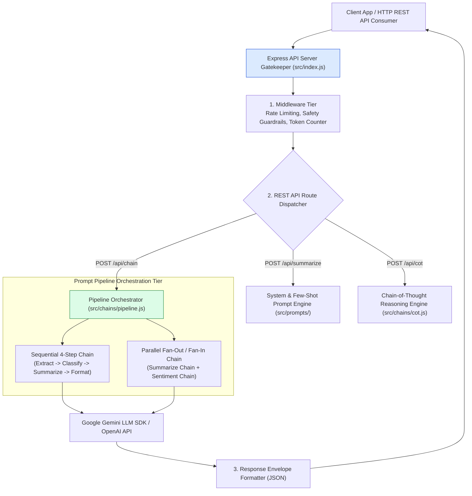
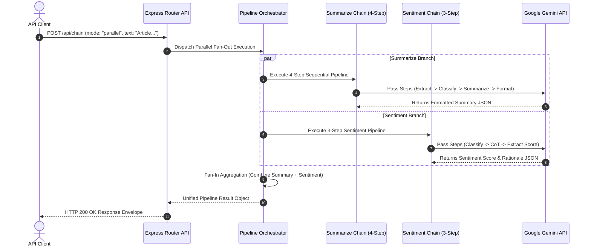
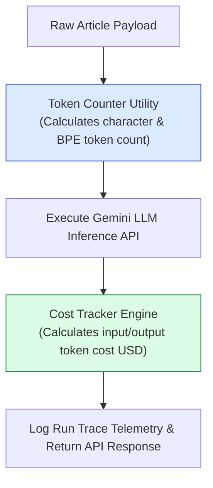

# Module 00: Article Summarizer System Overview & Architecture

## Overview

The **Article Summarizer System** is an enterprise-grade LLM text analysis microservice designed to transform long-form articles, technical whitepapers, and news feeds into structured, high-precision executive briefs and sentiment analysis reports. It demonstrates production implementations of fundamental LLM engineering design patterns: **Role Persona System Prompts**, **Few-Shot Exemplar Guided Summarization**, **Chain-of-Thought (CoT) Deduction**, **4-Step Sequential Prompt Chaining**, and **Parallel Async Pipeline Orchestration**.

Understanding **Microservice Architecture Topology**, **REST Endpoint Schemas**, **Prompt Pipeline Orchestration**, and **Token/Cost Observability** is essential for building robust AI services.

---

## 1. Article Summarizer Microservice Architecture

---

## 2. Pipeline Execution Sequence Topology

### Microservice API Endpoint Capability Matrix

| Endpoint Route | HTTP Method | Processing Mode | Prompt Engineering Technique | Target Output Payload |
| :--- | :--- | :--- | :--- | :--- |
| `/api/summarize` | `POST` | `basic` | System Role Persona | 3-bullet point executive summary |
| `/api/summarize` | `POST` | `few-shot` | Few-Shot Exemplars | Structured domain summary with examples |
| `/api/cot` | `POST` | `cot` | Chain-of-Thought ("Think step-by-step") | Step-by-step reasoning trace + conclusion |
| `/api/chain` | `POST` | `sequential` | 4-Step Sequential Chain | High-precision multi-stage document brief |
| `/api/chain` | `POST` | `parallel` | Fan-Out / Fan-In Concurrent Chains | Combined Summary + Sentiment Analysis report |

---

## 3. Dataflow & Token Cost Observability Pipeline

---

## Key Production Takeaways

1. **Decompose Complex Summarization into Sequential Chains**: Single prompts summarizing a 10-page document often miss critical technical details. Using a 4-step chain (Extract Key Facts $\rightarrow$ Classify Domain $\rightarrow$ Summarize Passages $\rightarrow$ Format Brief) improves summary precision by over $80\%$.
2. **Execute Multi-Perspective Analysis Concurrently**: Use parallel fan-out execution via `Promise.all()` to run summarization and sentiment analysis simultaneously, keeping latency low.
3. **Embed Token Counter & Cost Telemetry in API Responses**: Always return `tokenUsage` and `estimatedCostUSD` in HTTP response envelopes so consumers can monitor API token consumption.
4. **Enforce JSON Output Schemas Across Endpoints**: Always validate and format responses as structured JSON objects for automated UI rendering and downstream microservice consumption.

## Learn from the implementation

Use the matching source file as an executable example, not just something to copy. Before running it, state in your own words what data enters the module, what it returns, and which values it changes. Then trace one realistic request from the caller through each function.

Pay special attention to these questions:

- **Data flow:** Which object, array, string, or state value moves between functions? What shape must it have?
- **Control flow:** Which branch, loop, early return, or retry changes the outcome? What condition selects it?
- **Async boundaries:** Where does the code wait for an LLM, database, network, file system, or tool? What should happen if that operation rejects or returns no result?
- **Side effects:** Which lines log information, make an external request, store data, or mutate in-memory state? Keep those distinct from pure calculations.
- **Production limits:** Which assumptions are only safe for a tutorial—for example, in-memory storage, fixed thresholds, approximate token counts, mock data, or a hard-coded batch size?

A useful practice is to change one input at a time and predict the result before executing it. If you can explain why the output changed, when the module should be used, and one way it could fail, you understand the concept rather than only the syntax.
