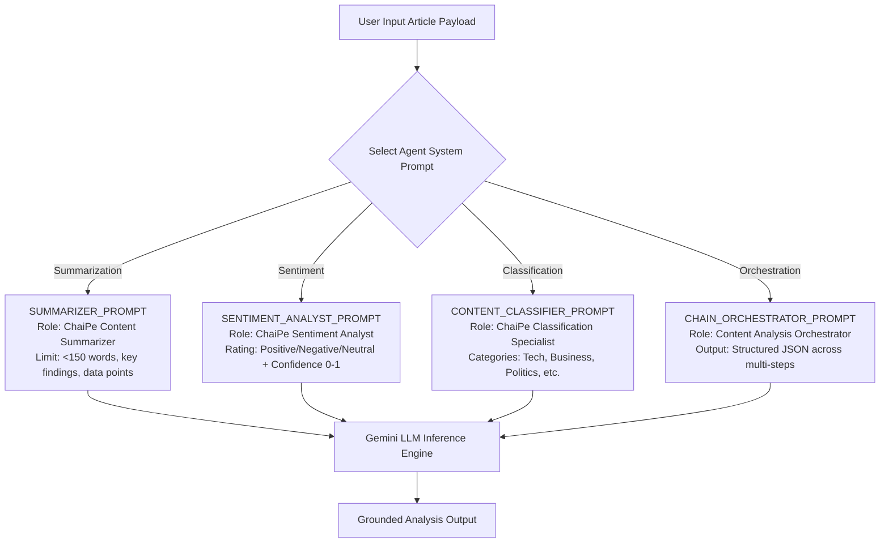

# Module 01: System Roles & Persona Configuration (`src/prompts/system-prompts.js`)

## Overview

In LLM application engineering, **System Prompts** establish the operational persona, behavioral constraints, domain rules, and output formatting guidelines before any user text is evaluated. By decoupling system-level rules from user-provided content, system prompts prevent context drift and hallucination errors while enforcing strict output schemas across analysis endpoints.

In **ChaiPe Analytics**, the `src/prompts/system-prompts.js` module exports specialized system prompts for distinct AI agents: **Summarizer**, **Sentiment Analyst**, **Content Classifier**, and **Chain Orchestrator**.



---

## 1. System Prompt Agent Capabilities Matrix

| System Prompt Constant | Agent Persona Role | Core Rules & Directives | Expected Output Format |
| :--- | :--- | :--- | :--- |
| **`SUMMARIZER_PROMPT`** | Content Summarizer | Keep under 150 words; use simple language; highlight main findings; cite stats. | Concise Markdown / Text summary. |
| **`SENTIMENT_ANALYST_PROMPT`** | Sentiment Analyst | Positive/Negative/Neutral rating; 0–1 confidence; list key emotional phrases; consider Indian English context. | JSON payload with sentiment, confidence, & phrases. |
| **`CONTENT_CLASSIFIER_PROMPT`** | Content Classifier | Pick 1 primary category from 9 allowed topics; suggest 2 secondary; explain reasoning. | JSON payload with primary/secondary categories. |
| **`CHAIN_ORCHESTRATOR_PROMPT`** | Pipeline Orchestrator | Multi-step execution manager; enforce strict structured JSON output at each step. | Multi-stage JSON object envelope. |

---

## 2. Complete Source Code Walkthrough (`src/prompts/system-prompts.js`)

```javascript
// System prompts define the AI's role and behavior for each task

export const SUMMARIZER_PROMPT = `You are an expert content summarizer for ChaiPe Analytics.
Your job is to create clear, concise summaries of articles.
Rules:
- Keep summaries under 150 words
- Use simple language
- Highlight the main argument or finding
- Mention any data or statistics referenced`;

export const SENTIMENT_ANALYST_PROMPT = `You are a sentiment analysis expert at ChaiPe Analytics.
Your job is to analyze the emotional tone of text content.
Rules:
- Identify the overall sentiment: positive, negative, or neutral
- Rate confidence from 0 to 1
- List specific phrases that indicate sentiment
- Consider cultural context for Indian English content`;

export const CONTENT_CLASSIFIER_PROMPT = `You are a content classification specialist at ChaiPe Analytics.
Your job is to categorize articles into topics.
Available categories: Technology, Business, Sports, Entertainment, Politics, Science, Health, Education, Lifestyle
Rules:
- Pick the single best-fit primary category
- Suggest up to 2 secondary categories
- Explain your reasoning in one sentence`;

export const CHAIN_ORCHESTRATOR_PROMPT = `You are a content analysis orchestrator at ChaiPe Analytics.
You process articles through multiple analysis steps.
For each step, provide structured JSON output.
Be thorough but concise.`;
```

---

## Key Production Takeaways

1. **Decouple Persona Directives into Dedicated Modules**: Storing system prompts in `src/prompts/system-prompts.js` ensures prompt instructions remain version-controlled, reusable, and cleanly separated from route handler logic.
2. **Account for Regional Context**: The `SENTIMENT_ANALYST_PROMPT` explicitly instructs the model to consider Indian English nuances (e.g. phrases like *"funding winter"*, *"pre-monsoon prep"*, or *"doing the needful"*).
3. **Enforce Hard Constraints in System Rules**: Setting explicit rules (such as word limits under 150 words or confidence bounds between 0 and 1) reduces output variance across model calls.
4. **Prepare for Pipeline Integration**: Passing `systemInstruction` in Gemini `model.startChat({ systemInstruction: ... })` grounds all downstream chat turns under the designated role.


## Learn from the implementation

Use the matching source file as an executable example, not just something to copy. Before running it, state in your own words what data enters the module, what it returns, and which values it changes. Then trace one realistic request from the caller through each function.

Pay special attention to these questions:

- **Data flow:** Which object, array, string, or state value moves between functions? What shape must it have?
- **Control flow:** Which branch, loop, early return, or retry changes the outcome? What condition selects it?
- **Async boundaries:** Where does the code wait for an LLM, database, network, file system, or tool? What should happen if that operation rejects or returns no result?
- **Side effects:** Which lines log information, make an external request, store data, or mutate in-memory state? Keep those distinct from pure calculations.
- **Production limits:** Which assumptions are only safe for a tutorial—for example, in-memory storage, fixed thresholds, approximate token counts, mock data, or a hard-coded batch size?

A useful practice is to change one input at a time and predict the result before executing it. If you can explain why the output changed, when the module should be used, and one way it could fail, you understand the concept rather than only the syntax.
