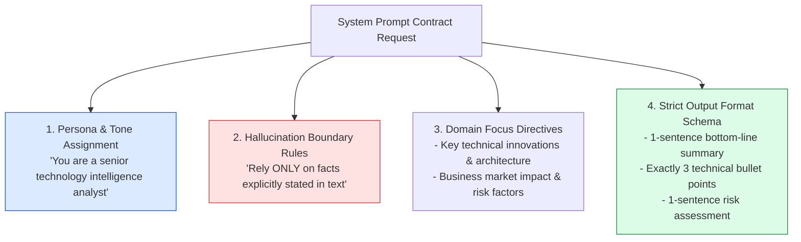
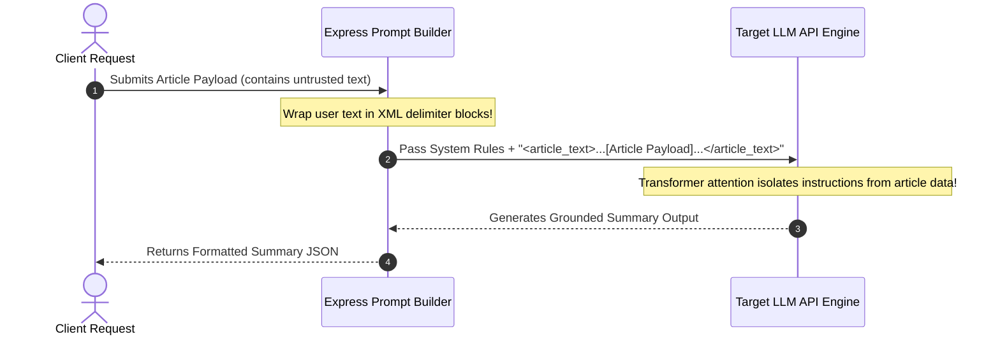
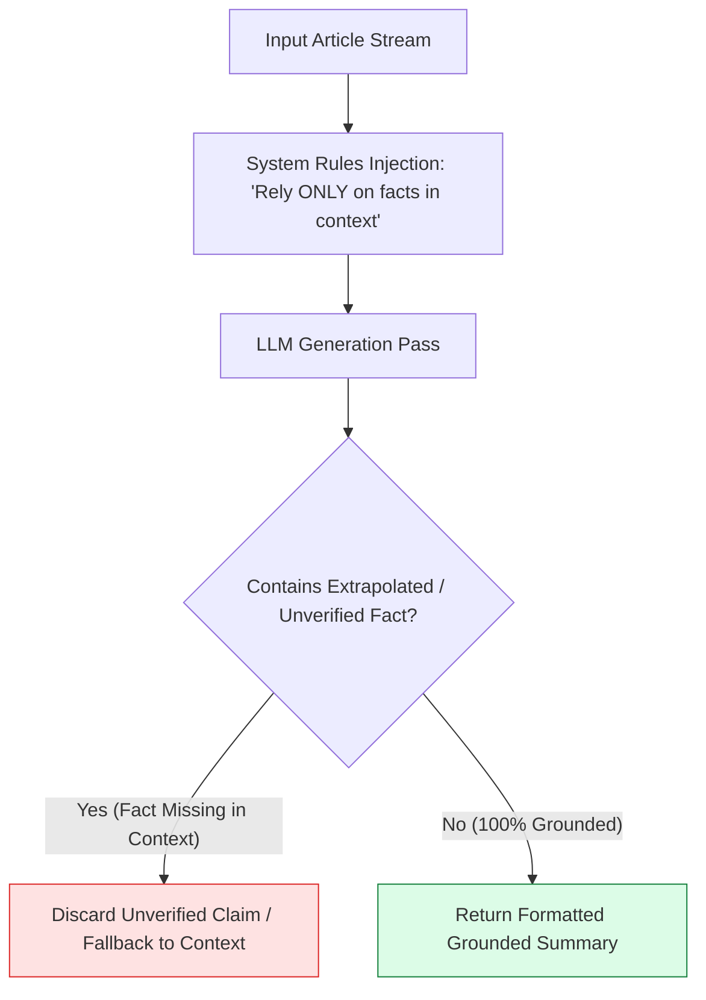

# Module 01: System Roles, Persona Configuration, and Boundary Isolation (`src/prompts/system-prompts.js`)

## Overview

In LLM application engineering, **System Prompts** establish the operational persona, behavioral constraints, domain rules, and output formatting guidelines before any user text is evaluated. By decoupling system-level rules from user-provided content, system prompts prevent context drift and hallucination errors while enforcing strict output schemas across summary endpoints.

Understanding **System Persona Configuration**, **Hallucination Prevention Rules**, **XML Delimiter Isolation**, and **Prompt Compilation Patterns** is essential for backend AI development.

---

## 1. System Prompt Architectural Topology



---

## 2. Structural Prompt Delimiter Isolation against Injection Attacks



### System Persona Configuration Matrix

| Persona Key | Target Audience | Primary Focus | Output Structure |
| :--- | :--- | :--- | :--- |
| **`DEFAULT`** | General Readership | Concise, accessible main points | Exactly 3 bullet points. |
| **`TECH`** | Software Engineers & CTOs | Architecture, technical trade-offs, security risks | 1-sentence executive summary + 3 technical bullets + 1 risk assessment. |
| **`EXECUTIVE`** | C-Level Executives | Business ROI, strategic impact, market risk | 1-sentence bottom line + 3 executive bullet points. |

---

## 3. Grounding & Anti-Hallucination Guard Pipeline



---

## 4. Code Walkthrough (`src/prompts/system-prompts.js`)

```javascript
/**
 * System Prompts Repository defining personas, boundaries, and output rules
 */
export const SYSTEM_PROMPTS = {
  DEFAULT: `You are an expert news and article analyst. Your task is to provide clear, concise, and accurate summaries of articles provided by the user.

Strict Rules:
1. Rely ONLY on clear facts mentioned in the provided text context.
2. Do NOT assume, infer, or extrapolate facts outside the provided text.
3. Keep summaries clear, objective, and accessible.
4. Output exactly 3 bullet points unless requested otherwise.`,

  TECH: `You are a senior technology intelligence analyst. Your task is to analyze technical software articles for engineering executives.

Focus Areas:
- Key technical innovations, architectural changes, and code patterns
- Business, performance, and competitive market dynamics
- Security risks, limitations, and future outlook

Required Format:
- 1-sentence executive summary
- 3 key technical takeaways (bullet points)
- 1-sentence risk and limitation assessment`,

  EXECUTIVE: `You are an executive chief of staff preparing high-level briefs for C-level executives.

Required Format:
- 1-sentence bottom line
- 3 key strategic bullet points maximum (using • symbol)
- Concise business impact statement`
};

/**
 * Compiles a system prompt and user text into a structured, injection-resistant payload
 */
export function buildPromptWithSystem(systemPromptKey, userText) {
  const systemPrompt = SYSTEM_PROMPTS[systemPromptKey] || SYSTEM_PROMPTS.DEFAULT;
  const sanitizedText = userText.trim().replace(/<\/?article_text>/g, ""); // Strip nested XML tags

  return `${systemPrompt}

### INPUT ARTICLE PAYLOAD
<article_text>
${sanitizedText}
</article_text>

### GENERATED SUMMARY BRIEF:`;
}

// Execution Verification Example
const rawInputArticle = "Node.js 22 was released featuring native WebSocket client support and V8 v12.4 engine updates.";
const compiledPromptPayload = buildPromptWithSystem("TECH", rawInputArticle);

console.log("Compiled System Prompt Payload:\n");
console.log(compiledPromptPayload);
```

---

## Key Production Takeaways

1. **Decouple System Prompts from Dynamic Content**: Store system role definitions in dedicated prompt repository files (`src/prompts/system-prompts.js`) rather than hardcoding prompt strings inside route handlers.
2. **Enforce Strict Anti-Hallucination Directives**: Always include explicit rules (e.g. `"Rely ONLY on clear facts mentioned in the context. Do NOT extrapolate or infer facts outside the text."`) to minimize model hallucination.
3. **Use Structural Delimiters (`<article_text>`)**: Wrap untrusted article text inside XML tags to prevent malicious articles from hijacking system prompt instructions.
4. **Offer Domain-Tailored Personas**: Provide specialized persona variants (`TECH`, `EXECUTIVE`, `LEGAL`) so clients can request summaries tailored to their target audience.

