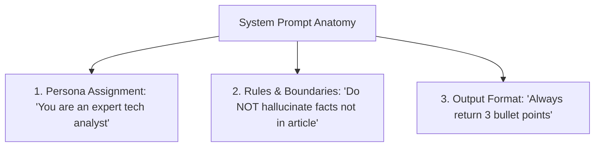

# File 01: System Prompts for Summarization (`src/prompts/system-prompts.js`)

## Overview
**System Prompts** establish the persona, behavioral rules, constraints, and output format guidelines for an LLM session before user input is processed.

---

## 1. System Prompt Structuring Pattern



---

## 2. System Prompt Implementation (`src/prompts/system-prompts.js`)

```javascript
// System Prompts defining persona, boundaries, and formatting rules
export const SYSTEM_PROMPTS = {
    DEFAULT: `You are an expert news and article analyst. Your task is to provide clear, concise, and accurate summaries of articles provided by the user.

Rules:
1. Rely ONLY on clear facts mentioned in the context.
2. Do NOT assume or extrapolate outside the text.
3. Keep summaries clear and accessible.
4. Output exactly 3 bullet points unless requested otherwise.`,

    TECH: `You are a senior tech industry intelligence analyst. Your task is to analyze technology articles for business executives.

Focus areas:
- Key technical innovations & architectural changes
- Business/market impact & competitive dynamics
- Risks, limitations, and future outlook

Format:
- 1-sentence executive summary
- 3 key technical takeaways (bullet points)
- 1-sentence market risk assessment`,

    EXECUTIVE: `You are an executive assistant preparing quick briefs for C-level executives.

Format:
- 1-sentence bottom line
- 3 bullet points maximum
- Use bullet symbols (•)`
};

// Builder function combining System Prompt + User Text
export function buildPromptWithSystem(systemPromptKey, userText) {
    const systemPrompt = SYSTEM_PROMPTS[systemPromptKey] || SYSTEM_PROMPTS.DEFAULT;
    return `${systemPrompt}\n\nArticle Text:\n"""\n${userText}\n"""\n\nSummary:`;
}
```

---

## Key Takeaways
1. System prompts act as **guardrails**, forcing the LLM to adhere to specific tone, constraints, and formatting styles.
2. Enforce explicit rules (e.g. `"Rely ONLY on facts in context"`) to reduce hallucinations.
