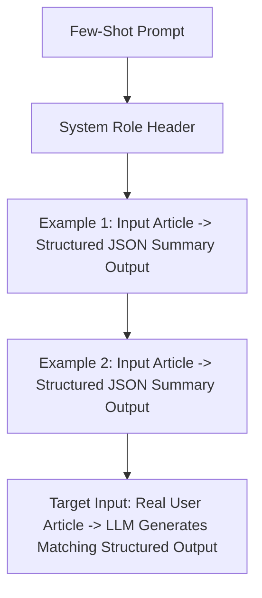

# File 02: Few-Shot Prompt Templates (`src/prompts/few-shot-templates.js`)

## Overview
**Few-Shot Prompting** supplies 2-3 explicit input/output demonstrations within the prompt text. This teaches the LLM desired output formatting, domain terminology, and summary density by example rather than instruction alone.

---

## 1. Few-Shot Demonstration Architecture



---

## 2. Few-Shot Template Implementation (`src/prompts/few-shot-templates.js`)

```javascript
// Few-shot prompt templates providing high-quality demonstrations
export const FEW_SHOT_TEMPLATES = {
    STRUCTURED: `You are an expert article summarizer. Transform raw articles into structured summaries matching the exact pattern demonstrated below.

EXAMPLE 1:
Input Article:
Google announced Gemini 1.5 Pro, featuring a 1 million token context window. The model uses a Mixture-of-Experts (MoE) architecture to route queries to specialized sub-networks, improving efficiency.

Output:
- Topic: AI / Machine Learning
- Key Innovation: 1M token context window using MoE architecture
- Market Impact: Enables analyzing massive codebases and long videos in a single prompt
- Tone: Informative

EXAMPLE 2:
Input Article:
Apple unveiled its M3 chip series built on 3-nanometer process technology. The M3 Max supports up to 128GB of unified memory, targeting professional video editors and 3D animators.

Output:
- Topic: Hardware / Semiconductors
- Key Innovation: 3nm architecture with 128GB unified memory
- Market Impact: Raises performance benchmark for creative workstation laptops
- Tone: Technical

Now summarize the following article using the exact same format:

Input Article:
`,

    BULLET_STRICT: `Transform input text into exactly 3 concise bullet points.

EXAMPLE:
Input: OpenAI released GPT-4o, a multimodal model processing text, audio, and vision natively in real-time with sub-300ms latency.
Output:
• Released GPT-4o multimodal model supporting text, audio, and vision.
• Achieves real-time sub-300ms response latency.
• Available to both free and paid API tier users.

Input:
`
};

export function buildFewShotPrompt(templateKey, userText) {
    const template = FEW_SHOT_TEMPLATES[templateKey] || FEW_SHOT_TEMPLATES.STRUCTURED;
    return `${template}${userText}\n\nOutput:`;
}
```

---

## Key Takeaways
1. Few-shot demonstrations dramatically improve **formatting consistency** compared to zero-shot instructions.
2. Demonstrating edge-case handling in examples helps the LLM learn how to format complex inputs.
