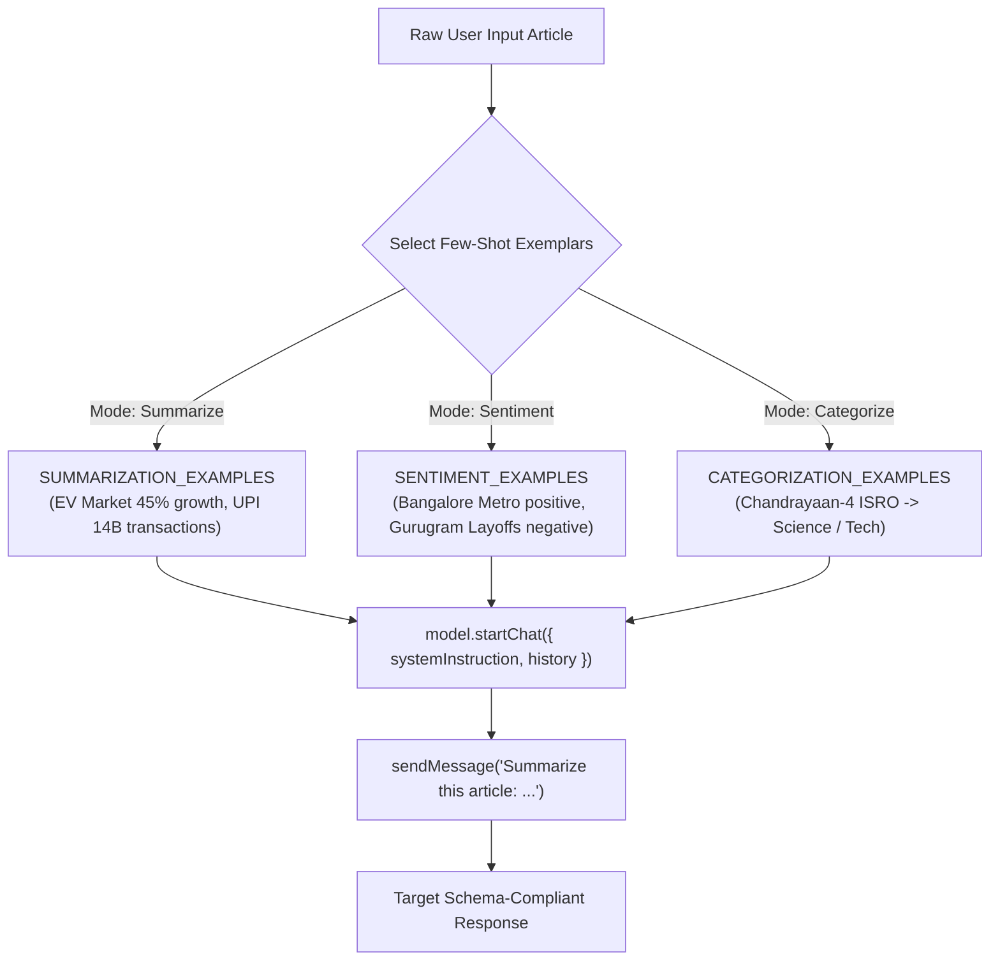
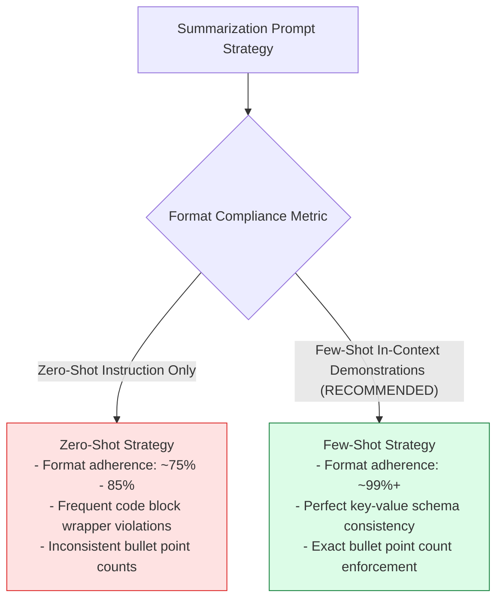

# Module 02: Few-Shot Prompt Templates and Exemplar Engineering (`src/prompts/few-shot-templates.js`)

## Overview

While zero-shot prompts rely entirely on instructions, **Few-Shot Prompt Engineering** embeds ground-truth input/output exemplar demonstrations directly within the conversation history or prompt context. This in-context learning mechanism guides the LLM to reproduce target schema formatting, domain terminology density, and summary extraction rules with near $100\%$ formatting compliance.

In **ChaiPe Analytics**, `src/prompts/few-shot-templates.js` exports structured conversation history arrays formatted specifically for Gemini `startChat({ history: [...] })`: **`SUMMARIZATION_EXAMPLES`**, **`SENTIMENT_EXAMPLES`**, and **`CATEGORIZATION_EXAMPLES`**.



---

## 1. Few-Shot Exemplar Guided Pipeline Matrix

| Exemplar Set | Purpose & Task | Context Domain Examples | Output Structure & Schema |
| :--- | :--- | :--- | :--- |
| **`SUMMARIZATION_EXAMPLES`** | In-context summarization | EV Market growth in India, UPI 14B transaction record. | Markdown `**Summary:**` paragraph + 4 `**Key Points:**` bullets. |
| **`SENTIMENT_EXAMPLES`** | Sentiment extraction | Bangalore metro fast commute (+), Gurugram tech startup layoffs (-). | JSON payload: `{ sentiment, confidence, reasoning, key_phrases }`. |
| **`CATEGORIZATION_EXAMPLES`** | Domain classification | ISRO Chandrayaan-4 lunar mission. | JSON payload: `{ primary_category, secondary_categories, reasoning }`. |

---

## 2. In-Context Exemplar Learning vs. Zero-Shot Format Compliance



---

## 3. Complete Source Code Walkthrough (`src/prompts/few-shot-templates.js`)

```javascript
// Few-shot examples teach the model by showing input-output pairs

export const SUMMARIZATION_EXAMPLES = [
  {
    role: "user",
    content: `Summarize this article:
India's electric vehicle market grew 45% in 2024, driven by government subsidies under the FAME-II scheme and increasing fuel costs. Tata Motors led the passenger EV segment with 65% market share, while Ola Electric dominated two-wheelers. Analysts predict the market will reach $100 billion by 2030.`
  },
  {
    role: "model",
    content: `**Summary:** India's EV market saw 45% growth in 2024, fueled by FAME-II subsidies and rising fuel prices. Tata Motors commands 65% of passenger EVs, with Ola Electric leading two-wheelers. The market is projected to hit $100 billion by 2030.

**Key Points:**
- 45% year-over-year growth
- Government subsidies as primary driver
- Market leaders: Tata Motors (cars), Ola Electric (two-wheelers)
- $100B projected market size by 2030`
  },
  {
    role: "user",
    content: `Summarize this article:
UPI transactions crossed 14 billion in December 2024, marking India's digital payments revolution. Small merchants in tier-2 and tier-3 cities now account for 40% of all UPI transactions. PhonePe and Google Pay together hold 85% market share. The RBI is exploring UPI integration with 5 more countries.`
  },
  {
    role: "model",
    content: `**Summary:** UPI hit a record 14 billion monthly transactions in December 2024, with small-town merchants driving 40% of volume. PhonePe and Google Pay dominate with 85% combined share. RBI plans to expand UPI internationally to 5 additional countries.

**Key Points:**
- 14 billion transactions in single month
- Tier-2/3 cities driving 40% of transactions
- PhonePe + Google Pay = 85% market share
- International expansion planned to 5 countries`
  }
];

export const SENTIMENT_EXAMPLES = [
  {
    role: "user",
    content: `Analyze sentiment: "The new Bangalore metro extension is fantastic! Finally, commuters from Whitefield can reach MG Road in 30 minutes instead of 2 hours in traffic."`
  },
  {
    role: "model",
    content: `{
  "sentiment": "positive",
  "confidence": 0.92,
  "reasoning": "Strongly positive language ('fantastic', 'finally') expressing relief and satisfaction about infrastructure improvement.",
  "key_phrases": ["fantastic", "finally", "30 minutes instead of 2 hours"]
}`
  },
  {
    role: "user",
    content: `Analyze sentiment: "Another startup layoff wave hits Gurugram. Over 2000 employees lost jobs this quarter as funding winter continues."`
  },
  {
    role: "model",
    content: `{
  "sentiment": "negative",
  "confidence": 0.88,
  "reasoning": "Negative framing of job losses with words like 'layoff wave' and 'funding winter' indicating economic distress.",
  "key_phrases": ["layoff wave", "lost jobs", "funding winter continues"]
}`
  }
];

export const CATEGORIZATION_EXAMPLES = [
  {
    role: "user",
    content: `Categorize: "ISRO successfully launched Chandrayaan-4 mission components, marking India's next step toward a lunar sample return by 2028."`
  },
  {
    role: "model",
    content: `{
  "primary_category": "Science",
  "secondary_categories": ["Technology"],
  "reasoning": "Space exploration mission by ISRO is primarily science, with technology as a secondary aspect."
}`
  }
];
```

---

## Key Production Takeaways

1. **Format Exemplars for Native Chat History**: Formatting few-shot exemplars as `{ role: "user", content: "..." }` and `{ role: "model", content: "..." }` allows direct injection into SDK chat instances (`model.startChat({ history })`).
2. **Demonstrate Expected Output Schemas**: Notice how `SENTIMENT_EXAMPLES` returns raw JSON strings so the LLM learns to respond in valid, parseable JSON.
3. **Incorporate Regional Domain Context**: The exemplars feature real-world Indian technical and business contexts (EVs in India, UPI payments, Bangalore Metro, Gurugram layoffs, ISRO Chandrayaan-4).
4. **Enforce Consistent Output Headers**: Bullet points in `SUMMARIZATION_EXAMPLES` establish strict Markdown formatting (`**Summary:**` and `**Key Points:**`).


## Learn from the implementation

Use the matching source file as an executable example, not just something to copy. Before running it, state in your own words what data enters the module, what it returns, and which values it changes. Then trace one realistic request from the caller through each function.

Pay special attention to these questions:

- **Data flow:** Which object, array, string, or state value moves between functions? What shape must it have?
- **Control flow:** Which branch, loop, early return, or retry changes the outcome? What condition selects it?
- **Async boundaries:** Where does the code wait for an LLM, database, network, file system, or tool? What should happen if that operation rejects or returns no result?
- **Side effects:** Which lines log information, make an external request, store data, or mutate in-memory state? Keep those distinct from pure calculations.
- **Production limits:** Which assumptions are only safe for a tutorial—for example, in-memory storage, fixed thresholds, approximate token counts, mock data, or a hard-coded batch size?

A useful practice is to change one input at a time and predict the result before executing it. If you can explain why the output changed, when the module should be used, and one way it could fail, you understand the concept rather than only the syntax.
