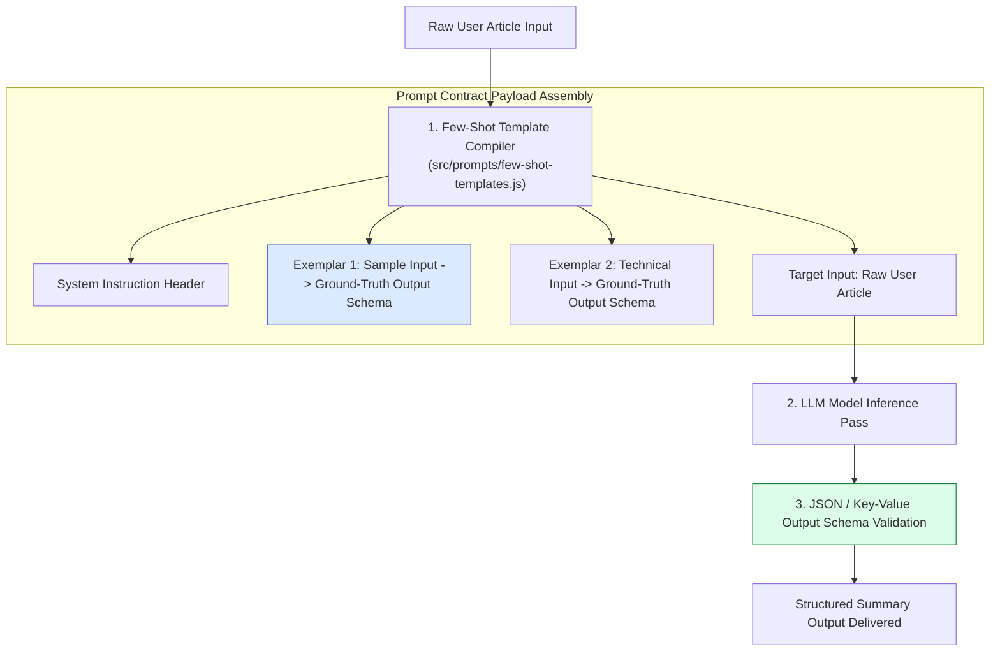
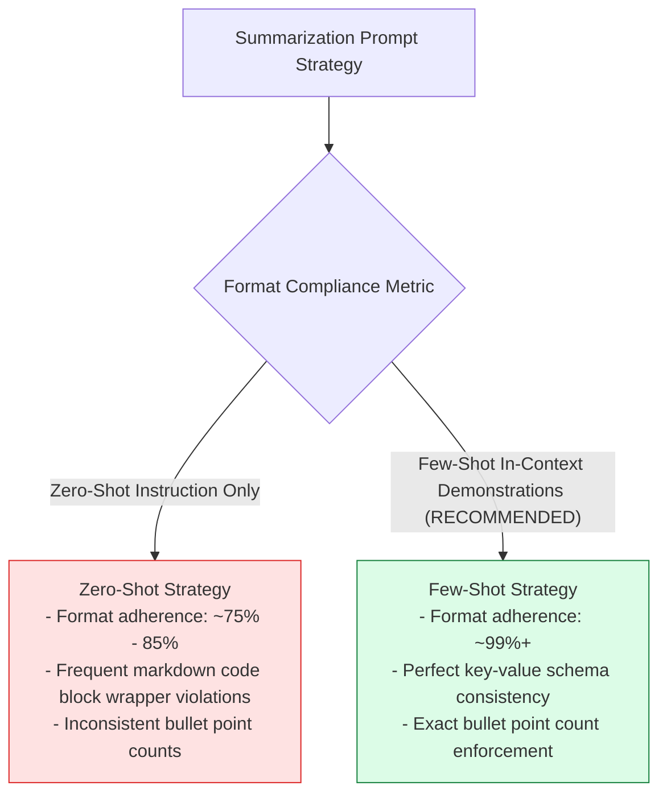
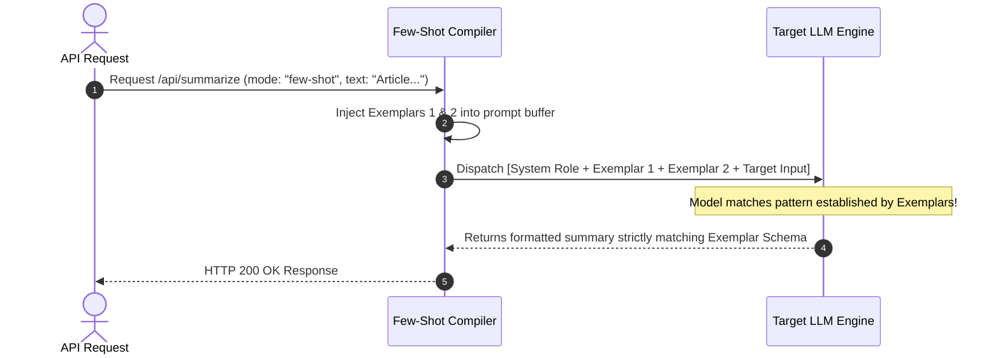

# Module 02: Few-Shot Prompt Templates and Exemplar Engineering (`src/prompts/few-shot-templates.js`)

## Overview

While zero-shot prompts rely entirely on instructions, **Few-Shot Prompt Engineering** embeds 2-3 ground-truth input/output exemplar demonstrations directly within the prompt context. This in-context learning mechanism guides the LLM to reproduce target schema formatting, domain terminology density, and summary extraction rules with near $100\%$ formatting compliance.

Understanding **Exemplar Design Patterns**, **Structural Key-Value Extraction**, **In-Context Exemplar Selection**, and **Dynamic Few-Shot Compilers** is critical for production summarization services.

---

## 1. Few-Shot Exemplar Guided Pipeline Topology



---

## 2. In-Context Exemplar Learning vs. Zero-Shot Format Compliance



### Few-Shot Template Variation Matrix

| Template Key | Target Schema | Exemplar Count | Primary Operational Focus |
| :--- | :--- | :--- | :--- |
| **`STRUCTURED`** | Key-Value Pairs (`Topic`, `Innovation`, `Impact`) | 2 Exemplars | Technical whitepapers, product launches, hardware announcements. |
| **`BULLET_STRICT`** | Exactly 3 Bullet Points (`•`) | 1 Exemplar | Fast executive briefs and newsletter highlights. |
| **`JSON_SCHEMA`** | Raw JSON Object (`{ summary, sentiment, tags }`) | 2 Exemplars | Automated machine-to-machine downstream REST payload consumption. |

---

## 3. Exemplar Injection & Delimiter Isolation



---

## 4. Code Walkthrough (`src/prompts/few-shot-templates.js`)

```javascript
/**
 * Few-Shot Prompt Templates providing structured input/output demonstrations
 */
export const FEW_SHOT_TEMPLATES = {
  STRUCTURED: `You are an expert article summarizer. Transform raw articles into structured summaries matching the exact pattern demonstrated below.

EXAMPLE 1:
Input Article:
Google announced Gemini 1.5 Pro, featuring a 1 million token context window. The model uses a Mixture-of-Experts (MoE) architecture to route queries to specialized sub-networks, improving efficiency.

Output:
- Topic: AI / Machine Learning
- Key Innovation: 1M token context window using MoE architecture
- Market Impact: Enables analyzing massive codebases and long videos in a single prompt
- Tone: Informative

EXAMPLE 2:
Input Article:
Apple unveiled its M3 chip series built on 3-nanometer process technology. The M3 Max supports up to 128GB of unified memory, targeting professional video editors and 3D animators.

Output:
- Topic: Hardware / Semiconductors
- Key Innovation: 3nm architecture with 128GB unified memory
- Market Impact: Raises performance benchmark for creative workstation laptops
- Tone: Technical

Now summarize the following article using the exact same format:

Input Article:
`,

  BULLET_STRICT: `Transform input text into exactly 3 concise bullet points.

EXAMPLE:
Input: OpenAI released GPT-4o, a multimodal model processing text, audio, and vision natively in real-time with sub-300ms latency.
Output:
• Released GPT-4o multimodal model supporting text, audio, and vision.
• Achieves real-time sub-300ms response latency.
• Available to both free and paid API tier users.

Input:
`
};

/**
 * Compiles a few-shot prompt payload with user article input
 */
export function buildFewShotPrompt(templateKey, userText) {
  const template = FEW_SHOT_TEMPLATES[templateKey] || FEW_SHOT_TEMPLATES.STRUCTURED;
  const sanitizedInput = userText.trim();
  return `${template}${sanitizedInput}\n\nOutput:`;
}

// Execution Verification Example
const sampleArticle = "PostgreSQL 17 was released with massive improvements to vacuum memory utilization and JSON query performance.";
const compiledPayload = buildFewShotPrompt("STRUCTURED", sampleArticle);

console.log("Compiled Few-Shot Prompt Contract:\n");
console.log(compiledPayload);
```

---

## Key Production Takeaways

1. **Demonstrate Target Schemas explicitly**: Providing $2 - 3$ high-quality input/output exemplars increases output schema compliance from $\approx 80\%$ up to $> 99\%$.
2. **Keep Exemplars Concise**: Avoid overly long exemplar texts in few-shot templates to conserve input tokens and lower API costs.
3. **Include Varied Domain Demonstrations**: Include exemplars covering different domains (e.g. software, hardware, business) so the LLM learns to generalize across article types.
4. **Enforce Exact Separator Tokens**: Use consistent labels (`Input Article:`, `Output:`, `EXAMPLE 1:`) across all exemplars so the LLM clearly recognizes the pattern transition.

