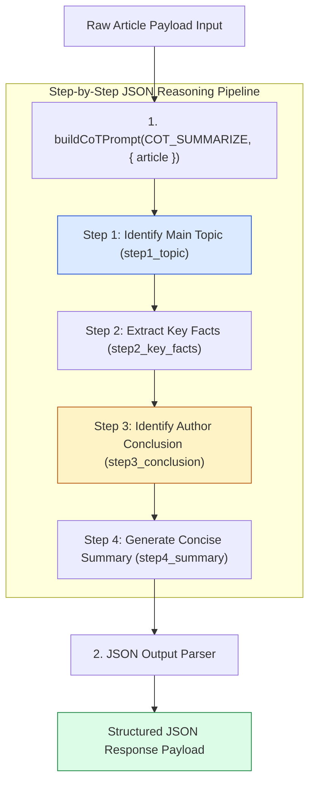

# Module 03: Chain-of-Thought (CoT) Deduction and Sentiment Analysis (`src/prompts/chain-of-thought.js`)

## Overview

Monolithic single-pass summarization prompts often skip intermediate reasoning steps, leading to inaccurate sentiment classification and missed facts. **Chain-of-Thought (CoT)** prompting forces the LLM to output explicit intermediate reasoning steps before declaring its final conclusions, allocating additional generation tokens to unlock deep transformer attention reasoning capabilities.

In **ChaiPe Analytics**, `src/prompts/chain-of-thought.js` exports step-by-step reasoning prompt templates that enforce **Structured JSON Output**: **`COT_SUMMARIZE`**, **`COT_SENTIMENT`**, **`COT_CATEGORIZE`**, and the variable injector utility **`buildCoTPrompt(template, variables)`**.



---

## 1. CoT Prompt Templates & Reasoning Steps Matrix

| CoT Constant | Step 1 (Extraction) | Step 2 (Mapping/Direction) | Step 3 (Ranking/Overall) | Step 4 (Final Synthesis) |
| :--- | :--- | :--- | :--- | :--- |
| **`COT_SUMMARIZE`** | Identify main topic (`step1_topic`) | Extract key facts array (`step2_key_facts`) | Identify main takeaway (`step3_conclusion`) | Generate concise summary (`step4_summary`). |
| **`COT_SENTIMENT`** | Identify emotional words (`step1_emotional_words`) | Determine positive/negative direction (`step2_directions`) | Assess overall sentiment (`step3_overall`) | Rate confidence 0–1 (`step4_confidence` + `reasoning`). |
| **`COT_CATEGORIZE`** | Extract domain keywords (`step1_keywords`) | Map to categories (`step2_category_mapping`) | Rank category match counts (`step3_ranking`) | Assign primary & secondary categories (`step4_primary`). |

---

## 2. Complete Source Code Walkthrough (`src/prompts/chain-of-thought.js`)

```javascript
// Chain-of-thought prompts force the model to show its reasoning step by step

export const COT_SUMMARIZE = `Analyze this article step by step:

Step 1 - Identify the main topic: What is this article primarily about?
Step 2 - Extract key facts: List the 3-5 most important facts or data points.
Step 3 - Identify the author's conclusion: What is the main takeaway?
Step 4 - Generate summary: Write a concise summary using the above analysis.

Article to analyze:
{article}

Respond in this JSON format:
{
  "step1_topic": "...",
  "step2_key_facts": ["...", "..."],
  "step3_conclusion": "...",
  "step4_summary": "..."
}`;

export const COT_SENTIMENT = `Analyze the sentiment of this text step by step:

Step 1 - Identify emotional words: List words or phrases that carry emotional weight.
Step 2 - Determine direction: Is each emotional word positive, negative, or neutral?
Step 3 - Assess overall tone: Considering all words together, what is the overall sentiment?
Step 4 - Rate confidence: How confident are you in this assessment (0-1)?

Text to analyze:
{text}

Respond in this JSON format:
{
  "step1_emotional_words": [{"word": "...", "emotion": "..."}],
  "step2_directions": [{"word": "...", "direction": "positive|negative|neutral"}],
  "step3_overall": "positive|negative|neutral",
  "step4_confidence": 0.0,
  "reasoning": "..."
}`;

export const COT_CATEGORIZE = `Classify this content step by step:

Step 1 - Identify keywords: What are the domain-specific terms in the text?
Step 2 - Map to categories: Which categories do these keywords belong to?
Step 3 - Rank categories: Which category has the most keyword matches?
Step 4 - Final classification: Pick the best primary and secondary categories.

Categories: Technology, Business, Sports, Entertainment, Politics, Science, Health, Education, Lifestyle

Text to classify:
{text}

Respond in this JSON format:
{
  "step1_keywords": ["...", "..."],
  "step2_category_mapping": [{"keyword": "...", "category": "..."}],
  "step3_ranking": [{"category": "...", "match_count": 0}],
  "step4_primary": "...",
  "step4_secondary": ["..."]
}`;

// Helper to fill in the template with actual content
export function buildCoTPrompt(template, variables) {
  let prompt = template;
  for (const [key, value] of Object.entries(variables)) {
    prompt = prompt.split(`{${key}}`).join(value);
  }
  return prompt;
}
```

---

## Key Production Takeaways

1. **Enforce JSON Contracts Across Reasoning Steps**: Asking the model to return JSON objects containing explicit keys (`step1_topic`, `step2_key_facts`, `step3_overall`) makes intermediate reasoning steps programmatically accessible to backend microservices.
2. **Template Interpolation Helper**: The `buildCoTPrompt` utility replaces `{text}` or `{article}` placeholders cleanly using simple string replacement.
3. **Improves Sentiment Classification Precision**: By requiring the model to identify emotional words in Step 1 and direction in Step 2 before scoring in Step 3, CoT eliminates impulsive sentiment labeling errors.
4. **Transparent Auditability**: Backend systems can log `reasoning` and intermediate `step1_keywords` to inspect *why* an article was categorized under a particular topic.


## Learn from the implementation

Use the matching source file as an executable example, not just something to copy. Before running it, state in your own words what data enters the module, what it returns, and which values it changes. Then trace one realistic request from the caller through each function.

Pay special attention to these questions:

- **Data flow:** Which object, array, string, or state value moves between functions? What shape must it have?
- **Control flow:** Which branch, loop, early return, or retry changes the outcome? What condition selects it?
- **Async boundaries:** Where does the code wait for an LLM, database, network, file system, or tool? What should happen if that operation rejects or returns no result?
- **Side effects:** Which lines log information, make an external request, store data, or mutate in-memory state? Keep those distinct from pure calculations.
- **Production limits:** Which assumptions are only safe for a tutorial—for example, in-memory storage, fixed thresholds, approximate token counts, mock data, or a hard-coded batch size?

A useful practice is to change one input at a time and predict the result before executing it. If you can explain why the output changed, when the module should be used, and one way it could fail, you understand the concept rather than only the syntax.
