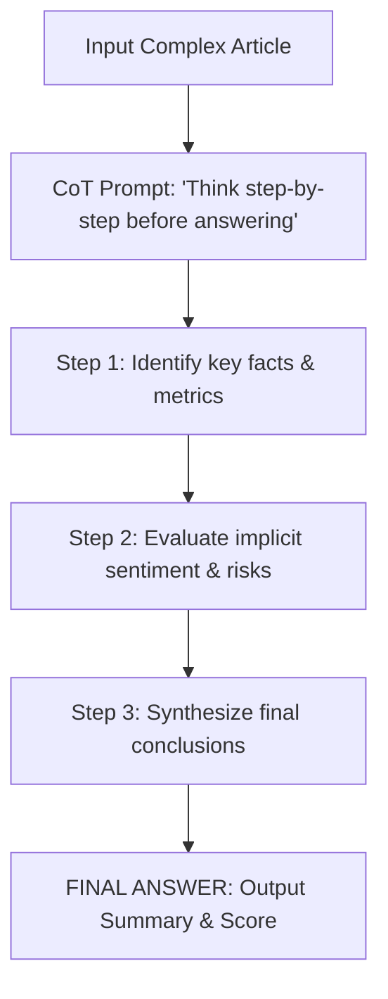

# File 03: Chain-of-Thought (CoT) Prompting (`src/prompts/chain-of-thought.js`)

## Overview
**Chain-of-Thought (CoT)** prompting forces the LLM to output its step-by-step reasoning steps before generating its final output summary or classification score, preventing premature conclusions on complex texts.

---

## 1. Chain-of-Thought Reasoning Sequence



---

## 2. CoT Implementation (`src/prompts/chain-of-thought.js`)

```javascript
export const COT_SUMMARIZE = `Analyze the article by following these explicit reasoning steps before providing the final summary:

Step 1 - Identify Core Entities & Events: List the main companies, products, or people mentioned and what happened.
Step 2 - Identify Metrics & Facts: Extract key statistics, financial numbers, or dates.
Step 3 - Synthesize Main Thesis: Write 1 sentence explaining why this article matters.
Step 4 - Generate Executive Summary: Write a 3-bullet point executive summary.

Format your output exactly as follows:

REASONING:
- Entities & Events: <your step 1 analysis>
- Key Metrics: <your step 2 analysis>
- Core Thesis: <your step 3 analysis>

FINAL SUMMARY:
<your 3 bullet points from step 4>
`;

export const COT_SENTIMENT = `Perform deep sentiment analysis on the text by following these reasoning steps:

Step 1 - Extract Key Claims: Identify major positive and negative statements.
Step 2 - Weigh Tone & Bias: Evaluate if language is overly promotional, critical, or neutral.
Step 3 - Determine Overall Score: Assign a sentiment score from -1.0 (extremely negative) to +1.0 (extremely positive).

Format:
REASONING:
<step-by-step evaluation>

FINAL SENTIMENT:
Score: <numeric score>
Label: <POSITIVE | NEUTRAL | NEGATIVE>
`;

export function buildCoTPrompt(cotTypeKey, articleText) {
    const template = cotTypeKey === "SENTIMENT" ? COT_SENTIMENT : COT_SUMMARIZE;
    return `${template}\nArticle to Analyze:\n"""\n${articleText}\n"""\n\nBegin Analysis:`;
}
```

---

## Key Takeaways
1. CoT prompts require the LLM to output **`REASONING:`** sections prior to generating **`FINAL SUMMARY:`**.
2. Significantly reduces hallucination rates when dealing with dense technical or financial text.
