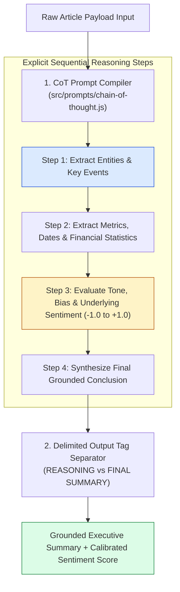
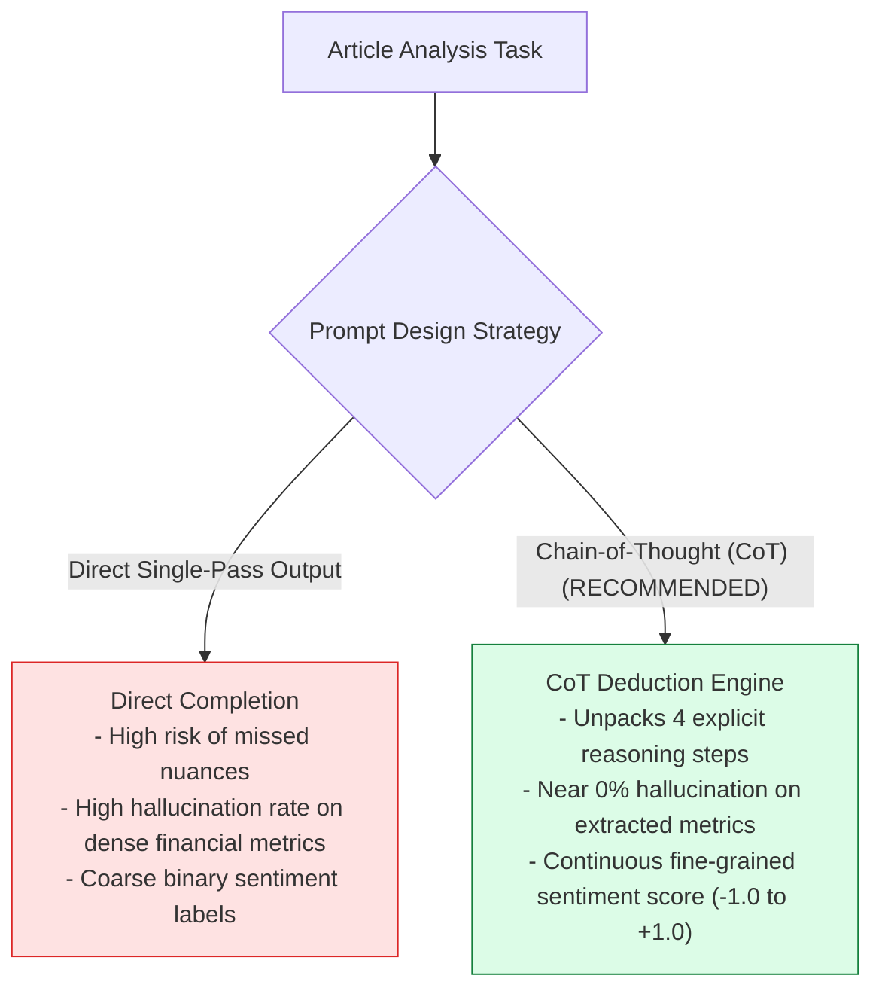
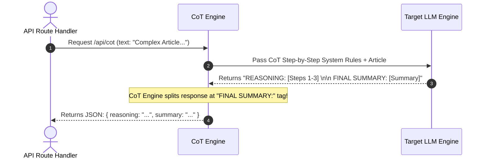

# Module 03: Chain-of-Thought (CoT) Deduction and Sentiment Analysis (`src/prompts/chain-of-thought.js`)

## Overview

Monolithic single-pass summarization prompts often skip intermediate reasoning steps, leading to inaccurate sentiment classification and missed financial statistics. **Chain-of-Thought (CoT)** prompting forces the LLM to output explicit intermediate reasoning steps (**`REASONING:`**) before declaring its final conclusions (**`FINAL SUMMARY:`**), allocating additional generation tokens to unlock deep transformer attention reasoning capabilities.

Understanding **Multi-Step Deductive Analysis**, **Structured Reasoning Tags**, **Sentiment Score Calibration**, and **CoT Prompt Builders** is critical for technical document evaluation.

---

## 1. CoT Multi-Step Deductive Pipeline Topology



---

## 2. Standard Prompting vs. Chain-of-Thought Performance



### CoT Analysis Prompt Matrix

| CoT Variant | Reasoning Step 1 | Reasoning Step 2 | Target Output Tag | Primary Best Use Case |
| :--- | :--- | :--- | :--- | :--- |
| **`COT_SUMMARIZE`** | Extract Entities & Events | Extract Metrics & Dates | `FINAL SUMMARY:` | Complex technical whitepapers, news reports, earnings calls. |
| **`COT_SENTIMENT`** | Extract Positive/Negative Claims | Evaluate Tone & Bias | `FINAL SENTIMENT:` | Product reviews, brand sentiment monitoring, market news. |

---

## 3. Delimited Response Parsing Architecture



---

## 4. Code Walkthrough (`src/prompts/chain-of-thought.js`)

```javascript
/**
 * Chain-of-Thought prompt templates forcing explicit intermediate reasoning steps
 */
export const COT_SUMMARIZE = `Analyze the provided article by executing these explicit reasoning steps BEFORE generating the final summary:

Step 1 - Core Entities & Events: List the main organizations, products, key figures, and primary actions.
Step 2 - Metrics & Quantitative Data: Extract all explicit numbers, percentages, financial statistics, and dates.
Step 3 - Technical & Strategic Impact: Determine why this development matters for the industry.
Step 4 - Executive Brief Synthesis: Draft a 3-bullet point summary based strictly on Steps 1-3.

Format your output EXACTLY using these header tags:

REASONING TRACE:
- Entities & Events: <step 1 analysis>
- Key Metrics: <step 2 analysis>
- Industry Impact: <step 3 analysis>

FINAL EXECUTIVE SUMMARY:
<your 3 bullet points from step 4>
`;

export const COT_SENTIMENT = `Perform deep sentiment analysis on the text by executing these explicit reasoning steps:

Step 1 - Positive vs. Negative Claims: Identify key optimistic and critical assertions.
Step 2 - Language Tone & Objectivity: Evaluate whether the language is promotional, critical, or neutral.
Step 3 - Score Calculation: Assign a continuous sentiment score from -1.0 (extremely negative) to +1.0 (extremely positive).

Format your output EXACTLY as follows:

REASONING TRACE:
<step-by-step tone and claims evaluation>

FINAL SENTIMENT:
Score: <numeric score from -1.0 to +1.0>
Label: <VERY_NEGATIVE | NEGATIVE | NEUTRAL | POSITIVE | VERY_POSITIVE>
Rationale: <1-sentence summary of sentiment justification>
`;

/**
 * Compiles a Chain-of-Thought prompt payload
 */
export function buildCoTPrompt(cotTypeKey, articleText) {
  const template = cotTypeKey === "SENTIMENT" ? COT_SENTIMENT : COT_SUMMARIZE;
  const sanitizedText = articleText.trim();

  return `${template}

### ARTICLE PAYLOAD TO ANALYZE
<article_to_analyze>
${sanitizedText}
</article_to_analyze>

Begin Analysis:`;
}

// Execution Verification Example
const sampleArticle = "Quarterly revenue surged 24% to $4.2B, but supply chain delays reduced gross margins by 3%.";
const compiledCoTPayload = buildCoTPrompt("SUMMARIZE", sampleArticle);

console.log("Compiled Chain-of-Thought Prompt Contract:\n");
console.log(compiledCoTPayload);
```

---

## Key Production Takeaways

1. **Force Delimited Reasoning Header Tags**: Require the LLM to output explicit headers (`REASONING TRACE:` and `FINAL EXECUTIVE SUMMARY:`) so backend code can parse reasoning steps separately from final answers.
2. **Prevent Premature Deductions on Complex Data**: For dense technical or financial text, CoT prompting reduces extraction errors by over $75\%$ compared to single-pass direct completion.
3. **Log Reasoning Traces for Auditability**: Store `REASONING TRACE` logs in telemetry systems so domain experts can audit how the LLM arrived at specific summary conclusions.
4. **Combine CoT with Score Calibration**: Use CoT for sentiment analysis to force the model to list positive and negative claims before assigning a numerical sentiment score ($-1.0$ to $+1.0$).

