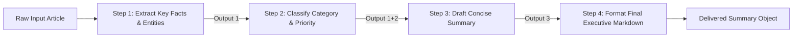

# File 04: 4-Step Summarization Chain (`src/chains/summarize-chain.js`)

## Overview
The **4-Step Summarization Chain** breaks article summarization into four discrete sequential LLM calls: **Extract Key Facts** $\rightarrow$ **Classify Topic** $\rightarrow$ **Draft Summary** $\rightarrow$ **Format Final Markdown Output**.

---

## 1. 4-Step Sequential Pipeline



---

## 2. Summarize Chain Implementation (`src/chains/summarize-chain.js`)

```javascript
// Step 1: Extract Key Facts
async function stepExtractFacts(model, article) {
    const prompt = `Extract top 5 verifiable facts, metrics, and entities from this article:\n\n${article}`;
    const result = await model.generateContent(prompt);
    return result.response.text();
}

// Step 2: Classify Category
async function stepClassifyCategory(model, facts) {
    const prompt = `Based on these extracted facts, classify category (Tech/Finance/Health) and urgency (High/Medium/Low):\n\nFacts:\n${facts}`;
    const result = await model.generateContent(prompt);
    return result.response.text();
}

// Step 3: Draft Summary
async function stepDraftSummary(model, facts, category) {
    const prompt = `Using these facts and category context, draft a 3-bullet point executive summary:\n\nCategory: ${category}\nFacts: ${facts}`;
    const result = await model.generateContent(prompt);
    return result.response.text();
}

// Full 4-Step Chain Runner
export async function runSummarizeChain(model, article) {
    console.log("[CHAIN STEP 1/4] Extracting facts...");
    const facts = await stepExtractFacts(model, article);

    console.log("[CHAIN STEP 2/4] Classifying category...");
    const category = await stepClassifyCategory(model, facts);

    console.log("[CHAIN STEP 3/4] Drafting summary...");
    const summary = await stepDraftSummary(model, facts, category);

    return {
        facts,
        category,
        summary
    };
}
```

---

## Key Takeaways
1. Passing intermediate step outputs sequentially yields **significantly higher quality summaries** than single-prompt generation.
2. Allows logging and inspecting intermediate step states for debugging.
