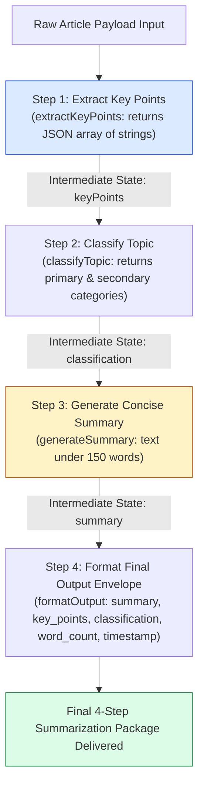
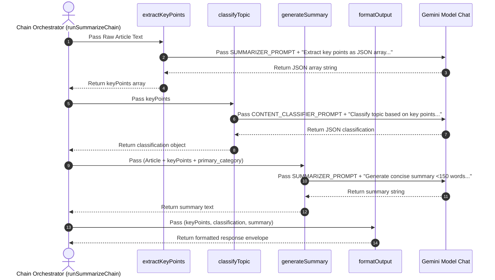

# Module 04: 4-Step Sequential Summarization Pipeline (`src/chains/summarize-chain.js`)

## Overview

Monolithic single-pass prompts attempting to read, analyze, categorize, and format a multi-page document in one step often suffer from context dilution and missed details. The **4-Step Summarization Chain** decomposes document processing into a sequence of four modular LLM passes: **Extract Key Points** $\rightarrow$ **Classify Topic** $\rightarrow$ **Generate Summary** $\rightarrow$ **Format Output Payload**.

In **ChaiPe Analytics**, `src/chains/summarize-chain.js` implements this modular pipeline using Gemini SDK chats with role system instructions (`SUMMARIZER_PROMPT` and `CONTENT_CLASSIFIER_PROMPT`).



---

## 1. Sequential Pipeline Step Feature Matrix

| Step Function | Model System Instruction | Input Payload | Output Payload | Resilience / Fallback Strategy |
| :--- | :--- | :--- | :--- | :--- |
| **`extractKeyPoints`** | `SUMMARIZER_PROMPT` | Raw Article Text | JSON array of key point strings | `try { JSON.parse() } catch { return [text] }` |
| **`classifyTopic`** | `CONTENT_CLASSIFIER_PROMPT` | `keyPoints` array | `{ primary_category, secondary_categories }` | Default: `{ primary_category: "General", secondary_categories: [] }` |
| **`generateSummary`** | `SUMMARIZER_PROMPT` | Article + `keyPoints` + `primary_category` | Concise summary string (<150 words) | Directly returns generated text |
| **`formatOutput`** | None (Pure JS function) | `keyPoints` + `classification` + `summary` | Final aggregated object | Computes `word_count` & ISO timestamp |

---

## 2. Sequential Chain Context Evolution



---

## 3. Complete Source Code Walkthrough (`src/chains/summarize-chain.js`)

```javascript
// 4-step summarization chain: extract → classify → summarize → format

import { SUMMARIZER_PROMPT, CONTENT_CLASSIFIER_PROMPT } from "../prompts/system-prompts.js";

// Step 1: Extract key points from the article
async function extractKeyPoints(model, article) {
  const chat = model.startChat({
    systemInstruction: SUMMARIZER_PROMPT
  });

  const result = await chat.sendMessage(
    `Extract the key points from this article as a JSON array of strings.
Only return the JSON array, nothing else.

Article: ${article}`
  );

  const text = result.response.text();

  try {
    return JSON.parse(text);
  } catch {
    // If the model didn't return clean JSON, wrap the text
    return [text];
  }
}

// Step 2: Classify the topic based on extracted points
async function classifyTopic(model, keyPoints) {
  const chat = model.startChat({
    systemInstruction: CONTENT_CLASSIFIER_PROMPT
  });

  const result = await chat.sendMessage(
    `Based on these key points, classify the topic.
Return JSON with "primary_category" and "secondary_categories" fields.

Key points: ${JSON.stringify(keyPoints)}`
  );

  try {
    return JSON.parse(result.response.text());
  } catch {
    return { primary_category: "General", secondary_categories: [] };
  }
}

// Step 3: Generate a summary using key points and classification
async function generateSummary(model, article, keyPoints, classification) {
  const chat = model.startChat({
    systemInstruction: SUMMARIZER_PROMPT
  });

  const result = await chat.sendMessage(
    `Generate a concise summary of this article.
Use these extracted key points and classification to guide your summary.

Article: ${article}
Key Points: ${JSON.stringify(keyPoints)}
Category: ${classification.primary_category}

Return only the summary text, under 150 words.`
  );

  return result.response.text();
}

// Step 4: Format the final output
function formatOutput(keyPoints, classification, summary) {
  return {
    summary,
    key_points: keyPoints,
    classification,
    word_count: summary.split(" ").length,
    generated_at: new Date().toISOString()
  };
}

// Run the full 4-step chain
export async function runSummarizeChain(model, article) {
  console.log("Step 1: Extracting key points...");
  const keyPoints = await extractKeyPoints(model, article);

  console.log("Step 2: Classifying topic...");
  const classification = await classifyTopic(model, keyPoints);

  console.log("Step 3: Generating summary...");
  const summary = await generateSummary(model, article, keyPoints, classification);

  console.log("Step 4: Formatting output...");
  const output = formatOutput(keyPoints, classification, summary);

  return output;
}
```

---

## Key Production Takeaways

1. **Modular LLM Passes Improve Quality**: Splitting tasks into `extractKeyPoints`, `classifyTopic`, and `generateSummary` prevents prompt overload and ensures each sub-task benefits from dedicated system instructions.
2. **Defensive Parsing with Fallbacks**: Always wrap `JSON.parse()` in `try...catch` blocks to handle non-compliant model responses gracefully without crashing the pipeline.
3. **Context Chaining Across Steps**: Passing extracted `keyPoints` into Step 2 and combining `article`, `keyPoints`, and `primary_category` into Step 3 ensures downstream passes build upon grounded factual data.
4. **Rich Execution Telemetry**: The final `formatOutput` step adds computed metrics like `word_count` and an ISO `generated_at` timestamp for auditability.


## Learn from the implementation

Use the matching source file as an executable example, not just something to copy. Before running it, state in your own words what data enters the module, what it returns, and which values it changes. Then trace one realistic request from the caller through each function.

Pay special attention to these questions:

- **Data flow:** Which object, array, string, or state value moves between functions? What shape must it have?
- **Control flow:** Which branch, loop, early return, or retry changes the outcome? What condition selects it?
- **Async boundaries:** Where does the code wait for an LLM, database, network, file system, or tool? What should happen if that operation rejects or returns no result?
- **Side effects:** Which lines log information, make an external request, store data, or mutate in-memory state? Keep those distinct from pure calculations.
- **Production limits:** Which assumptions are only safe for a tutorial—for example, in-memory storage, fixed thresholds, approximate token counts, mock data, or a hard-coded batch size?

A useful practice is to change one input at a time and predict the result before executing it. If you can explain why the output changed, when the module should be used, and one way it could fail, you understand the concept rather than only the syntax.
