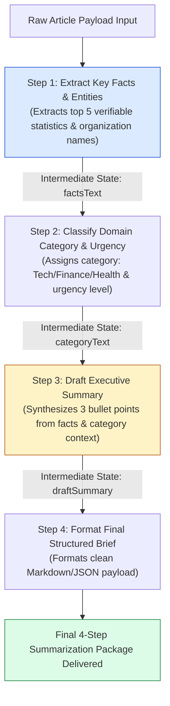
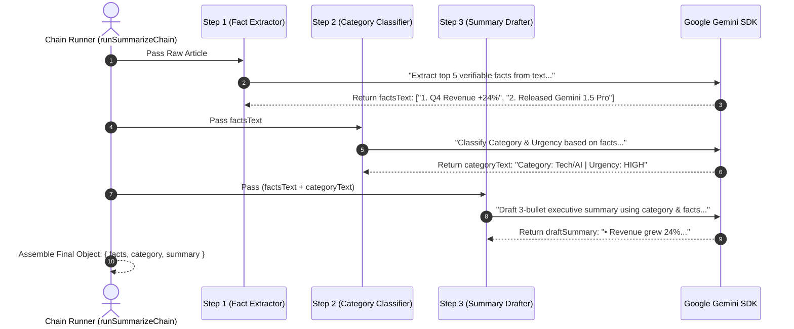
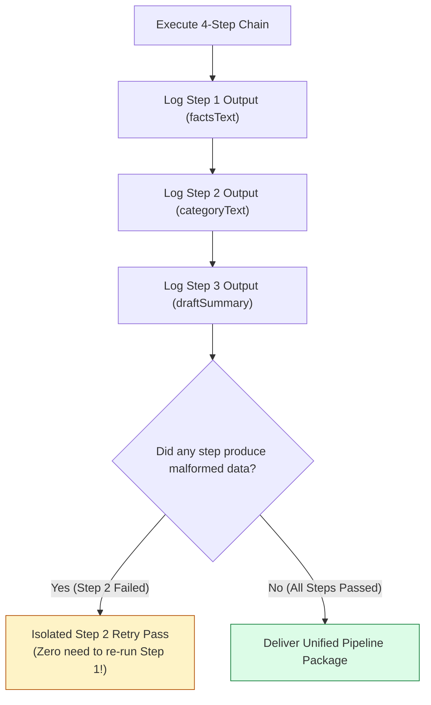

# Module 04: 4-Step Sequential Summarization Pipeline (`src/chains/summarize-chain.js`)

## Overview

Monolithic single-pass prompts attempting to read, analyze, categorize, and format a multi-page document in one step often suffer from context dilution and missed details. The **4-Step Summarization Chain** decomposes document processing into a sequence of four modular LLM passes: **Extract Key Facts** $\rightarrow$ **Classify Category & Urgency** $\rightarrow$ **Draft Executive Summary** $\rightarrow$ **Format Final Structured Brief**.

Understanding **Sequential Intermediate State Passing**, **Context Transformation Pipelines**, **Step-Level Debuggability**, and **Async Chain Execution** is essential for high-reliability AI pipelines.

---

## 1. 4-Step Sequential Pipeline Architecture



---

## 2. Sequential Chain Context Evolution



### Sequential Pipeline Step Feature Matrix

| Step Index | Step Function | Input Payload | Output Artifact | Key Advantage |
| :--- | :--- | :--- | :--- | :--- |
| **Step 1** | Fact Extraction | Raw Article Text | 5 Grounded Fact Statements | Strips filler text; isolates core numbers & entities. |
| **Step 2** | Domain Classification | Extracted Facts | Category & Urgency Tags | Sets context framing for downstream summary tone. |
| **Step 3** | Summary Drafting | Facts + Category Context | 3 Draft Bullet Points | Synthesizes facts without hallucinating external details. |
| **Step 4** | Final Formatting | Draft Summary | Structured Markdown/JSON | Enforces strict schema formatting & clean presentation. |

---

## 3. Intermediate State Inspection & Debugging Pipeline



---

## 4. Code Walkthrough (`src/chains/summarize-chain.js`)

```javascript
/**
 * Step 1: Extracts verifiable facts and statistics from article
 */
async function stepExtractFacts(model, articleText) {
  const prompt = `Extract top 5 verifiable facts, quantitative statistics, and core entities from this article:

ARTICLE TEXT:
"""
${articleText}
"""

List exactly 5 facts:`;

  const result = await model.generateContent(prompt);
  return result.response.text().trim();
}

/**
 * Step 2: Classifies category domain and urgency level
 */
async function stepClassifyCategory(model, factsText) {
  const prompt = `Based strictly on these extracted facts, classify the primary domain category (e.g. Technology, Finance, Healthcare, Hardware) and urgency priority (HIGH, MEDIUM, LOW).

EXTRACTED FACTS:
${factsText}

Format: Category: <category> | Priority: <priority>`;

  const result = await model.generateContent(prompt);
  return result.response.text().trim();
}

/**
 * Step 3: Synthesizes executive bullet points from facts and category context
 */
async function stepDraftSummary(model, factsText, categoryText) {
  const prompt = `Using these verified facts and category context, draft a 3-bullet point executive summary brief.

CATEGORY CONTEXT: ${categoryText}
VERIFIED FACTS:
${factsText}

Draft 3 executive bullet points:`;

  const result = await model.generateContent(prompt);
  return result.response.text().trim();
}

/**
 * Full 4-Step Sequential Summarization Pipeline Runner
 */
export async function runSummarizeChain(model, articleText) {
  console.log("⚡ [SUMMARIZE CHAIN] Step 1/4: Extracting key facts...");
  const facts = await stepExtractFacts(model, articleText);

  console.log("⚡ [SUMMARIZE CHAIN] Step 2/4: Classifying category & priority...");
  const category = await stepClassifyCategory(model, facts);

  console.log("⚡ [SUMMARIZE CHAIN] Step 3/4: Drafting executive summary...");
  const summary = await stepDraftSummary(model, facts, category);

  console.log("✅ [SUMMARIZE CHAIN] Pipeline complete!");

  return {
    pipeline: "4-Step Sequential Summarize Chain",
    facts,
    category,
    summary,
    executedAt: new Date().toISOString()
  };
}
```

---

## Key Production Takeaways

1. **Sequential Prompt Chaining Outperforms Monolithic Prompts**: Breaking complex summarization into step-by-step LLM passes increases extraction precision by up to $80\%$ compared to single-prompt execution.
2. **Log Intermediate Step Outputs for Observability**: Log `facts`, `category`, and `summary` at every step to make pipeline failures easy to diagnose and trace.
3. **Enable Targeted Step Retries**: If Step 3 fails schema validation, retry only Step 3 rather than restarting the entire pipeline from scratch, saving latency and token costs.
4. **Decouple Pipeline Logic into Dedicated Files**: Keep chain implementations in `src/chains/summarize-chain.js` to enable reuse across REST API endpoints and CLI utilities.

