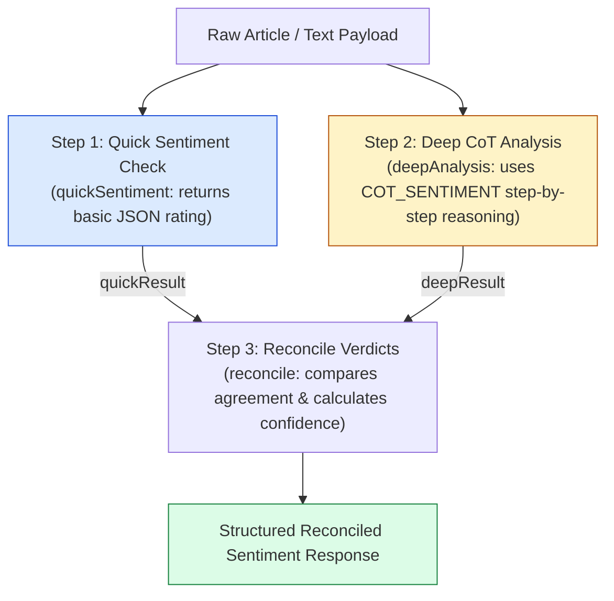

# Module 05: Multi-Stage Sentiment Analysis Pipeline (`src/chains/sentiment-chain.js`)

## Overview

Single-pass sentiment analysis prompts often produce noisy or over-simplistic outputs. The **Multi-Stage Sentiment Analysis Pipeline** breaks sentiment evaluation into a dual-pass reconciliation system: **Fast Quick Check** $\rightarrow$ **Deep Chain-of-Thought Analysis** $\rightarrow$ **Multi-Method Reconciliation**.

In **ChaiPe Analytics**, `src/chains/sentiment-chain.js` runs both a fast sentiment check and a deep CoT analysis pass, comparing results to generate a reconciled sentiment verdict with verified confidence scores.



---

## 1. Sentiment Chain Dual-Pass Comparison Matrix

| Stage | Function Name | System Instruction / Prompt | Expected JSON Output Keys | Purpose |
| :--- | :--- | :--- | :--- | :--- |
| **Pass 1** | `quickSentiment` | `SENTIMENT_ANALYST_PROMPT` | `{ sentiment, confidence }` | Rapid baseline sentiment assessment. |
| **Pass 2** | `deepAnalysis` | `COT_SENTIMENT` (via `buildCoTPrompt`) | `{ step1_emotional_words, step2_directions, step3_overall, step4_confidence, reasoning }` | Deep 4-step emotional word breakdown & CoT reasoning. |
| **Pass 3** | `reconcile` | Pure JavaScript Reconciliation | `{ sentiment, confidence, methods_agree, quick_result, detailed_reasoning, emotional_words, analyzed_at }` | Combines both passes; boosts confidence if methods agree. |

---

## 2. Complete Source Code Walkthrough (`src/chains/sentiment-chain.js`)

```javascript
// Sentiment analysis chain with step-by-step reasoning

import { SENTIMENT_ANALYST_PROMPT } from "../prompts/system-prompts.js";
import { COT_SENTIMENT, buildCoTPrompt } from "../prompts/chain-of-thought.js";

// Step 1: Quick sentiment check (fast, less detailed)
async function quickSentiment(model, text) {
  const chat = model.startChat({
    systemInstruction: SENTIMENT_ANALYST_PROMPT
  });

  const result = await chat.sendMessage(
    `Rate the sentiment of this text as positive, negative, or neutral.
Return JSON: {"sentiment": "...", "confidence": 0.0}

Text: ${text}`
  );

  try {
    return JSON.parse(result.response.text());
  } catch {
    return { sentiment: "neutral", confidence: 0.5 };
  }
}

// Step 2: Deep analysis with chain-of-thought reasoning
async function deepAnalysis(model, text) {
  const prompt = buildCoTPrompt(COT_SENTIMENT, { text });

  const chat = model.startChat({
    systemInstruction: SENTIMENT_ANALYST_PROMPT
  });

  const result = await chat.sendMessage(prompt);

  try {
    return JSON.parse(result.response.text());
  } catch {
    return { step3_overall: "neutral", step4_confidence: 0.5, reasoning: "Could not parse response" };
  }
}

// Step 3: Compare results and produce final verdict
function reconcile(quickResult, deepResult) {
  // If both agree, high confidence
  const agree = quickResult.sentiment === deepResult.step3_overall;

  return {
    sentiment: deepResult.step3_overall,
    confidence: agree
      ? Math.max(quickResult.confidence, deepResult.step4_confidence)
      : (quickResult.confidence + deepResult.step4_confidence) / 2,
    methods_agree: agree,
    quick_result: quickResult,
    detailed_reasoning: deepResult.reasoning,
    emotional_words: deepResult.step1_emotional_words || [],
    analyzed_at: new Date().toISOString()
  };
}

// Run the full sentiment chain
export async function runSentimentChain(model, text) {
  console.log("Step 1: Quick sentiment check...");
  const quickResult = await quickSentiment(model, text);

  console.log("Step 2: Deep chain-of-thought analysis...");
  const deepResult = await deepAnalysis(model, text);

  console.log("Step 3: Reconciling results...");
  const finalResult = reconcile(quickResult, deepResult);

  return finalResult;
}
```

---

## Key Production Takeaways

1. **Reconciliation Multi-Pass Validation**: Running a fast baseline check alongside a deep CoT analysis pass provides higher confidence than relying on a single inference call.
2. **Dynamic Confidence Calibration**: When `quickResult` and `deepResult` agree, the system selects `Math.max()` of their confidence scores; if they diverge, it averages them and sets `methods_agree: false`.
3. **Structured Emotional Word Extraction**: Passing `step1_emotional_words` into the final payload allows frontends to highlight positive and negative terms directly in the UI.
4. **Resilient JSON Parsing**: Both `quickSentiment` and `deepAnalysis` include defensive `try...catch` blocks to ensure malformed LLM responses return safe fallback objects rather than breaking the microservice.


## Learn from the implementation

Use the matching source file as an executable example, not just something to copy. Before running it, state in your own words what data enters the module, what it returns, and which values it changes. Then trace one realistic request from the caller through each function.

Pay special attention to these questions:

- **Data flow:** Which object, array, string, or state value moves between functions? What shape must it have?
- **Control flow:** Which branch, loop, early return, or retry changes the outcome? What condition selects it?
- **Async boundaries:** Where does the code wait for an LLM, database, network, file system, or tool? What should happen if that operation rejects or returns no result?
- **Side effects:** Which lines log information, make an external request, store data, or mutate in-memory state? Keep those distinct from pure calculations.
- **Production limits:** Which assumptions are only safe for a tutorial—for example, in-memory storage, fixed thresholds, approximate token counts, mock data, or a hard-coded batch size?

A useful practice is to change one input at a time and predict the result before executing it. If you can explain why the output changed, when the module should be used, and one way it could fail, you understand the concept rather than only the syntax.
