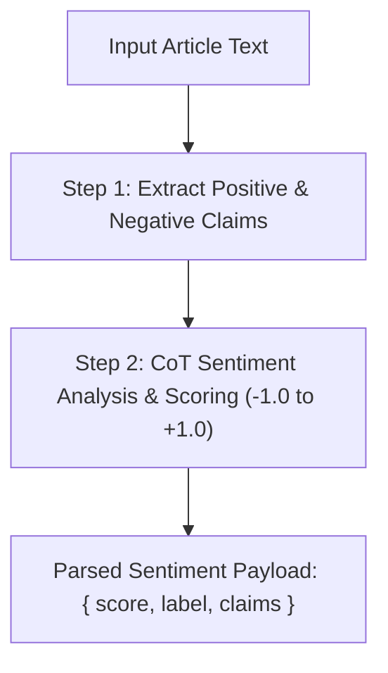

# File 05: Sentiment Analysis Chain (`src/chains/sentiment-chain.js`)

## Overview
The **Sentiment Analysis Chain** evaluates market sentiment by running a 2-step prompt pipeline combining key claims extraction with Chain-of-Thought reasoning to assign a sentiment score between -1.0 and +1.0.

---

## 1. Sentiment Pipeline Sequence



---

## 2. Sentiment Chain Implementation (`src/chains/sentiment-chain.js`)

```javascript
import { buildCoTPrompt } from "../prompts/chain-of-thought.js";

// Step 1: Extract Claims
async function extractClaims(model, text) {
    const prompt = `Extract all positive statements and negative statements from this text separately:\n\n${text}`;
    const result = await model.generateContent(prompt);
    return result.response.text();
}

// Step 2: CoT Reasoning Analysis
async function analyzeCoTSentiment(model, text, claims) {
    const cotPrompt = buildCoTPrompt("SENTIMENT", `Claims:\n${claims}\n\nOriginal Text:\n${text}`);
    const result = await model.generateContent(cotPrompt);
    return result.response.text();
}

export async function runSentimentChain(model, text) {
    console.log("[SENTIMENT CHAIN STEP 1] Extracting claims...");
    const claims = await extractClaims(model, text);

    console.log("[SENTIMENT CHAIN STEP 2] Running CoT sentiment analysis...");
    const analysis = await analyzeCoTSentiment(model, text, claims);

    return {
        claims,
        analysis
    };
}
```

---

## Key Takeaways
1. Separates fact extraction from sentiment evaluation to prevent bias.
2. Uses **CoT reasoning** to ensure score assignments are backed by logical claims analysis.
