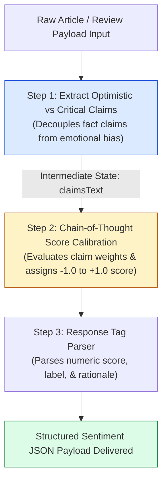
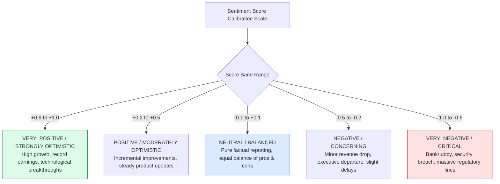
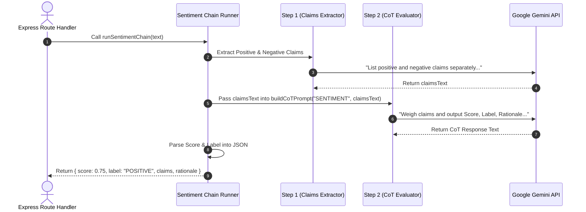

# Module 05: Multi-Stage Sentiment Analysis Pipeline (`src/chains/sentiment-chain.js`)

## Overview

Single-pass sentiment analysis prompts often produce noisy, biased, or over-simplistic binary outputs (e.g. "Positive" or "Negative") without backing justification. The **Multi-Stage Sentiment Analysis Pipeline** breaks sentiment evaluation into two decoupled stages: **Extract Claims (Positive vs. Negative)** $\rightarrow$ **Chain-of-Thought Score Calibration (-1.0 to +1.0)**.

Understanding **Claim Decoupling**, **Continuous Sentiment Score Calibration**, **Bias Elimination**, and **Chain Runner Integration** is critical for financial and brand monitoring services.

---

## 1. Multi-Stage Sentiment Pipeline Topology



---

## 2. Sentiment Score Calibration Curve (-1.0 to +1.0)



### Sentiment Pipeline Stage Feature Matrix

| Stage Index | Stage Function | Primary Input Payload | Output Artifact | Key Operational Benefit |
| :--- | :--- | :--- | :--- | :--- |
| **Stage 1** | Claims Extraction | Raw Article Text | Positive & Negative Statements | Eliminates subjective guessing by extracting factual claims first. |
| **Stage 2** | CoT Calibration Pass | Extracted Claims Text | `REASONING:` + `FINAL SENTIMENT:` | Calibrates a precise continuous score between $-1.0$ and $+1.0$. |
| **Stage 3** | Regex Payload Parsing | Raw CoT Response | Structured Sentiment JSON Object | Enables automated downstream database indexing and chart rendering. |

---

## 3. Asynchronous Claims-to-Score Execution Sequence



---

## 4. Code Walkthrough (`src/chains/sentiment-chain.js`)

```javascript
import { buildCoTPrompt } from "../prompts/chain-of-thought.js";

/**
 * Step 1: Extracts optimistic and critical claims separately
 */
async function extractClaims(model, text) {
  const prompt = `Extract all positive statements and negative statements from this text separately:

TEXT PAYLOAD:
"""
${text}
"""

List positive and negative claims:`;

  const result = await model.generateContent(prompt);
  return result.response.text().trim();
}

/**
 * Step 2: CoT Sentiment Analysis & Calibrated Scoring Pass
 */
async function analyzeCoTSentiment(model, text, claimsText) {
  const cotPrompt = buildCoTPrompt(
    "SENTIMENT",
    `Extracted Claims:\n${claimsText}\n\nOriginal Document Context:\n${text}`
  );

  const result = await model.generateContent(cotPrompt);
  return result.response.text().trim();
}

/**
 * Full Multi-Stage Sentiment Pipeline Runner
 */
export async function runSentimentChain(model, text) {
  console.log("⚡ [SENTIMENT CHAIN] Step 1/2: Extracting factual claims...");
  const claims = await extractClaims(model, text);

  console.log("⚡ [SENTIMENT CHAIN] Step 2/2: Running CoT sentiment calibration...");
  const rawAnalysis = await analyzeCoTSentiment(model, text, claims);

  // Extract score and label via Regex parsing
  const scoreMatch = rawAnalysis.match(/Score:\s*([+-]?\d+(?:\.\d+)?)/i);
  const labelMatch = rawAnalysis.match(/Label:\s*([A-Z_]+)/i);

  const score = scoreMatch ? parseFloat(scoreMatch[1]) : 0.0;
  const label = labelMatch ? labelMatch[1].trim() : "NEUTRAL";

  console.log(`✅ [SENTIMENT CHAIN] Analysis Complete. Score: ${score} | Label: ${label}`);

  return {
    pipeline: "Multi-Stage Sentiment Chain",
    sentimentScore: score,
    sentimentLabel: label,
    extractedClaims: claims,
    fullCoTTrace: rawAnalysis,
    analyzedAt: new Date().toISOString()
  };
}
```

---

## Key Production Takeaways

1. **Decouple Claims Extraction from Scoring**: Extract positive and negative claims first before asking the model to assign a sentiment score to eliminate subjective bias.
2. **Calibrate Numerical Scores (-1.0 to +1.0)**: Use continuous floating-point scores ($+0.75$) rather than binary labels ("Positive") to enable fine-grained trend charts and sentiment aggregation.
3. **Parse Responses Safely via Regex**: Use robust Regular Expressions (`/Score:\s*([+-]?\d+(?:\.\d+)?)/`) to extract numerical scores from CoT reasoning outputs safely.
4. **Expose Intermediate Claims Payload**: Return `extractedClaims` in API responses so frontend applications can render "Pros vs Cons" UI bullet lists alongside the sentiment score.

