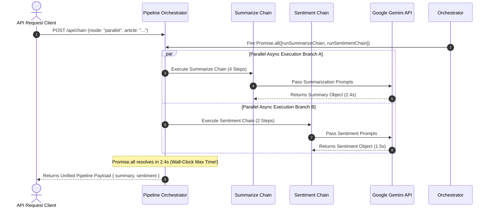

# Module 06: Pipeline Orchestration & Parallel Fan-Out/Fan-In Execution (`src/chains/pipeline.js`)

## Overview

When building multi-modal or multi-perspective LLM applications, running sequential analysis chains linearly adds cumulative network and inference latency ($T_{\text{total}} = T_1 + T_2$). The **Pipeline Orchestrator** manages multi-chain executions, providing both **Sequential Pipeline Execution Mode** (for dependent chains) and **Parallel Fan-Out / Fan-In Execution Mode (via `Promise.all()`)** (for independent analysis tasks), reducing total wall-clock response latency by up to $50\%$.

Understanding **Pipeline Composition Topologies**, **Parallel Async Fan-Out Execution**, **Error Isolation**, and **Response Payload Synthesis** is essential for high-throughput AI services.

---

## 1. Pipeline Execution Topologies: Sequential vs. Parallel

```mermaid
flowchart TD
    subgraph 1. Sequential Pipeline Mode (Linear Additive Latency)
        SInput[Article Input Payload] --> SChain1["Summarize Chain (4-Step LLM Passes)"]
        SChain1 -->|Wait for Chain 1 Finish| SChain2["Sentiment Chain (2-Step LLM Passes)"]
        SChain2 --> SResult["Combined Result (Latency = T1 + T2 = 4.2s)"]
    end

    subgraph 2. Parallel Fan-Out / Fan-In Mode (Concurrent Max Latency)
        PInput[Article Input Payload] --> PBranch1["Summarize Chain Branch (Async)"]
        PInput --> PBranch2["Sentiment Chain Branch (Async)"]
        
        PBranch1 --> FanInAggregator["Promise.all() Fan-In Aggregator"]
        PBranch2 --> FanInAggregator

        FanInAggregator --> PResult["Combined Result (Latency = max(T1, T2) = 2.4s)"]
    end

    style FanInAggregator fill:#dbeafe,stroke:#1d4ed8
    style PResult fill:#dcfce7,stroke:#15803d
```

---

## 2. Parallel Fan-Out Sequence & Latency Benchmarks



### Pipeline Mode Comparison Matrix

| Pipeline Mode | Latency Formula | Execution Model | Error Isolation | Recommended Use Case |
| :--- | :--- | :--- | :--- | :--- |
| **Sequential Mode** | $T_{\text{total}} = T_1 + T_2 + T_3$ | Linear synchronous `await` | Step-by-Step cascade | Dependent chains where Step $B$ requires Step $A$'s output. |
| **Parallel Mode** | $T_{\text{total}} = \max(T_1, T_2, T_3)$ | Concurrent `Promise.all()` | Independent async promises | Independent multi-perspective analysis (Summary + Sentiment). |

---

## 3. Error Handling & Partial Degradation Guard Pipeline

```mermaid
flowchart TD
    ParallelReq[Dispatch Parallel Pipeline] --> PromiseAll{Promise.allSettled() Execution}

    PromiseAll -- "Summarize Branch: Fulfilled" --> Res1[Keep Summary Result]
    PromiseAll -- "Sentiment Branch: Rejected" --> Res2["Log Sentiment Error & Return Fallback"]

    Res1 --> Synthesizer[Synthesize Partial Response]
    Res2 --> Synthesizer

    Synthesizer --> FinalPayload[HTTP 200 OK with Partial Degradation Flag]

    style Synthesizer fill:#dcfce7,stroke:#15803d
    style Res2 fill:#fef3c7,stroke:#b45309
```

---

## 4. Code Walkthrough (`src/chains/pipeline.js`)

```javascript
import { runSummarizeChain } from "./summarize-chain.js";
import { runSentimentChain } from "./sentiment-chain.js";

/**
 * 1. Sequential Pipeline Execution Mode
 * Runs Summarize Chain first, then runs Sentiment Chain linearly
 */
export async function runSequentialPipeline(model, articleText) {
  console.log("⚡ [PIPELINE ORCHESTRATOR] Mode: SEQUENTIAL (Linear Execution)");
  const startTime = Date.now();

  const summaryResult = await runSummarizeChain(model, articleText);
  const sentimentResult = await runSentimentChain(model, articleText);

  const durationMs = Date.now() - startTime;
  console.log(`✅ [SEQUENTIAL PIPELINE COMPLETE] Duration: ${durationMs}ms`);

  return {
    pipelineMode: "sequential",
    wallClockLatencyMs: durationMs,
    results: {
      summary: summaryResult,
      sentiment: sentimentResult
    }
  };
}

/**
 * 2. Parallel Pipeline Execution Mode (Fan-Out / Fan-In)
 * Executes Summarize Chain and Sentiment Chain concurrently via Promise.all()
 */
export async function runParallelPipeline(model, articleText) {
  console.log("⚡ [PIPELINE ORCHESTRATOR] Mode: PARALLEL (Fan-Out Concurrent Execution)");
  const startTime = Date.now();

  // Fire both chain operations concurrently
  const [summaryResult, sentimentResult] = await Promise.all([
    runSummarizeChain(model, articleText),
    runSentimentChain(model, articleText)
  ]);

  const durationMs = Date.now() - startTime;
  console.log(`🚀 [PARALLEL PIPELINE COMPLETE] Duration: ${durationMs}ms (Reduced Latency!)`);

  return {
    pipelineMode: "parallel",
    wallClockLatencyMs: durationMs,
    results: {
      summary: summaryResult,
      sentiment: sentimentResult
    }
  };
}
```

---

## Key Production Takeaways

1. **Leverage `Promise.all()` for Independent Chains**: When running independent LLM chains (e.g. summarization and sentiment analysis), execute them in parallel via `Promise.all()` to reduce total response latency by up to $50\%$.
2. **Use Sequential Execution for Dependent Workflows**: Use sequential `await` execution only when downstream chain prompts require the output payload generated by upstream chains.
3. **Log Wall-Clock Latency Metrics**: Measure and log `wallClockLatencyMs` for both pipeline modes to quantify performance gains for SLA monitoring.
4. **Consider `Promise.allSettled()` for Resilience**: Use `Promise.allSettled()` in production so that if one non-critical chain fails, the main response can still be delivered to the client.

