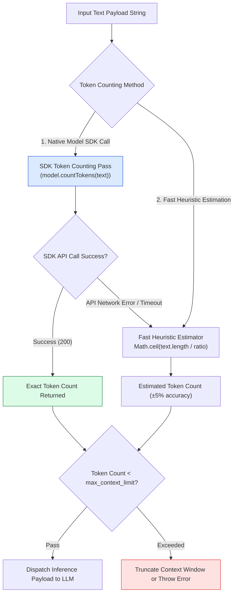
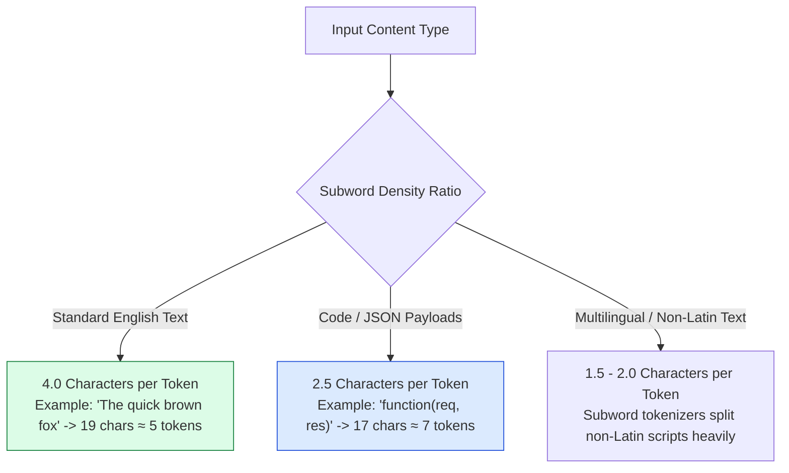
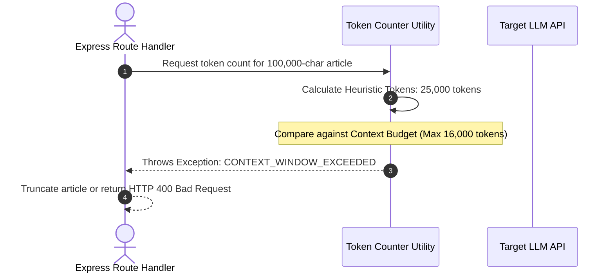

# Module 07: Token Counter Utility & Estimation Pipeline (`src/utils/token-counter.js`)

## Overview

Large Language Models process text using subword tokenization algorithms (BPE / tiktoken). Transmitting unmonitored text to provider APIs introduces risks of **Context Window Boundary Overflow Exceptions** and unanticipated API billing spikes. The **Token Counter Utility** provides fast, deterministic character-ratio heuristics and native SDK token counting passes before dispatching requests to LLM APIs.

Understanding **Subword Tokenization Ratios**, **SDK vs. Heuristic Estimation**, **Context Window Saturation Guards**, and **Fallback Engineering** is essential for cost management.

---

## 1. Token Estimation & Fallback Pipeline Topology



---

## 2. Character-to-Token Ratio Heuristic Matrix



### Token Counting Methodology Comparison

| Counting Method | Execution Speed | Accuracy | API Cost | Primary Best Use Case |
| :--- | :--- | :--- | :--- | :--- |
| **Native Model SDK (`countTokens`)** | Slow ($30\text{ms} - 80\text{ms}$ network call) | **100% Exact** | Free (no inference charge) | Final validation before submitting massive multi-thousand token prompts. |
| **Heuristic Ratio (`text.length / 4`)** | Instant ($< 0.1\text{ms}$) | High ($\approx 95\%$ for English) | Free | Real-time UI input character counter, rate limit pre-checks. |
| **Local Tiktoken WASM Library** | Fast ($< 1\text{ms}$) | High ($99\%$ for BPE) | Free | Offline backend token tracking without network API calls. |

---

## 3. Context Window Saturation Guard Pipeline



---

## 4. Code Walkthrough (`src/utils/token-counter.js`)

```javascript
/**
 * Fast character-based heuristic token estimator
 * Standard English: ~4 characters per token
 * Code / JSON: ~2.5 characters per token
 */
export function countTokensHeuristic(text, contentType = "english") {
  if (!text || typeof text !== "string") return 0;

  const charsPerToken = contentType === "code" || contentType === "json" ? 2.5 : 4.0;
  return Math.ceil(text.length / charsPerToken);
}

/**
 * SDK Native Token Counter with graceful heuristic fallback
 */
export async function countTokensSDK(model, text) {
  if (!text) return 0;

  try {
    const result = await model.countTokens(text);
    return result.totalTokens;
  } catch (err) {
    console.warn("⚠️ [TOKEN COUNTER] Native SDK countTokens failed. Falling back to heuristic counter:", err.message);
    return countTokensHeuristic(text);
  }
}

/**
 * Validates prompt payload against max token budget limit
 */
export function validateTokenBudget(text, maxTokenLimit = 8192) {
  const estimatedTokens = countTokensHeuristic(text);
  const isWithinBudget = estimatedTokens <= maxTokenLimit;

  return {
    estimatedTokens,
    maxTokenLimit,
    isWithinBudget,
    remainingTokens: Math.max(0, maxTokenLimit - estimatedTokens)
  };
}

// Execution Verification Example
const samplePayload = "Express.js handles incoming HTTP requests via middleware functions.";
console.log("Heuristic Token Count:", countTokensHeuristic(samplePayload));
console.log("Budget Validation:", validateTokenBudget(samplePayload, 1000));
```

---

## Key Production Takeaways

1. **Perform Instant Pre-Checks via Heuristic Counting**: Use fast character-ratio heuristics (`Math.ceil(text.length / 4)`) for instant client-side input validation before making API network calls.
2. **Implement Fallback Protection**: Wrap native SDK `model.countTokens()` API calls inside `try/catch` blocks that fall back to heuristic estimation if network timeouts occur.
3. **Account for Code & JSON Subword Density**: Use a lower character ratio ($\approx 2.5$ chars per token) when estimating JSON or code payloads, as tokenizers break down syntax punctuation into separate tokens.
4. **Enforce Token Budget Caps**: Use `validateTokenBudget()` to reject oversized payloads early, avoiding HTTP 500 errors from LLM providers due to context window saturation.

