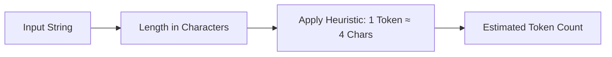

# File 07: Token Counter Utility (`src/utils/token-counter.js`)

## Overview
The **Token Counter Utility** estimates token consumption for prompt input and completion text prior to sending API calls, preventing Context Window overflows and tracking usage.

---

## 1. Token Estimation Pipeline



---

## 2. Token Counter Implementation (`src/utils/token-counter.js`)

```javascript
// Heuristic token counter (1 token ≈ 4 characters in English)
export function countTokensHeuristic(text) {
    if (!text || typeof text !== "string") return 0;
    return Math.ceil(text.length / 4);
}

// SDK Native Token Counter (for Gemini SDK)
export async function countTokensSDK(model, text) {
    try {
        const result = await model.countTokens(text);
        return result.totalTokens;
    } catch (err) {
        // Fallback to heuristic counter
        return countTokensHeuristic(text);
    }
}
```

---

## Key Takeaways
1. Fast heuristic fallback ($1 \text{ Token} \approx 4 \text{ Chars}$) enables instantaneous client-side estimation.
2. SDK native counting (`model.countTokens`) provides exact counts prior to API execution.
