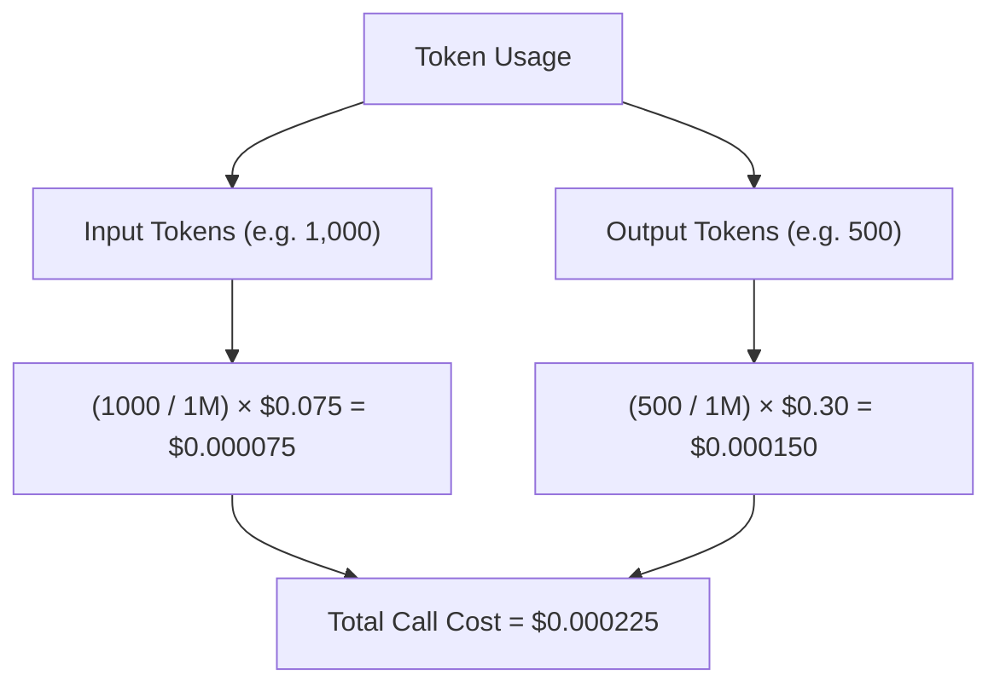

# File 08: Cost Tracker Utility (`src/utils/cost-tracker.js`)

## Overview
The **Cost Tracker Utility** logs, accumulates, and calculates financial API expenditures based on prompt tokens, completion tokens, and model tier pricing matrices.

---

## 1. Cost Tracker Calculation Model



---

## 2. Cost Tracker Implementation (`src/utils/cost-tracker.js`)

```javascript
// Pricing per 1 Million Tokens (Gemini 1.5 Flash rates)
const PRICING = {
    "gemini-1.5-flash": { input: 0.075, output: 0.30 },
    "gemini-1.5-pro": { input: 3.50, output: 10.50 }
};

export class CostTracker {
    constructor(modelName = "gemini-1.5-flash") {
        this.modelName = modelName;
        this.totalInputTokens = 0;
        this.totalOutputTokens = 0;
    }

    trackCall(inputTokens, outputTokens) {
        this.totalInputTokens += inputTokens;
        this.totalOutputTokens += outputTokens;
    }

    getSummary() {
        const rates = PRICING[this.modelName] || PRICING["gemini-1.5-flash"];
        const inputCost = (this.totalInputTokens / 1_000_000) * rates.input;
        const outputCost = (this.totalOutputTokens / 1_000_000) * rates.output;
        const totalCost = inputCost + outputCost;

        return {
            model: this.modelName,
            totalInputTokens: this.totalInputTokens,
            totalOutputTokens: this.totalOutputTokens,
            totalTokens: this.totalInputTokens + this.totalOutputTokens,
            totalCostUSD: totalCost.toFixed(6)
        };
    }
}
```

---

## Key Takeaways
1. Accurately tracks accumulated API expenses across multi-step prompt chains.
2. Differentiates between input token and output token rates for accurate billing.
