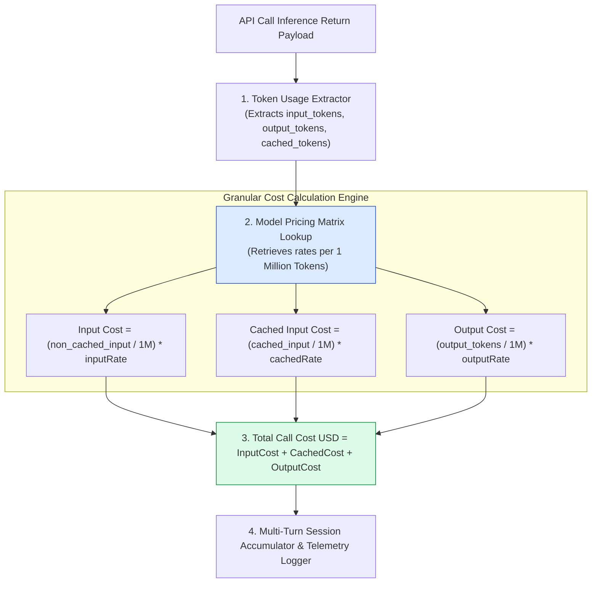
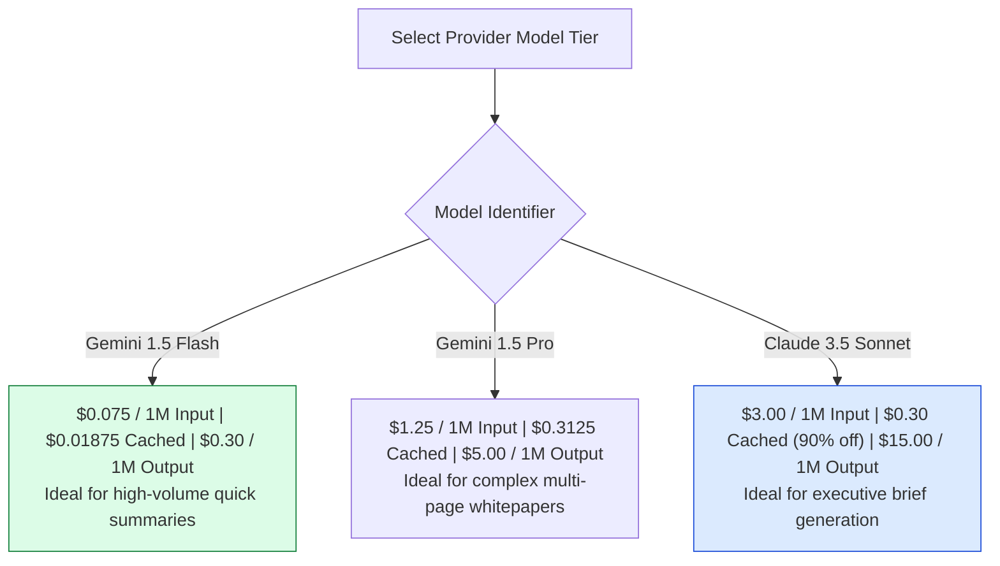
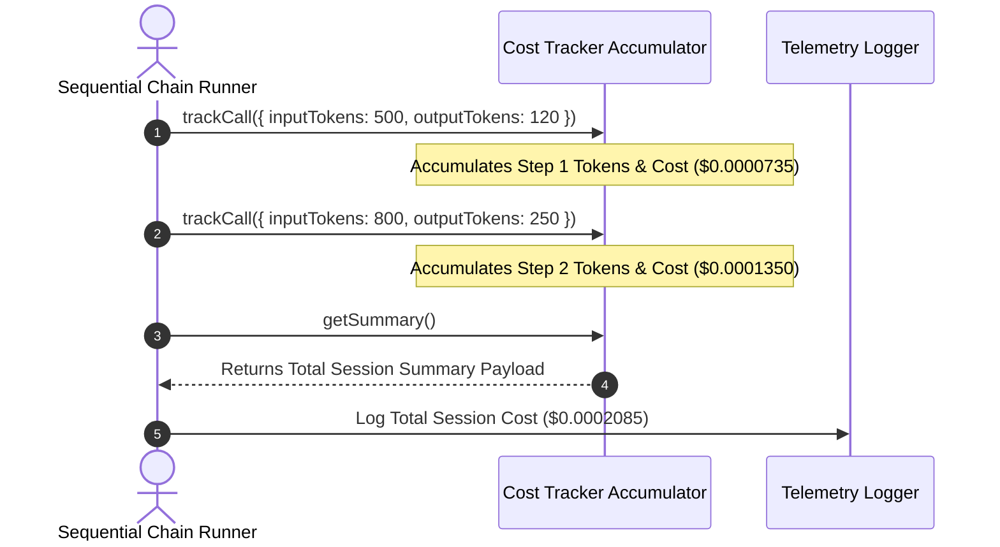

# Module 08: Financial Cost Tracker & Billing Telemetry (`src/utils/cost-tracker.js`)

## Overview

In production microservices, LLM inference fees represent the single largest operational expenditure. Because output completion tokens are significantly more expensive ($3\times - 5\times$) than input prompt tokens, naive token counting is insufficient for financial accounting. The **Cost Tracker Utility** tracks, accumulates, and calculates granular API expenditures across multi-step prompt chains using model pricing registries and prompt caching discount multipliers.

Understanding **Pricing Matrix Taxonomies**, **Multi-Turn Token Accumulation**, **Prompt Caching Discount Factors**, and **Billing Telemetry Exports** is critical for financial governance.

---

## 1. Cost Calculation Pipeline Topology



---

## 2. Multi-Model Provider Pricing & Prompt Caching Matrix



### Model Pricing Matrix Reference ($ / 1 Million Tokens)

| Model Key | Standard Input Price | Cached Input Price ($75\%-90\%$ Off) | Output Price | Target Microservice Use Case |
| :--- | :--- | :--- | :--- | :--- |
| **`gemini-1.5-flash`** | **$0.075** | **$0.01875** | **$0.30** | Default high-speed summarization & sentiment analysis. |
| **`gemini-1.5-pro`** | **$1.25** | **$0.3125** | **$5.00** | Deep multi-page whitepaper analysis. |
| **`gpt-4o-mini`** | **$0.15** | **$0.075** | **$0.60** | Low-cost fallback tier for basic endpoints. |

---

## 3. Accumulator & Telemetry Logging Architecture



---

## 4. Code Walkthrough (`src/utils/cost-tracker.js`)

```javascript
/**
 * Model Pricing Matrix per 1 Million Tokens (in USD)
 */
const PRICING_MATRIX = {
  "gemini-1.5-flash": {
    inputPerM: 0.075,
    cachedInputPerM: 0.01875,
    outputPerM: 0.30
  },
  "gemini-1.5-pro": {
    inputPerM: 1.25,
    cachedInputPerM: 0.3125,
    outputPerM: 5.0
  },
  "gpt-4o-mini": {
    inputPerM: 0.15,
    cachedInputPerM: 0.075,
    outputPerM: 0.60
  }
};

export class CostTracker {
  constructor(modelName = "gemini-1.5-flash") {
    this.modelName = modelName;
    this.rates = PRICING_MATRIX[modelName] || PRICING_MATRIX["gemini-1.5-flash"];
    this.totalInputTokens = 0;
    this.totalCachedTokens = 0;
    this.totalOutputTokens = 0;
    this.callCount = 0;
  }

  /**
   * Tracks an individual API call invocation
   */
  trackCall(inputTokens, outputTokens, cachedTokens = 0) {
    this.callCount++;
    this.totalInputTokens += inputTokens;
    this.totalOutputTokens += outputTokens;
    this.totalCachedTokens += cachedTokens;
  }

  /**
   * Calculates total financial expenditure summary
   */
  getSummary() {
    const nonCachedInput = Math.max(0, this.totalInputTokens - this.totalCachedTokens);

    const baseInputCost = (nonCachedInput / 1_000_000) * this.rates.inputPerM;
    const cachedInputCost = (this.totalCachedTokens / 1_000_000) * this.rates.cachedInputPerM;
    const outputCost = (this.totalOutputTokens / 1_000_000) * this.rates.outputPerM;

    const totalCostUSD = baseInputCost + cachedInputCost + outputCost;

    return {
      model: this.modelName,
      totalApiCalls: this.callCount,
      tokenBreakdown: {
        totalInputTokens: this.totalInputTokens,
        cachedInputTokens: this.totalCachedTokens,
        nonCachedInputTokens: nonCachedInput,
        outputTokens: this.totalOutputTokens,
        grandTotalTokens: this.totalInputTokens + this.totalOutputTokens
      },
      costBreakdownUSD: {
        inputCost: Number(baseInputCost.toFixed(6)),
        cachedInputCost: Number(cachedInputCost.toFixed(6)),
        outputCost: Number(outputCost.toFixed(6)),
        totalCostUSD: Number(totalCostUSD.toFixed(6))
      }
    };
  }
}

// Execution Verification Example
const tracker = new CostTracker("gemini-1.5-flash");
tracker.trackCall(1200, 300, 1000); // 1200 total input (1000 cached), 300 output
tracker.trackCall(800, 250, 0);      // 800 input, 250 output

console.log("Session Financial Billing Telemetry:\n", JSON.stringify(tracker.getSummary(), null, 2));
```

---

## Key Production Takeaways

1. **Differentiate Input vs. Output Token Rates**: Output completion tokens are up to $4\times$ more expensive than input prompt tokens. Track them separately to maintain financial accuracy.
2. **Account for Prompt Caching Discounts**: If your architecture uses fixed system prompt prefixes, incorporate cached token rates ($75\% - 90\%$ cost reduction) into financial calculations.
3. **Accumulate Costs Across Multi-Step Chains**: Use `CostTracker` instances across multi-step sequential prompt chains to log total pipeline costs in HTTP response telemetry.
4. **Enforce Per-Request Budget Caps**: Monitor accumulated cost during execution and abort long-running agent loops if a request exceeds a pre-set budget limit (e.g. $\$0.05$).


## Learn from the implementation

Use the matching source file as an executable example, not just something to copy. Before running it, state in your own words what data enters the module, what it returns, and which values it changes. Then trace one realistic request from the caller through each function.

Pay special attention to these questions:

- **Data flow:** Which object, array, string, or state value moves between functions? What shape must it have?
- **Control flow:** Which branch, loop, early return, or retry changes the outcome? What condition selects it?
- **Async boundaries:** Where does the code wait for an LLM, database, network, file system, or tool? What should happen if that operation rejects or returns no result?
- **Side effects:** Which lines log information, make an external request, store data, or mutate in-memory state? Keep those distinct from pure calculations.
- **Production limits:** Which assumptions are only safe for a tutorial—for example, in-memory storage, fixed thresholds, approximate token counts, mock data, or a hard-coded batch size?

A useful practice is to change one input at a time and predict the result before executing it. If you can explain why the output changed, when the module should be used, and one way it could fail, you understand the concept rather than only the syntax.
