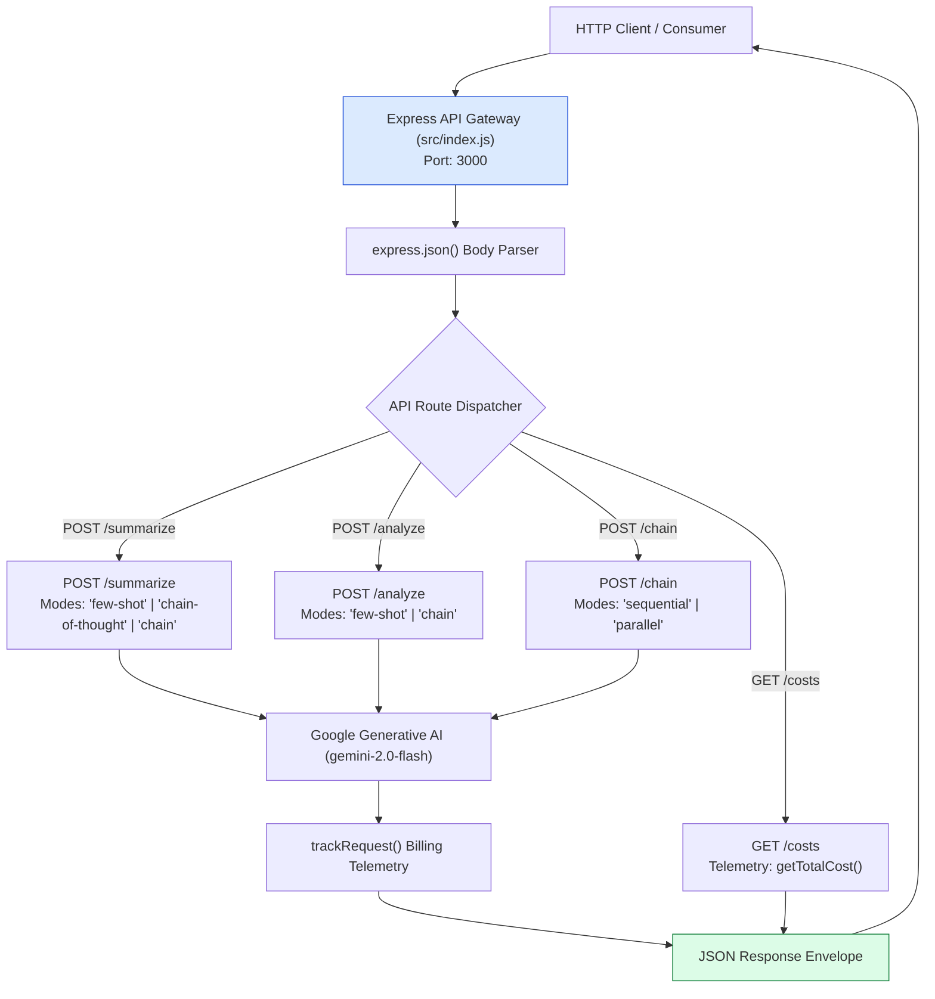
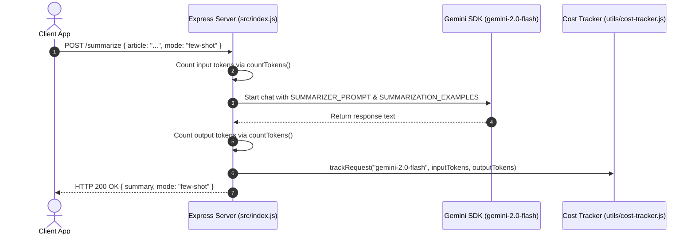

# Module 09: Express REST API Server & Endpoint Architecture (`src/index.js`)

## Overview

The **Express Summarizer API Server** serves as the production HTTP entry point for the **ChaiPe Analytics** microservice. It exposes structured REST endpoints (`POST /summarize`, `POST /analyze`, `POST /chain`, `GET /costs`) allowing web frontends, mobile apps, and backend services to execute few-shot summarization, Chain-of-Thought analysis, parallel pipeline orchestration, and real-time cost telemetry audits.

In **ChaiPe Analytics**, `src/index.js` initializes Google Generative AI (`gemini-2.0-flash`), configures Express middleware, routes requests to prompt and chain modules, and tracks token consumption for every request.



---

## 1. REST Endpoint Specification Matrix

| Endpoint Route | Method | JSON Request Body | Processing Modes | Output Response Envelope |
| :--- | :--- | :--- | :--- | :--- |
| **`/summarize`** | `POST` | `{ article: string, mode?: string }` | `few-shot`, `chain-of-thought`, `chain` (default) | Summary object + token telemetry |
| **`/analyze`** | `POST` | `{ text: string, mode?: string }` | `few-shot`, `chain` (default) | Reconciled sentiment analysis payload |
| **`/chain`** | `POST` | `{ article: string, mode?: string }` | `sequential`, `parallel` (default) | Combined Summary + Sentiment Analysis object |
| **`/costs`** | `GET` | None | N/A | Financial expenditure log & aggregate metrics |

---

## 2. API Request Lifecycle & Execution Sequence



---

## 3. Complete Source Code Walkthrough (`src/index.js`)

```javascript
import express from "express";
import { GoogleGenerativeAI } from "@google/generative-ai";
import dotenv from "dotenv";

import { SUMMARIZER_PROMPT, SENTIMENT_ANALYST_PROMPT } from "./prompts/system-prompts.js";
import { SUMMARIZATION_EXAMPLES, SENTIMENT_EXAMPLES } from "./prompts/few-shot-templates.js";
import { COT_SUMMARIZE, buildCoTPrompt } from "./prompts/chain-of-thought.js";
import { runSummarizeChain } from "./chains/summarize-chain.js";
import { runSentimentChain } from "./chains/sentiment-chain.js";
import { runPipeline } from "./chains/pipeline.js";
import { countTokens, formatTokenCount } from "./utils/token-counter.js";
import { trackRequest, getTotalCost } from "./utils/cost-tracker.js";

dotenv.config();

const app = express();
app.use(express.json());

// Initialize Gemini
const genAI = new GoogleGenerativeAI(process.env.GEMINI_API_KEY);
const model = genAI.getGenerativeModel({ model: "gemini-2.0-flash" });

// POST /summarize - Summarize an article using few-shot + CoT
app.post("/summarize", async (req, res) => {
  try {
    const { article, mode } = req.body;

    if (!article) {
      return res.status(400).json({ error: "Article text is required" });
    }

    const inputTokens = countTokens(article);
    console.log(`Input: ${formatTokenCount(inputTokens)}`);

    let result;

    if (mode === "few-shot") {
      // Use few-shot examples for summarization
      const chat = model.startChat({
        systemInstruction: SUMMARIZER_PROMPT,
        history: SUMMARIZATION_EXAMPLES.map(ex => ({
          role: ex.role,
          parts: [{ text: ex.content }]
        }))
      });

      const response = await chat.sendMessage(`Summarize this article:\n${article}`);
      result = { summary: response.response.text(), mode: "few-shot" };

    } else if (mode === "chain-of-thought") {
      // Use chain-of-thought for detailed reasoning
      const prompt = buildCoTPrompt(COT_SUMMARIZE, { article });
      const chat = model.startChat({ systemInstruction: SUMMARIZER_PROMPT });
      const response = await chat.sendMessage(prompt);

      try {
        result = { analysis: JSON.parse(response.response.text()), mode: "chain-of-thought" };
      } catch {
        result = { analysis: response.response.text(), mode: "chain-of-thought" };
      }

    } else {
      // Default: use the 4-step chain
      result = await runSummarizeChain(model, article);
      result.mode = "chain";
    }

    const outputTokens = countTokens(JSON.stringify(result));
    trackRequest("gemini-2.0-flash", inputTokens, outputTokens);

    res.json(result);
  } catch (error) {
    console.error("Summarize error:", error.message);
    res.status(500).json({ error: error.message });
  }
});

// POST /analyze - Run sentiment analysis
app.post("/analyze", async (req, res) => {
  try {
    const { text, mode } = req.body;

    if (!text) {
      return res.status(400).json({ error: "Text is required" });
    }

    let result;

    if (mode === "few-shot") {
      // Use few-shot examples
      const chat = model.startChat({
        systemInstruction: SENTIMENT_ANALYST_PROMPT,
        history: SENTIMENT_EXAMPLES.map(ex => ({
          role: ex.role,
          parts: [{ text: ex.content }]
        }))
      });

      const response = await chat.sendMessage(`Analyze sentiment: "${text}"`);
      try {
        result = JSON.parse(response.response.text());
      } catch {
        result = { raw: response.response.text() };
      }
      result.mode = "few-shot";

    } else {
      // Default: full sentiment chain with reasoning
      result = await runSentimentChain(model, text);
      result.mode = "chain";
    }

    const inputTokens = countTokens(text);
    const outputTokens = countTokens(JSON.stringify(result));
    trackRequest("gemini-2.0-flash", inputTokens, outputTokens);

    res.json(result);
  } catch (error) {
    console.error("Analyze error:", error.message);
    res.status(500).json({ error: error.message });
  }
});

// POST /chain - Run the full analysis pipeline
app.post("/chain", async (req, res) => {
  try {
    const { article, mode } = req.body;

    if (!article) {
      return res.status(400).json({ error: "Article text is required" });
    }

    // mode can be "sequential" or "parallel" (default)
    const result = await runPipeline(model, article, { mode });

    res.json(result);
  } catch (error) {
    console.error("Chain error:", error.message);
    res.status(500).json({ error: error.message });
  }
});

// GET /costs - View API usage and costs
app.get("/costs", (req, res) => {
  res.json(getTotalCost());
});

const PORT = process.env.PORT || 3000;
app.listen(PORT, () => {
  console.log(`ChaiPe Summarizer API running on http://localhost:${PORT}`);
  console.log("Endpoints:");
  console.log("  POST /summarize  - Summarize an article");
  console.log("  POST /analyze    - Sentiment analysis");
  console.log("  POST /chain      - Full analysis pipeline");
  console.log("  GET  /costs      - View API usage costs");
});
```

---

## Key Production Takeaways

1. **Integrated Token & Billing Telemetry**: `trackRequest("gemini-2.0-flash", inputTokens, outputTokens)` automatically logs every endpoint call, allowing `GET /costs` to expose real-time spending metrics.
2. **Flexible Route Mode Parameters**: Endpoints support multiple processing modes (`mode: "few-shot"`, `"chain-of-thought"`, or `"chain"`) to accommodate different prompt strategies dynamically.
3. **Defensive Error Handling**: Wrap route logic in `try...catch` blocks returning `400 Bad Request` for missing inputs and `500 Internal Server Error` with diagnostic messages for unexpected failures.
4. **Environment-Driven Configuration**: Uses `dotenv` to load `GEMINI_API_KEY` securely from `.env` files without hardcoding credentials in production code.
