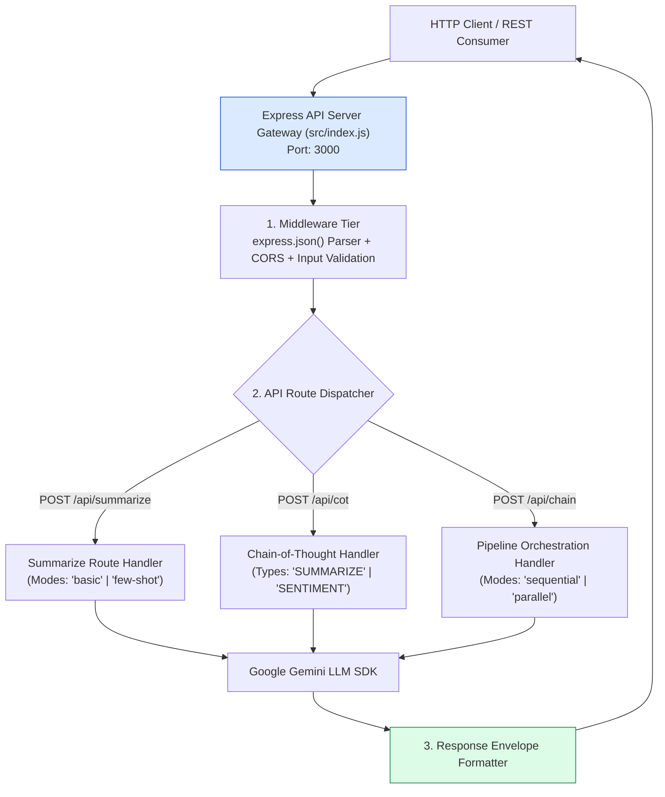
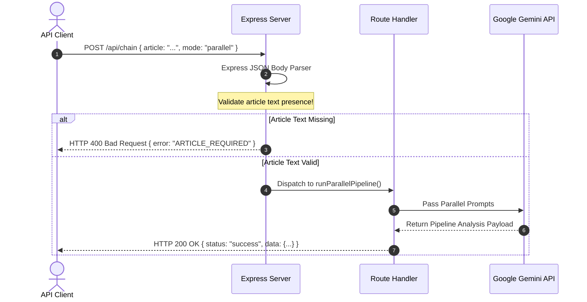
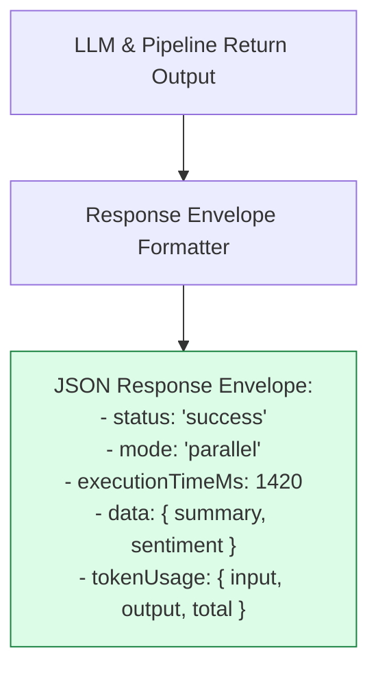

# Module 09: Express REST API Server & Endpoint Architecture (`src/index.js`)

## Overview

The **Express Summarizer API Server** serves as the production HTTP entry point for the text analysis microservice. It exposes structured REST endpoints (`/api/summarize`, `/api/cot`, `/api/chain`) allowing frontend web clients, CLI tools, and external services to trigger basic role-prompted summaries, Chain-of-Thought reasoning passes, and parallel multi-chain pipelines.

Understanding **REST API Route Dispatching**, **Standardized Response Envelopes**, **Input Validation Middleware**, and **Graceful Error Handling** is essential for backend engineering.

---

## 1. Express API Routing & Dispatcher Architecture



---

## 2. API Request Lifecycle & Error Middleware Flow



### API Endpoint Specification Reference Matrix

| Endpoint Route | Method | Required JSON Body | Query Parameters | HTTP Success Response |
| :--- | :--- | :--- | :--- | :--- |
| `/api/summarize` | `POST` | `{ article: string, mode?: "basic" \| "few-shot" }` | `persona?: "TECH" \| "EXECUTIVE"` | `200 OK` + Structured Summary Object |
| `/api/cot` | `POST` | `{ article: string, type?: "SUMMARIZE" \| "SENTIMENT" }` | None | `200 OK` + CoT Reasoning Trace |
| `/api/chain` | `POST` | `{ article: string, mode?: "sequential" \| "parallel" }` | None | `200 OK` + Unified Summary & Sentiment Object |
| `/health` | `GET` | None | None | `200 OK` + `{ status: "UP", timestamp }` |

---

## 3. Standardized HTTP Response Envelope Format



---

## 4. Code Walkthrough (`src/index.js`)

```javascript
import express from "express";
import { GoogleGenerativeAI } from "@google/generative-ai";
import { buildPromptWithSystem } from "./prompts/system-prompts.js";
import { buildFewShotPrompt } from "./prompts/few-shot-templates.js";
import { buildCoTPrompt } from "./prompts/chain-of-thought.js";
import { runSequentialPipeline, runParallelPipeline } from "./chains/pipeline.js";

const app = express();
app.use(express.json());

// Initialize Gemini LLM SDK
const apiKey = process.env.GEMINI_API_KEY || "MOCK_DEVELOPMENT_KEY";
const genAI = new GoogleGenerativeAI(apiKey);
const model = genAI.getGenerativeModel({ model: "gemini-1.5-flash" });

/**
 * Health Check Endpoint
 */
app.get("/health", (req, res) => {
  res.status(200).json({ status: "UP", service: "article-summarizer-api", timestamp: new Date().toISOString() });
});

/**
 * 1. Basic & Few-Shot Summarization Endpoint
 */
app.post("/api/summarize", async (req, res, next) => {
  try {
    const { article, mode = "basic", persona = "TECH" } = req.body;
    if (!article || typeof article !== "string") {
      return res.status(400).json({ error: "INVALID_REQUEST", message: "Property 'article' string is required." });
    }

    const startTime = Date.now();
    const prompt = mode === "few-shot"
      ? buildFewShotPrompt("STRUCTURED", article)
      : buildPromptWithSystem(persona, article);

    const result = await model.generateContent(prompt);
    const durationMs = Date.now() - startTime;

    return res.status(200).json({
      status: "success",
      mode,
      persona,
      durationMs,
      summary: result.response.text().trim()
    });
  } catch (err) {
    next(err);
  }
});

/**
 * 2. Chain-of-Thought Deductive Analysis Endpoint
 */
app.post("/api/cot", async (req, res, next) => {
  try {
    const { article, type = "SUMMARIZE" } = req.body;
    if (!article) {
      return res.status(400).json({ error: "INVALID_REQUEST", message: "Property 'article' is required." });
    }

    const startTime = Date.now();
    const prompt = buildCoTPrompt(type, article);
    const result = await model.generateContent(prompt);
    const durationMs = Date.now() - startTime;

    return res.status(200).json({
      status: "success",
      type,
      durationMs,
      cotAnalysis: result.response.text().trim()
    });
  } catch (err) {
    next(err);
  }
});

/**
 * 3. Multi-Step Chain Pipeline Endpoint (Sequential / Parallel)
 */
app.post("/api/chain", async (req, res, next) => {
  try {
    const { article, mode = "sequential" } = req.body;
    if (!article) {
      return res.status(400).json({ error: "INVALID_REQUEST", message: "Property 'article' is required." });
    }

    const resultPayload = mode === "parallel"
      ? await runParallelPipeline(model, article)
      : await runSequentialPipeline(model, article);

    return res.status(200).json({
      status: "success",
      mode,
      data: resultPayload
    });
  } catch (err) {
    next(err);
  }
});

/**
 * Centralized Error Handling Middleware
 */
app.use((err, req, res, next) => {
  console.error("🚨 [UNHANDLED API ERROR]:", err.stack);
  res.status(500).json({
    error: "INTERNAL_SERVER_ERROR",
    message: err.message || "An unexpected error occurred during LLM processing."
  });
});

const PORT = process.env.PORT || 3000;
app.listen(PORT, () => {
  console.log(`🚀 [SERVER STARTED] Article Summarizer API listening on port ${PORT}`);
});
```

---

## Key Production Takeaways

1. **Use Standardized JSON Response Envelopes**: Always return consistent JSON envelopes containing `status`, `durationMs`, and `data` objects across all API endpoints.
2. **Validate Request Bodies Early**: Validate input payloads in route middleware before initializing expensive LLM API calls to return HTTP 400 Bad Request errors early.
3. **Implement Centralized Express Error Middleware**: Use centralized error handling middleware (`app.use((err, req, res, next) => ...)` to log unhandled errors and return clean HTTP 500 JSON errors.
4. **Decouple API Routes from Prompt Construction**: Keep prompt builders (`buildPromptWithSystem`, `buildFewShotPrompt`) isolated in `src/prompts/` to ensure clean separation of concerns.

