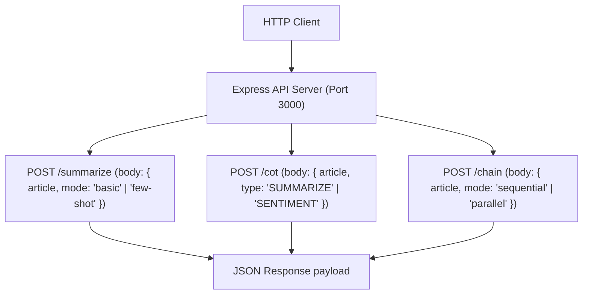

# File 09: Express Summarizer API Server (`src/index.js`)

## Overview
The **Express Summarizer API Server** exposes HTTP REST endpoints (`/summarize`, `/cot`, `/chain`) to allow external applications to trigger basic summarization, Chain-of-Thought analysis, and multi-step prompt pipeline orchestration.

---

## 1. REST API Routing Architecture



---

## 2. API Server Implementation (`src/index.js`)

```javascript
import express from "express";
import { GoogleGenerativeAI } from "@google/generative-ai";
import { buildPromptWithSystem } from "./prompts/system-prompts.js";
import { buildFewShotPrompt } from "./prompts/few-shot-templates.js";
import { buildCoTPrompt } from "./prompts/chain-of-thought.js";
import { runSequentialPipeline, runParallelPipeline } from "./chains/pipeline.js";

const app = express();
app.use(express.json());

const genAI = new GoogleGenerativeAI(process.env.GEMINI_API_KEY || "MOCK_KEY");
const model = genAI.getGenerativeModel({ model: "gemini-1.5-flash" });

// 1. Basic & Few-Shot Summarization Endpoint
app.post("/summarize", async (req, res) => {
    const { article, mode = "basic" } = req.body;
    if (!article) return res.status(400).json({ error: "Article text is required" });

    const prompt = mode === "few-shot" 
        ? buildFewShotPrompt("STRUCTURED", article)
        : buildPromptWithSystem("TECH", article);

    const result = await model.generateContent(prompt);
    res.status(200).json({ status: "success", mode, summary: result.response.text() });
});

// 2. Chain-of-Thought Analysis Endpoint
app.post("/cot", async (req, res) => {
    const { article, type = "SUMMARIZE" } = req.body;
    const prompt = buildCoTPrompt(type, article);
    const result = await model.generateContent(prompt);
    res.status(200).json({ status: "success", type, output: result.response.text() });
});

// 3. Multi-Step Chain Pipeline Endpoint
app.post("/chain", async (req, res) => {
    const { article, mode = "sequential" } = req.body;
    const result = mode === "parallel"
        ? await runParallelPipeline(model, article)
        : await runSequentialPipeline(model, article);
    res.status(200).json({ status: "success", result });
});

app.listen(3000, () => console.log("Article Summarizer API running on port 3000"));
```

---

## Key Takeaways
1. Integrates Express API routes with **Gemini SDK** generative models.
2. Supports dynamic execution modes (`basic`, `few-shot`, `cot`, `sequential`, `parallel`) via HTTP POST parameters.
