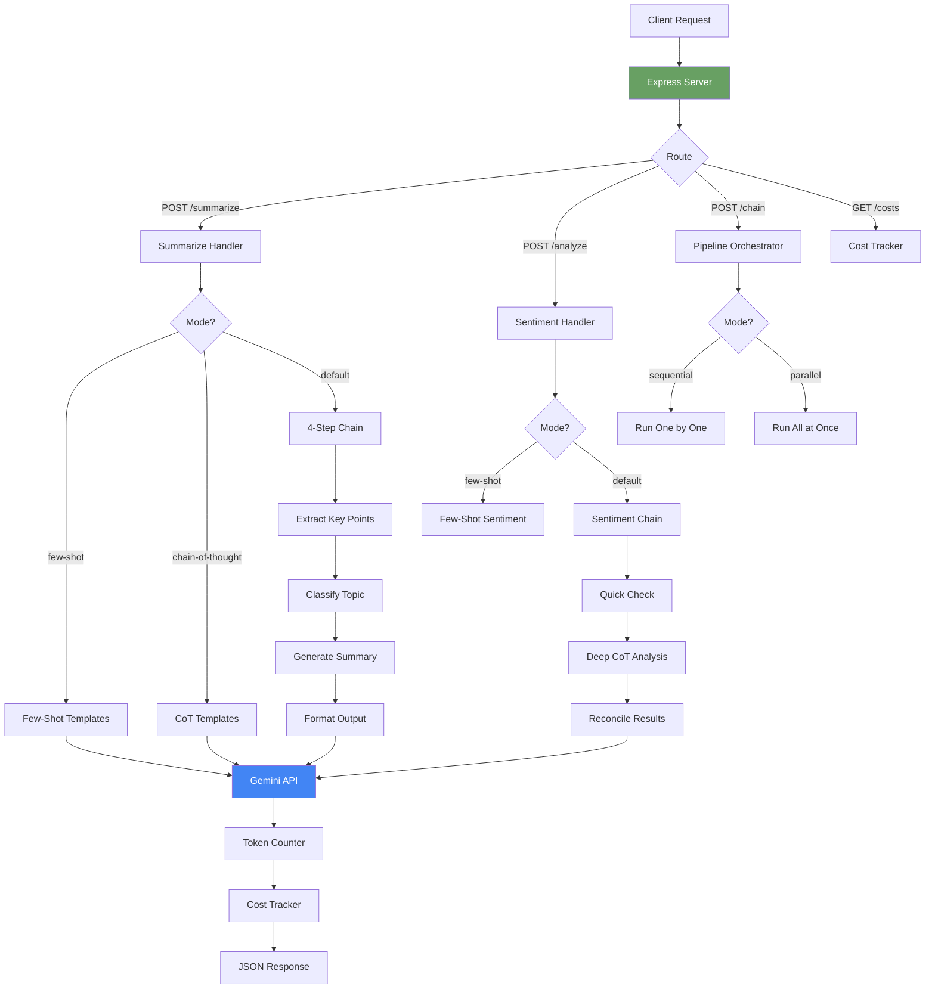
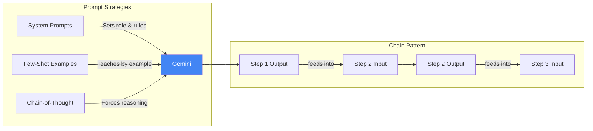

# Tech Summarizer - Article Analysis API

**Client:** Tech Analytics, Bengaluru - Content analytics startup needing article summarization.

**Tech:** Gemini (free tier), Express.js, Raw SDK

## Architecture



## Prompt Engineering Flow



## Setup

```bash
npm install
cp .env.example .env
# Add your Gemini API key to .env
npm run dev
```

## API Endpoints

### POST /summarize
```bash
curl -X POST http://localhost:3000/summarize \
  -H "Content-Type: application/json" \
  -d '{"article": "India EV market grew 45%...", "mode": "few-shot"}'
```
Modes: `few-shot`, `chain-of-thought`, or omit for default 4-step chain.

### POST /analyze
```bash
curl -X POST http://localhost:3000/analyze \
  -H "Content-Type: application/json" \
  -d '{"text": "The new metro line is amazing!", "mode": "few-shot"}'
```

### POST /chain
```bash
curl -X POST http://localhost:3000/chain \
  -H "Content-Type: application/json" \
  -d '{"article": "Full article text here...", "mode": "parallel"}'
```

### GET /costs
```bash
curl http://localhost:3000/costs
```

## Key Concepts

1. **System Prompts** - Define the AI's role and constraints
2. **Few-Shot Learning** - Teach by showing input-output examples
3. **Chain-of-Thought** - Force step-by-step reasoning for better accuracy
4. **Prompt Chaining** - Output of one LLM call becomes input for the next
5. **Sequential vs Parallel** - Trade-off between speed and token usage


## Learning path

Read the numbered module notes in order before changing the application. Each note explains one responsibility and points to the matching implementation. For each module, follow one input through the code, identify its output and side effects, then run a small example. This builds understanding of the system boundaries before you combine them.
