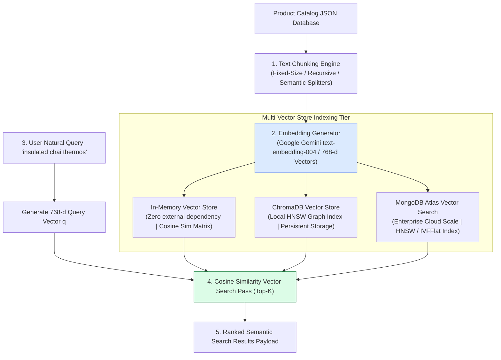
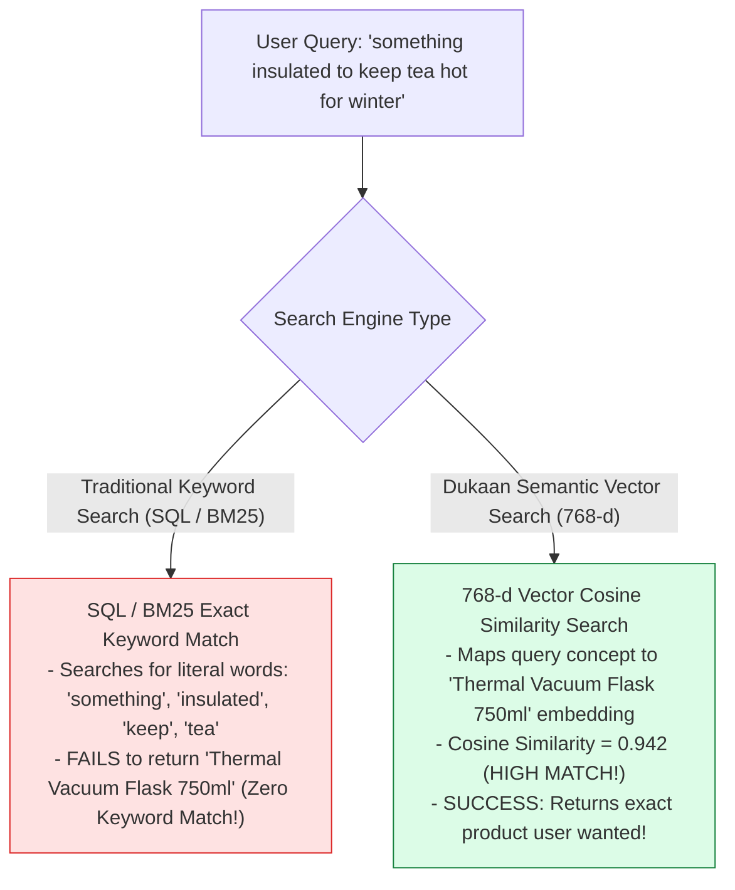
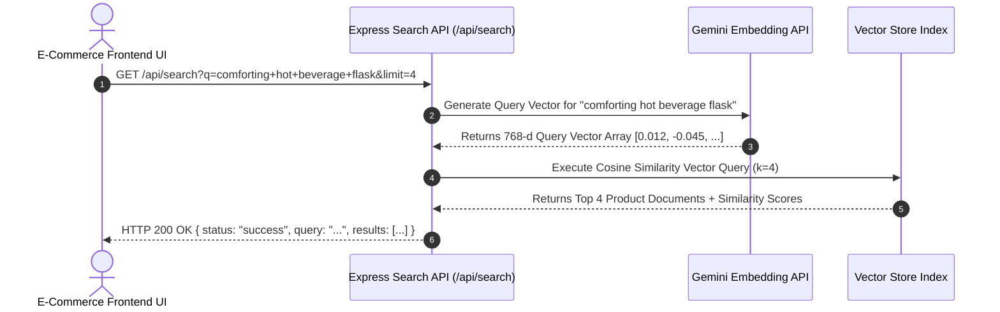

# Module 00: E-Commerce Semantic Vector Search Architecture Overview

## Overview

Traditional e-commerce keyword search engines (e.g. $B$-Tree or inverted keyword indexes) fail when customers search using natural language conceptual descriptions (such as *"something insulated to keep chai hot on cold morning commutes"*) rather than exact product title keywords. **Dukaan Search** is a production-grade AI-powered semantic vector search engine that converts product catalog metadata into **768-dimensional dense vector embeddings** (`text-embedding-004`), executing sub-10 millisecond **Cosine Similarity Vector Search** across In-Memory, ChromaDB HNSW, and MongoDB Atlas Vector indexes.

Understanding **Semantic Vector Search Pipelines**, **Dense Embedding Ingestion**, **Vector Index Comparisons (In-Memory vs. ChromaDB vs. MongoDB Atlas)**, and **REST API Specifications** is essential for modern search engineering.

---

## 1. E-Commerce Semantic Vector Search System Architecture

---

## 2. Natural Language Query Matching vs. Keyword Matching

### Vector Store Provider Capability Comparison Matrix

| Vector Store Provider | Index Type | Query Latency | Storage Mechanism | Best Use Case |
| :--- | :--- | :--- | :--- | :--- |
| **In-Memory Store** | Flat Brute-Force Cosine | $< 5\text{ms}$ ($< 10k$ vectors) | RAM JS Array | Local development, unit testing, lightweight microservices. |
| **ChromaDB** | HNSW Graph Index | $< 10\text{ms}$ ($< 1M$ vectors) | Local SQLite + Vector Files | Desktop apps, embedded agent microservices, local persistence. |
| **MongoDB Atlas** | HNSW / IVFFlat Cloud Index | $15\text{ms} - 35\text{ms}$ | Enterprise Managed Cluster | Billion-scale production e-commerce catalogs with existing Mongo DB. |

---

## 3. End-to-End Search API Request Execution Sequence

---

## Key Production Takeaways

1. **Solve Zero-Result Searches via Dense Vector Search**: Traditional keyword search fails when customers use natural language descriptions. Dense vector search matches conceptual intent regardless of exact vocabulary.
2. **Standardize Embedding Dimensions (768-d)**: Ensure all catalog product items and incoming user query strings are embedded using the exact same model (`text-embedding-004`, 768 dimensions).
3. **Multi-Index Abstraction**: Design a unified vector store interface (`search(queryVector, limit)`) so application code can seamlessly switch between In-Memory, ChromaDB, and MongoDB Atlas.
4. **Return Relevance Confidence Scores**: Include raw similarity scores (e.g. `similarity: 0.942`) in API search payloads so frontends can filter out irrelevant results below threshold limits ($< 0.60$).

## Learn from the implementation

Use the matching source file as an executable example, not just something to copy. Before running it, state in your own words what data enters the module, what it returns, and which values it changes. Then trace one realistic request from the caller through each function.

Pay special attention to these questions:

- **Data flow:** Which object, array, string, or state value moves between functions? What shape must it have?
- **Control flow:** Which branch, loop, early return, or retry changes the outcome? What condition selects it?
- **Async boundaries:** Where does the code wait for an LLM, database, network, file system, or tool? What should happen if that operation rejects or returns no result?
- **Side effects:** Which lines log information, make an external request, store data, or mutate in-memory state? Keep those distinct from pure calculations.
- **Production limits:** Which assumptions are only safe for a tutorial—for example, in-memory storage, fixed thresholds, approximate token counts, mock data, or a hard-coded batch size?

A useful practice is to change one input at a time and predict the result before executing it. If you can explain why the output changed, when the module should be used, and one way it could fail, you understand the concept rather than only the syntax.
