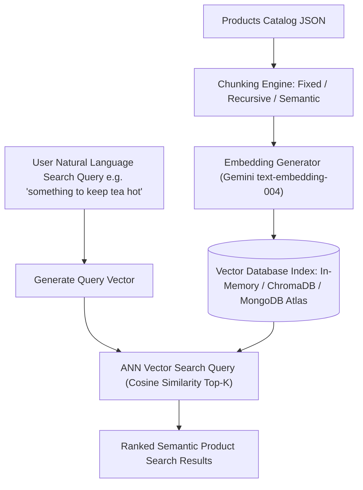

# File 00: E-Commerce Semantic Vector Search System Overview

## Overview
**Dukaan Search** is an AI-powered e-commerce semantic product search engine. Unlike legacy keyword-matching search engines (which fail on natural language queries like *"something to keep tea hot for winter"*), Dukaan Search converts product catalog metadata into **768-dimensional dense vector embeddings** and performs **Cosine Similarity Vector Search** across in-memory, ChromaDB, and MongoDB Atlas Vector indexes.

---

## 1. E-Commerce Semantic Vector Search Pipeline

---

## 2. System Capabilities & Endpoints

| Endpoint | Method | Parameter | Description |
| :--- | :--- | :--- | :--- |
| `/search` | `GET` | `?q=query&limit=5` | Semantic product vector search using In-Memory store |
| `/compare` | `GET` | `?q=query` | Benchmark search accuracy across In-Memory, ChromaDB, and MongoDB Atlas stores |
| `/chunk` | `POST` | `body: { text, strategy }` | Test Chunking Strategies (`fixed`, `recursive`, `semantic`) |

---

## Key Takeaways
1. Enables **natural language concept search** without needing exact product title keyword matches.
2. Supports **Multiple Vector Stores**: In-Memory (Zero dependency), ChromaDB (Persistent local HNSW graph index), and MongoDB Atlas Vector Search (Enterprise scale).
3. Demonstrates **Chunking Strategies** for long product document indexing.
