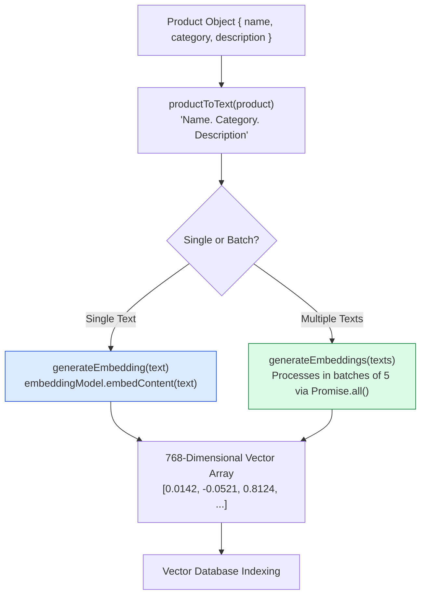

# Module 01: Vector Embedding Generator (`src/embeddings/generate.js`)

## Overview

Text descriptions cannot be indexed directly into vector databases without first passing through a dense embedding model. The **Vector Embedding Generator** utilizes the Google Gemini SDK (`text-embedding-004` model) to map unstructured e-commerce product titles and descriptions into **768-dimensional dense floating-point vector arrays**.

In **Dukaan Search**, `src/embeddings/generate.js` exports: **`generateEmbedding(text)`**, **`generateEmbeddings(texts)`** (batch processor with rate-limit batching), and **`productToText(product)`**.



---

## 1. Function Capabilities & Specification Matrix

| Function Name | Input Data Type | Processing Pattern | Output Result | Primary Best Use Case |
| :--- | :--- | :--- | :--- | :--- |
| **`generateEmbedding(text)`** | String | Single API call (`text-embedding-004`) | 768-d Float Array (`result.embedding.values`) | Real-time user search queries. |
| **`generateEmbeddings(texts)`** | String Array | Batch processing (batches of 5 via `Promise.all`) | Array of 768-d Float Arrays | Bulk product catalog indexing while respecting rate limits. |
| **`productToText(product)`** | Product Object | Text concatenation (`${name}. ${category}. ${description}`) | Standardized single string | Preparing product metadata for embedding generation. |

---

## 2. Complete Source Code Walkthrough (`src/embeddings/generate.js`)

```javascript
// Generate embeddings using Gemini's embedding model

import { GoogleGenerativeAI } from "@google/generative-ai";
import dotenv from "dotenv";

dotenv.config();

const genAI = new GoogleGenerativeAI(process.env.GEMINI_API_KEY);
const embeddingModel = genAI.getGenerativeModel({ model: "text-embedding-004" });

// Generate embedding for a single text
export async function generateEmbedding(text) {
  const result = await embeddingModel.embedContent(text);
  return result.embedding.values;
}

// Generate embeddings for multiple texts in batch
export async function generateEmbeddings(texts) {
  const embeddings = [];

  // Process in batches of 5 to respect rate limits
  const batchSize = 5;

  for (let i = 0; i < texts.length; i += batchSize) {
    const batch = texts.slice(i, i + batchSize);

    const batchResults = await Promise.all(
      batch.map(text => generateEmbedding(text))
    );

    embeddings.push(...batchResults);
    console.log(`Embedded ${Math.min(i + batchSize, texts.length)}/${texts.length} texts`);
  }

  return embeddings;
}

// Create a searchable text from a product object
export function productToText(product) {
  return `${product.name}. ${product.category}. ${product.description}`;
}
```

---

## Key Production Takeaways

1. **Structured Product Stringification**: `productToText` combines `name`, `category`, and `description` into a single coherent text representation to capture both product identity and semantic details in vector space.
2. **Rate Limit Safe Batching**: `generateEmbeddings` processes texts in chunks of 5 using `Promise.all()`, balancing high throughput with rate limit compliance (e.g. Gemini 15 RPM limits).
3. **Consistent Vector Dimensions**: Google's `text-embedding-004` model produces 768-dimensional vectors, optimized for fast similarity search in e-commerce applications.
4. **Clean Async Processing**: Separating single-text generation (`generateEmbedding`) from batch operations (`generateEmbeddings`) provides flexibility across single search queries and catalog bulk ingest pipelines.
