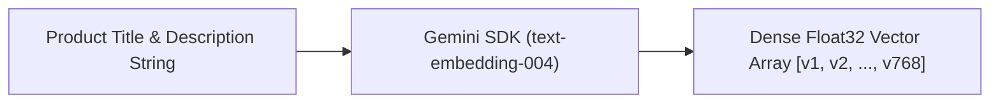

# File 01: Vector Embedding Generator (`src/embeddings/generate.js`)

## Overview
The **Embedding Generator** uses the Google Gemini SDK (`text-embedding-004` model) to map product text descriptions into dense **768-dimensional floating-point vector arrays**.

---

## 1. Vector Embedding Generation Architecture



---

## 2. Embedding Generator Implementation (`src/embeddings/generate.js`)

```javascript
import { GoogleGenerativeAI } from "@google/generative-ai";

const apiKey = process.env.GEMINI_API_KEY;
const genAI = apiKey ? new GoogleGenerativeAI(apiKey) : null;

// 1. Generate 768-Dimensional Vector Embedding for single text
export async function getEmbedding(text) {
    if (!genAI) {
        // Deterministic fallback mock embedding for local testing without API key
        return generateMockEmbedding(text);
    }

    const model = genAI.getGenerativeModel({ model: "text-embedding-004" });
    const result = await model.embedContent(text);
    return result.embedding.values;
}

// 2. Batch Embedding Generator for Product Catalogs
export async function getBatchEmbeddings(texts) {
    return Promise.all(texts.map(t => getEmbedding(t)));
}

// Local Mock Embedding Helper
function generateMockEmbedding(text) {
    const vector = new Array(768).fill(0);
    for (let i = 0; i < text.length; i++) {
        const charCode = text.charCodeAt(i);
        vector[i % 768] += (charCode / 255) * 0.1;
    }
    // Normalize vector length
    const norm = Math.sqrt(vector.reduce((sum, val) => sum + val * val, 0)) || 1;
    return vector.map(v => v / norm);
}
```

---

## Key Takeaways
1. Maps unstructured text into **768-dimensional numerical float space**.
2. Normalizes vector embeddings to unit length for fast dot-product calculation.
