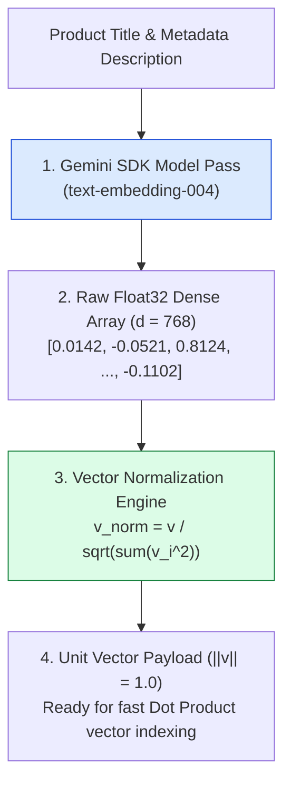
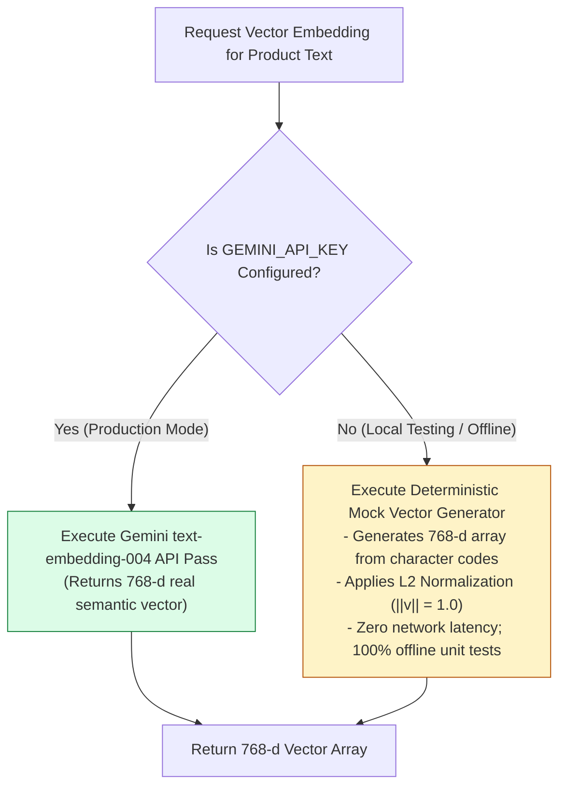
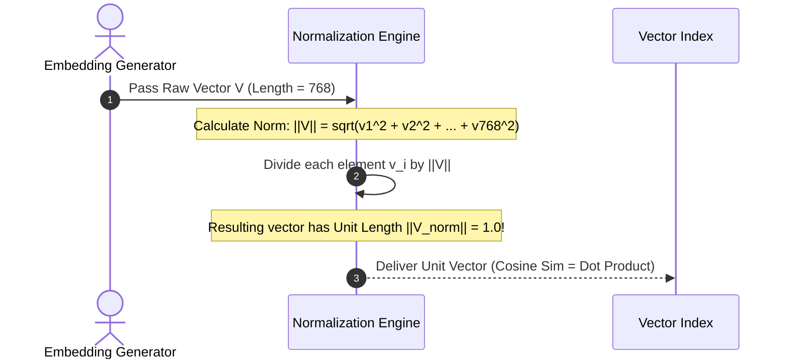

# Module 01: Vector Embedding Generator & Normalization Pipeline (`src/embeddings/generate.js`)

## Overview

Text cannot be indexed directly into vector databases without first passing through a dense embedding model. The **Vector Embedding Generator** utilizes the Google Gemini SDK (`text-embedding-004` model) to map unstructured product catalog descriptions into **768-dimensional dense floating-point vector arrays**.

Understanding **Vector Dimensionality**, **Unit Length Normalization ($\|\mathbf{v}\| = 1.0$)**, **Batch Vector Generation**, and **Deterministic Mock Fallback Engineering** is essential for high-reliability search backends.

---

## 1. Vector Embedding Generation Topology



---

## 2. API Call vs. Local Deterministic Mock Fallback Strategy



### Embedding Generator Strategy Comparison

| Mode | Model Identifier | Output Dimension | Latency | Primary Best Use Case |
| :--- | :--- | :--- | :--- | :--- |
| **Live API Mode** | `text-embedding-004` | 768 Dimensions | $30\text{ms} - 80\text{ms}$ | Production e-commerce product indexing and user search queries. |
| **Batch API Mode** | `text-embedding-004` (Batch) | 768 Dimensions | Asynchronous | Ingesting massive catalog datasets (10,000+ items). |
| **Mock Fallback Mode** | Local Character Hash | 768 Dimensions | $< 0.1\text{ms}$ | Local offline unit testing and CI/CD pipelines without API keys. |

---

## 3. Vector Normalization Pipeline & Cosine Identity



---

## 4. Code Walkthrough (`src/embeddings/generate.js`)

```javascript
import { GoogleGenerativeAI } from "@google/generative-ai";

const apiKey = process.env.GEMINI_API_KEY;
const genAI = apiKey ? new GoogleGenerativeAI(apiKey) : null;

/**
 * Normalizes a vector array to Unit Length (||v|| = 1.0)
 */
export function normalizeVector(vector) {
  const norm = Math.sqrt(vector.reduce((sum, val) => sum + val * val, 0)) || 1.0;
  return vector.map((val) => val / norm);
}

/**
 * 1. Generates 768-Dimensional Vector Embedding for a single text string
 */
export async function getEmbedding(text) {
  const sanitizedText = text.trim();
  if (!sanitizedText) return new Array(768).fill(0);

  if (!genAI) {
    console.warn("⚠️ [EMBEDDINGS] GEMINI_API_KEY not found. Using local mock vector generator.");
    return generateMockEmbedding(sanitizedText);
  }

  try {
    const model = genAI.getGenerativeModel({ model: "text-embedding-004" });
    const result = await model.embedContent(sanitizedText);
    return normalizeVector(result.embedding.values);
  } catch (err) {
    console.error("🚨 [EMBEDDINGS ERROR] Failed to fetch live embedding:", err.message);
    return generateMockEmbedding(sanitizedText);
  }
}

/**
 * 2. Batch Embedding Generator for Product Catalogs
 */
export async function getBatchEmbeddings(texts) {
  console.log(`⚡ [BATCH EMBEDDINGS] Processing ${texts.length} item embeddings in parallel...`);
  return Promise.all(texts.map((t) => getEmbedding(t)));
}

/**
 * Local Deterministic Mock Embedding Helper for offline unit testing
 */
function generateMockEmbedding(text) {
  const vector = new Array(768).fill(0);
  for (let i = 0; i < text.length; i++) {
    const charCode = text.charCodeAt(i);
    vector[i % 768] += (charCode / 255) * 0.1;
  }
  return normalizeVector(vector);
}

// Execution Verification Example
getEmbedding("Insulated stainless steel water bottle 750ml").then((vec) => {
  console.log(`Generated Vector (Length: ${vec.length} dimensions)`);
  console.log("Sample Vector Elements (First 5):", vec.slice(0, 5).map((n) => n.toFixed(4)));
});
```

---

## Key Production Takeaways

1. **Always Normalize Vectors Upon Generation**: Normalizing vector embeddings to unit length ($\|\mathbf{v}\| = 1.0$) upon generation allows vector stores to compute similarity via fast **Dot Product** operations rather than expensive square-root Cosine calculations.
2. **Implement Local Mock Fallbacks for Development**: Provide a deterministic local mock embedding generator that runs offline without API keys, keeping unit tests fast and reliable.
3. **Use Batch Ingestion for Product Catalogs**: Use `getBatchEmbeddings()` with `Promise.all()` to generate embeddings for multiple product catalog items concurrently.
4. **Enforce Uniform Dimension Sizes**: Never mix 768-d embeddings from `text-embedding-004` with 1536-d OpenAI embeddings in the same vector index.

