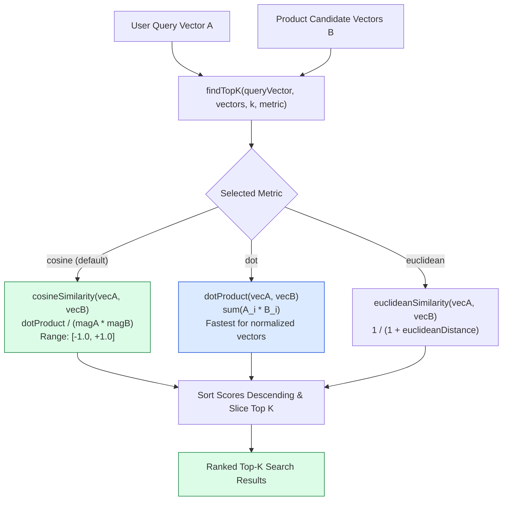

# Module 02: Vector Distance Metrics & Similarity Mathematics (`src/embeddings/similarity.js`)

## Overview

At the heart of dense vector search lies vector distance mathematics. To determine how closely a user search query (e.g. *"insulated beverage container"*) matches a candidate e-commerce product (e.g. *"Stainless Steel Vacuum Flask 750ml"*), the system calculates mathematical proximity between their 768-dimensional vector representations using **Cosine Similarity**, **Dot Product**, **Euclidean Distance ($L2$)**, and **Euclidean Similarity**.

In **Dukaan Search**, `src/embeddings/similarity.js` implements all distance metrics from scratch without external libraries: **`cosineSimilarity`**, **`dotProduct`**, **`euclideanDistance`**, **`euclideanSimilarity`**, and **`findTopK`**.



---

## 1. Distance Metric Mathematical Comparison Matrix

| Function Name | Mathematical Formula | Score Range | Direction / Magnitude Behavior | Primary Best Use Case |
| :--- | :--- | :--- | :--- | :--- |
| **`cosineSimilarity`** | $\cos(\theta) = \frac{\mathbf{A} \cdot \mathbf{B}}{\|\mathbf{A}\| \|\mathbf{B}\|}$ | $[-1.0, +1.0]$ | Identical direction = $1.0$, perpendicular = $0.0$, opposite = $-1.0$. | Default semantic search over text embeddings. |
| **`dotProduct`** | $\mathbf{A} \cdot \mathbf{B} = \sum_{i=1}^n A_i B_i$ | $[-\infty, +\infty]$ | Higher = more similar; equals Cosine Sim when $\|\mathbf{A}\| = \|\mathbf{B}\| = 1.0$. | Ultra-fast search over unit-normalized vectors. |
| **`euclideanDistance`** | $d(\mathbf{A}, \mathbf{B}) = \sqrt{\sum_{i=1}^n (A_i - B_i)^2}$ | $[0, +\infty]$ | Straight-line distance between points. Lower = more similar. | Spatial indexing & geometric cluster analysis. |
| **`euclideanSimilarity`**| $\text{sim} = \frac{1}{1 + d(\mathbf{A}, \mathbf{B})}$ | $(0, 1.0]$ | Bounded 0–1 score derived from Euclidean distance. | Normalizing Euclidean metrics to similarity scores. |

---

## 2. Complete Source Code Walkthrough (`src/embeddings/similarity.js`)

```javascript
// Similarity metrics implemented from scratch - no libraries needed

// Cosine similarity: measures angle between two vectors
// Range: -1 to 1 (1 = identical direction, 0 = perpendicular)
export function cosineSimilarity(vecA, vecB) {
  let dotProduct = 0;
  let magnitudeA = 0;
  let magnitudeB = 0;

  for (let i = 0; i < vecA.length; i++) {
    dotProduct += vecA[i] * vecB[i];
    magnitudeA += vecA[i] * vecA[i];
    magnitudeB += vecB[i] * vecB[i];
  }

  magnitudeA = Math.sqrt(magnitudeA);
  magnitudeB = Math.sqrt(magnitudeB);

  if (magnitudeA === 0 || magnitudeB === 0) return 0;

  return dotProduct / (magnitudeA * magnitudeB);
}

// Dot product: simple measure of similarity
// Higher = more similar, but affected by vector magnitude
export function dotProduct(vecA, vecB) {
  let result = 0;

  for (let i = 0; i < vecA.length; i++) {
    result += vecA[i] * vecB[i];
  }

  return result;
}

// Euclidean distance: straight-line distance between two points
// Lower = more similar (opposite of similarity)
export function euclideanDistance(vecA, vecB) {
  let sum = 0;

  for (let i = 0; i < vecA.length; i++) {
    const diff = vecA[i] - vecB[i];
    sum += diff * diff;
  }

  return Math.sqrt(sum);
}

// Convert euclidean distance to a similarity score (0 to 1)
export function euclideanSimilarity(vecA, vecB) {
  const distance = euclideanDistance(vecA, vecB);
  return 1 / (1 + distance);
}

// Find top-k most similar vectors using a given metric
export function findTopK(queryVector, vectors, k = 5, metric = "cosine") {
  const scoreFn = {
    cosine: cosineSimilarity,
    dot: dotProduct,
    euclidean: euclideanSimilarity
  };

  const fn = scoreFn[metric] || cosineSimilarity;

  const scored = vectors.map((vec, index) => ({
    index,
    score: fn(queryVector, vec.embedding)
  }));

  // Sort by score descending
  scored.sort((a, b) => b.score - a.score);

  return scored.slice(0, k);
}
```

---

## Key Production Takeaways

1. **Zero-Dependency Vector Math**: Implementing similarity functions directly in pure JavaScript ensures fast execution without third-party library overhead.
2. **Flexible Top-K Ranking**: `findTopK` abstracts distance function lookup via a strategy object (`scoreFn`), sorting candidates in descending score order and slicing the top $K$ items.
3. **Scale-Invariant Cosine Metric**: Cosine similarity handles variation in vector magnitude, making it ideal for e-commerce search queries.
4. **Euclidean Metric Normalization**: `euclideanSimilarity` transforms unbounded distance values into a normalized score between $0$ and $1$ via `1 / (1 + distance)`.


## Learn from the implementation

Use the matching source file as an executable example, not just something to copy. Before running it, state in your own words what data enters the module, what it returns, and which values it changes. Then trace one realistic request from the caller through each function.

Pay special attention to these questions:

- **Data flow:** Which object, array, string, or state value moves between functions? What shape must it have?
- **Control flow:** Which branch, loop, early return, or retry changes the outcome? What condition selects it?
- **Async boundaries:** Where does the code wait for an LLM, database, network, file system, or tool? What should happen if that operation rejects or returns no result?
- **Side effects:** Which lines log information, make an external request, store data, or mutate in-memory state? Keep those distinct from pure calculations.
- **Production limits:** Which assumptions are only safe for a tutorial—for example, in-memory storage, fixed thresholds, approximate token counts, mock data, or a hard-coded batch size?

A useful practice is to change one input at a time and predict the result before executing it. If you can explain why the output changed, when the module should be used, and one way it could fail, you understand the concept rather than only the syntax.
