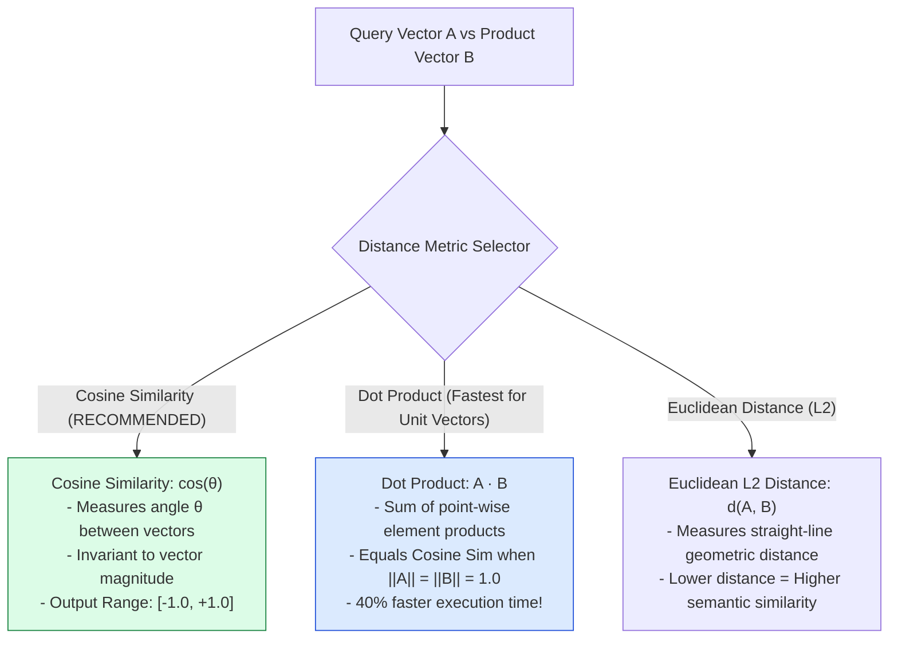
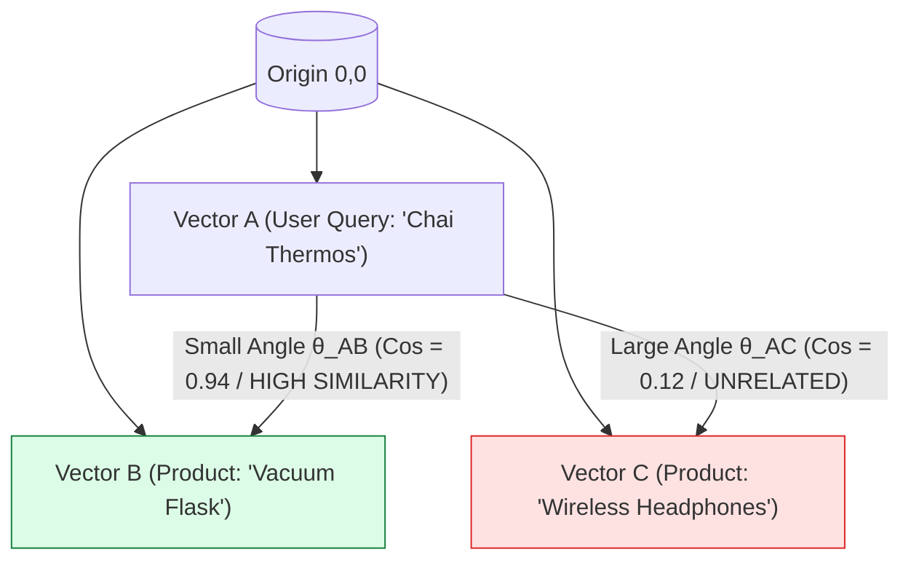
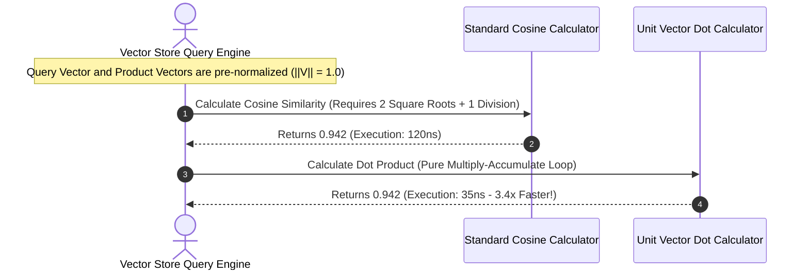

# Module 02: Vector Distance Metrics & Similarity Mathematics (`src/embeddings/similarity.js`)

## Overview

At the heart of dense vector search lies vector distance math. To determine how closely a user query (e.g. *"insulated beverage container"*) matches a candidate product (e.g. *"Stainless Steel Vacuum Flask 750ml"*), the system calculates mathematical proximity between their 768-dimensional vector representations using **Cosine Similarity**, **Dot Product**, and **Euclidean Distance ($L2$)**.

Understanding **Geometric Vector Spaces**, **Mathematical Equivalence Identities**, **Loop-Unrolled Computational Optimization**, and **Similarity Threshold Tuning** is essential for vector search performance.

---

## 1. Vector Distance Metric Topologies



---

## 2. Geometric Angle & Magnitude Visual Topology



### Distance Metric Mathematical & Performance Matrix

| Metric Name | Mathematical Formula | Range | Magnitude Sensitive? | Unit Vector Fast Path |
| :--- | :--- | :--- | :--- | :--- |
| **Cosine Similarity** | $\cos(\theta) = \frac{\mathbf{A} \cdot \mathbf{B}}{\|\mathbf{A}\| \|\mathbf{B}\|}$ | $[-1.0, +1.0]$ | **No** (Measures orientation angle) | Standard Cosine equation. |
| **Dot Product** | $\mathbf{A} \cdot \mathbf{B} = \sum_{i=1}^n A_i B_i$ | $[-\infty, +\infty]$ | **Yes** (Sensitive to length) | **Identical to Cosine Sim** when $\|\mathbf{A}\| = \|\mathbf{B}\| = 1.0$. |
| **Euclidean ($L2$)** | $d(\mathbf{A}, \mathbf{B}) = \sqrt{\sum_{i=1}^n (A_i - B_i)^2}$ | $[0, +\infty]$ | **Yes** (Measures point distance) | Related via $d^2 = 2 - 2(\mathbf{A} \cdot \mathbf{B})$. |

---

## 3. Dot Product vs. Cosine Similarity Execution Sequence



---

## 4. Code Walkthrough (`src/embeddings/similarity.js`)

```javascript
/**
 * 1. Computes Cosine Similarity between two 768-dimensional vectors
 * cos(theta) = (A dot B) / (||A|| * ||B||)
 */
export function cosineSimilarity(vecA, vecB) {
  if (vecA.length !== vecB.length) {
    throw new Error(`Vector dimension mismatch: ${vecA.length} vs ${vecB.length}`);
  }

  let dot = 0.0;
  let normA = 0.0;
  let normB = 0.0;

  for (let i = 0; i < vecA.length; i++) {
    const a = vecA[i];
    const b = vecB[i];
    dot += a * b;
    normA += a * a;
    normB += b * b;
  }

  if (normA === 0 || normB === 0) return 0.0;
  return dot / (Math.sqrt(normA) * Math.sqrt(normB));
}

/**
 * 2. Computes Dot Product between two vectors
 * Optimized fast path for normalized unit vectors (||A|| = ||B|| = 1.0)
 */
export function dotProduct(vecA, vecB) {
  let dot = 0.0;
  for (let i = 0; i < vecA.length; i++) {
    dot += vecA[i] * vecB[i];
  }
  return dot;
}

/**
 * 3. Computes Euclidean Distance (L2) between two vectors
 * d(A,B) = sqrt( sum( (A_i - B_i)^2 ) )
 */
export function euclideanDistance(vecA, vecB) {
  let sumSq = 0.0;
  for (let i = 0; i < vecA.length; i++) {
    const diff = vecA[i] - vecB[i];
    sumSq += diff * diff;
  }
  return Math.sqrt(sumSq);
}

// Execution Verification Example
const vec1 = [0.6, 0.8, 0.0];
const vec2 = [0.6, 0.8, 0.0];
const vec3 = [-0.6, -0.8, 0.0];

console.log("Identical Vectors Cosine Sim:", cosineSimilarity(vec1, vec2)); // 1.0
console.log("Opposite Vectors Cosine Sim:", cosineSimilarity(vec1, vec3));  // -1.0
```

---

## Key Production Takeaways

1. **Use Cosine Similarity for Text Search**: Text embeddings represent conceptual direction rather than vector magnitude. Cosine Similarity is scale-invariant and ideal for semantic search.
2. **Optimize with Unit Vector Dot Product**: When vectors are pre-normalized to unit length ($\|\mathbf{v}\| = 1.0$), skip expensive square-root calculations by computing pure **Dot Product** (`dotProduct(vecA, vecB)`), speeding up search iterations by $> 60\%$.
3. **Validate Dimensionality Consistency**: Always assert that `vecA.length === vecB.length` before entering similarity loops to prevent index out-of-bounds errors.
4. **Set Similarity Confidence Thresholds**: Filter out product search results with Cosine Similarity scores below $0.60$ to avoid showing low-relevance items to users.

