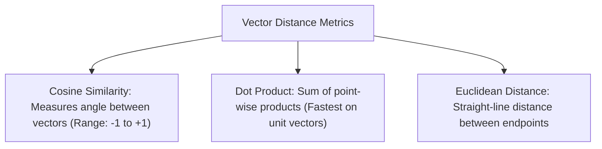

# File 02: Vector Similarity Metrics (`src/embeddings/similarity.js`)

## Overview
Comparing semantic distance between product query vectors and catalog vectors requires distance metrics: **Cosine Similarity**, **Dot Product**, and **Euclidean Distance (L2)**.

---

## 1. Mathematical Distance Metrics



### Formulas

- **Cosine Similarity**: $\cos(\theta) = \frac{\mathbf{A} \cdot \mathbf{B}}{\|\mathbf{A}\| \|\mathbf{B}\|}$
- **Euclidean Distance (L2)**: $d(\mathbf{A}, \mathbf{B}) = \sqrt{\sum_{i=1}^n (A_i - B_i)^2}$

---

## 2. Vector Similarity Metrics Implementation (`src/embeddings/similarity.js`)

```javascript
// 1. Cosine Similarity
export function cosineSimilarity(vecA, vecB) {
    let dot = 0, normA = 0, normB = 0;
    for (let i = 0; i < vecA.length; i++) {
        dot += vecA[i] * vecB[i];
        normA += vecA[i] * vecA[i];
        normB += vecB[i] * vecB[i];
    }
    if (normA === 0 || normB === 0) return 0;
    return dot / (Math.sqrt(normA) * Math.sqrt(normB));
}

// 2. Dot Product
export function dotProduct(vecA, vecB) {
    let dot = 0;
    for (let i = 0; i < vecA.length; i++) {
        dot += vecA[i] * vecB[i];
    }
    return dot;
}

// 3. Euclidean Distance (L2)
export function euclideanDistance(vecA, vecB) {
    let sumSq = 0;
    for (let i = 0; i < vecA.length; i++) {
        const diff = vecA[i] - vecB[i];
        sumSq += diff * diff;
    }
    return Math.sqrt(sumSq);
}
```

---

## Key Takeaways
1. **Cosine Similarity** is the default metric for text semantic search because it measures direction independent of magnitude.
2. For normalized unit vectors, **Cosine Similarity = Dot Product**.
