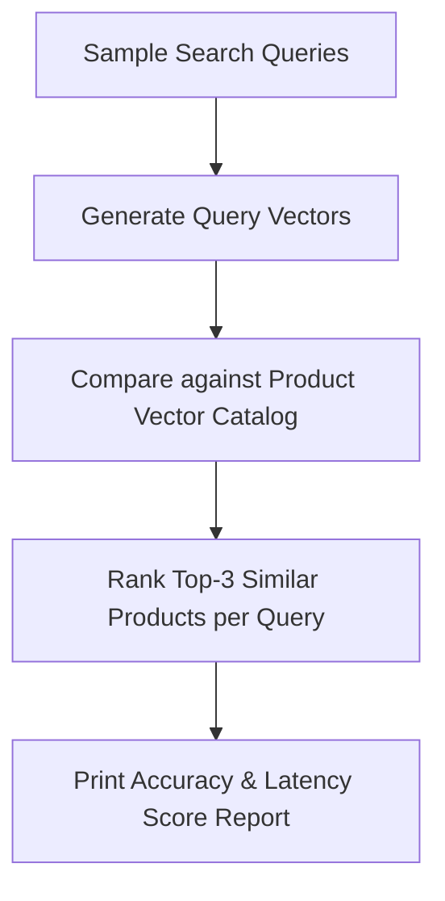

# File 03: Embeddings Benchmark Runner (`src/embeddings/benchmark.js`)

## Overview
The **Embeddings Benchmark Runner** evaluates search precision across multiple sample user queries ("*something to make tea*", "*warm clothes for winter*", "*healthy cooking oil*"), scoring catalog product matches using vector similarity metrics.

---

## 1. Search Benchmark Execution Flow



---

## 2. Benchmark Runner Implementation (`src/embeddings/benchmark.js`)

```javascript
import { getEmbedding } from "./generate.js";
import { cosineSimilarity } from "./similarity.js";
import products from "../data/products.json" assert { type: "json" };

export async function runBenchmark() {
    const queries = [
        "something to make tea",
        "warm clothes for winter",
        "healthy cooking oil"
    ];

    console.log("=== VECTOR SEARCH BENCHMARK RUNNER ===");

    // Pre-calculate product embeddings
    const productEmbeddings = await Promise.all(
        products.map(p => getEmbedding(`${p.name}: ${p.description}`))
    );

    for (const q of queries) {
        const queryVec = await getEmbedding(q);
        const scored = products.map((prod, idx) => ({
            name: prod.name,
            score: cosineSimilarity(queryVec, productEmbeddings[idx])
        }));

        scored.sort((a, b) => b.score - a.score);
        console.log(`\nQuery: "${q}"`);
        console.log(`Top Match: ${scored[0].name} (Score: ${scored[0].score.toFixed(4)})`);
    }
}
```

---

## Key Takeaways
1. Benchmarks real-world query intent accuracy against vector catalog representations.
2. Demonstrates how vector search matches conceptual intent (e.g. matching *"tea"* to *"Thermosteel Flask"*).
