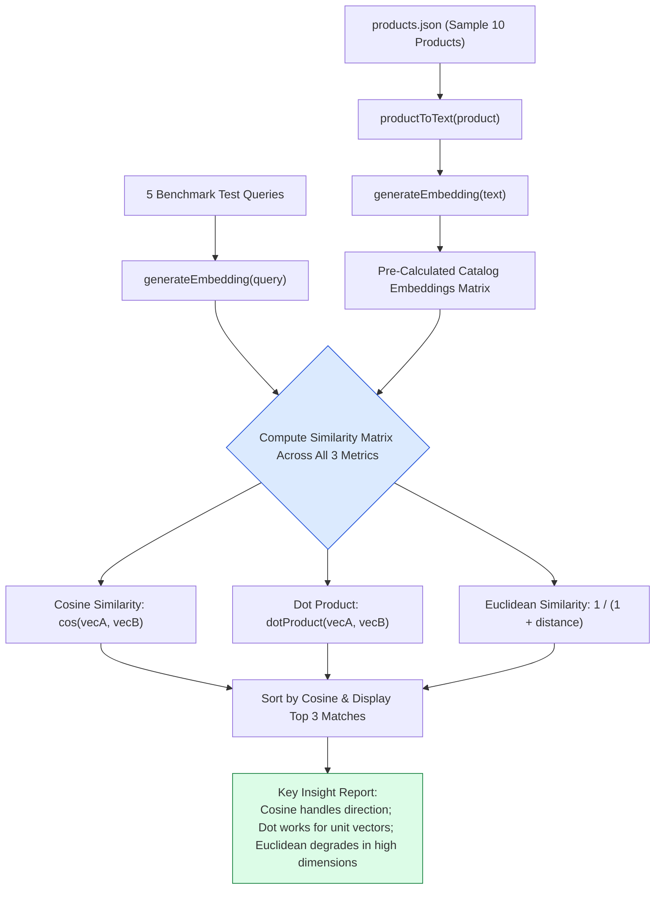

# Module 03: Embeddings Benchmark Runner (`src/embeddings/benchmark.js`)

## Overview

Deploying vector search to e-commerce production requires empirical comparison of distance metrics across real product catalog data. The **Embeddings Benchmark Runner** evaluates search performance across 5 test queries (*"something to make tea"*, *"warm clothes for winter"*, *"gadget for music"*, *"healthy cooking oil"*, *"gift for mom"*), computing **Cosine Similarity**, **Dot Product**, and **Euclidean Similarity** side-by-side.

In **Dukaan Search**, `src/embeddings/benchmark.js` benchmarks product data from `products.json` to demonstrate why Cosine similarity is the optimal metric for text embeddings.



---

## 1. Multi-Metric Benchmark Comparison

| Metric Evaluated | Formula / Function | Range | Magnitude Behavior | Accuracy on High-Dim Text |
| :--- | :--- | :--- | :--- | :--- |
| **Cosine Similarity** | `cosineSimilarity(q, p)` | $[-1.0, +1.0]$ | **Magnitude Invariant** (Focuses purely on direction & semantic meaning) | **Optimal (Best for Text)** |
| **Dot Product** | `dotProduct(q, p)` | Unbounded | Sensitive to vector magnitude unless pre-normalized | Fast & Accurate for Normalized Vectors |
| **Euclidean Similarity** | `euclideanSimilarity(q, p)` | $(0.0, 1.0]$ | Sensitive to distance; suffers from curse of dimensionality | Can be misleading in 768-d space |

---

## 2. Complete Source Code Walkthrough (`src/embeddings/benchmark.js`)

```javascript
// Benchmark: compare similarity metrics on the same product data

import { generateEmbedding, productToText } from "./generate.js";
import { cosineSimilarity, dotProduct, euclideanSimilarity } from "./similarity.js";
import products from "../data/products.json" with { type: "json" };

async function runBenchmark() {
  console.log("Generating embeddings for all products...\n");

  // Embed a subset for quick benchmarking
  const sampleProducts = products.slice(0, 10);
  const embeddings = [];

  for (const product of sampleProducts) {
    const text = productToText(product);
    const embedding = await generateEmbedding(text);
    embeddings.push({ product, embedding });
    console.log(`Embedded: ${product.name}`);
  }

  // Test queries
  const queries = [
    "something to make tea",
    "warm clothes for winter",
    "gadget for music",
    "healthy cooking oil",
    "gift for mom"
  ];

  console.log("\n--- Benchmark Results ---\n");

  for (const query of queries) {
    console.log(`Query: "${query}"`);
    console.log("-".repeat(60));

    const queryEmbedding = await generateEmbedding(query);

    // Score with all three metrics
    const results = embeddings.map(item => ({
      name: item.product.name,
      cosine: cosineSimilarity(queryEmbedding, item.embedding),
      dot: dotProduct(queryEmbedding, item.embedding),
      euclidean: euclideanSimilarity(queryEmbedding, item.embedding)
    }));

    // Sort by cosine and show top 3
    results.sort((a, b) => b.cosine - a.cosine);
    const top3 = results.slice(0, 3);

    for (const r of top3) {
      console.log(`  ${r.name}`);
      console.log(`    Cosine: ${r.cosine.toFixed(4)}  |  Dot: ${r.dot.toFixed(4)}  |  Euclidean: ${r.euclidean.toFixed(4)}`);
    }

    console.log();
  }

  // Show which metric agrees most often
  console.log("--- Key Insight ---");
  console.log("Cosine similarity is generally best for text embeddings because");
  console.log("it ignores vector magnitude and focuses on direction (meaning).");
  console.log("Dot product works well when vectors are already normalized.");
  console.log("Euclidean distance can be misleading with high-dimensional vectors.");
}

runBenchmark().catch(console.error);
```

---

## Key Production Takeaways

1. **Cosine Similarity Focuses on Semantic Direction**: Text embeddings encode semantic concept direction rather than magnitude. Cosine similarity isolates directional alignment.
2. **Dot Product Optimization for Unit Vectors**: When vectors are pre-normalized, Dot product scores equal Cosine similarity values while running faster due to fewer arithmetic operations.
3. **Curse of Dimensionality in Euclidean Space**: In high-dimensional vector spaces (768 dimensions), straight-line Euclidean distance can cluster un-intuitively due to distance concentration phenomena.
4. **Benchmarking with Natural Language Queries**: Testing conversational queries (*"something to make tea"*) verifies that the vector space captures semantic intent beyond simple keyword matching.
