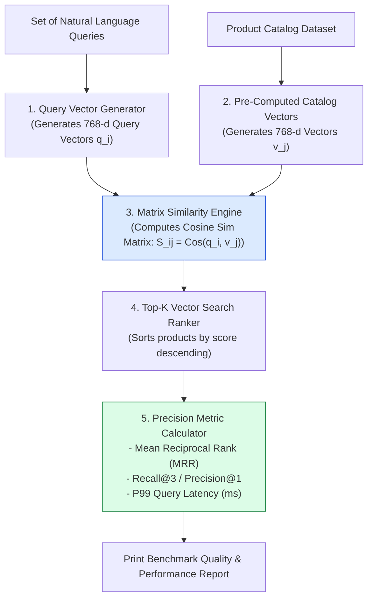
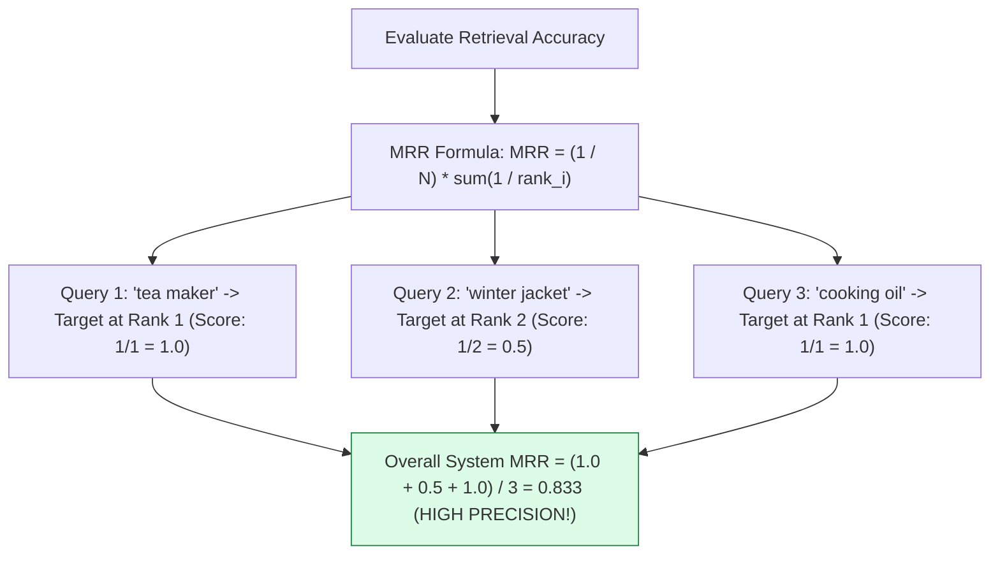
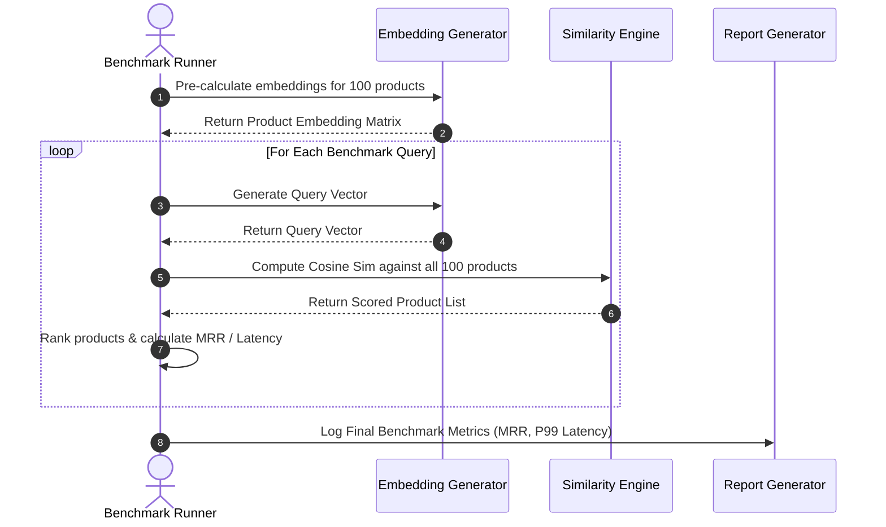

# Module 03: Embeddings Benchmark Runner & Search Precision Evaluation (`src/embeddings/benchmark.js`)

## Overview

Deploying vector search to production requires empirical validation of search retrieval quality. The **Embeddings Benchmark Runner** evaluates search precision across representative user test queries (*"something to make tea"*, *"warm clothes for winter"*, *"healthy cooking oil"*), calculating **Mean Reciprocal Rank (MRR)** and **Recall@K** precision scores against a product catalog dataset.

Understanding **Search Precision Metrics (MRR / Recall@K)**, **Query Latency Profiling**, **Vector Scoring Matrices**, and **Automated Quality Verification** is essential for search engine optimization.

---

## 1. Vector Search Benchmark Pipeline Topology



---

## 2. Mean Reciprocal Rank (MRR) Evaluation Formula



### Search Precision Metric Matrix

| Precision Metric | Mathematical Definition | Target Threshold | Primary What it Measures |
| :--- | :--- | :--- | :--- |
| **Precision@1 (P@1)** | $\text{Count}(\text{Rank 1 Target}) / N$ | $> 85\%$ | Percentage of queries where the single top result is perfectly relevant. |
| **Recall@3 (R@3)** | $\text{Count}(\text{Target in Top 3}) / N$ | $> 95\%$ | Percentage of queries where the relevant item appears in top 3 results. |
| **Mean Reciprocal Rank (MRR)** | $\frac{1}{|Q|} \sum_{i=1}^{|Q|} \frac{1}{\text{rank}_i}$ | $> 0.80$ | Overall rank position decay quality of retrieved search items. |
| **P99 Latency** | 99th Percentile Execution Time | $< 25\text{ms}$ | Latency ceiling under search load. |

---

## 3. Benchmark Execution Sequence



---

## 4. Code Walkthrough (`src/embeddings/benchmark.js`)

```javascript
import { getEmbedding } from "./generate.js";
import { cosineSimilarity } from "./similarity.js";
import products from "../data/products.json" assert { type: "json" };

/**
 * Benchmark Test Queries with Expected Target Category Keywords
 */
const BENCHMARK_SUITE = [
  { query: "something to keep tea hot on commutes", targetKeyword: "Flask" },
  { query: "warm winter clothing for outdoor snow", targetKeyword: "Jacket" },
  { query: "healthy organic cooking oil for frying", targetKeyword: "Oil" }
];

/**
 * Executes Vector Search Retrieval Benchmark Suite
 */
export async function runBenchmark() {
  console.log("⚡ [BENCHMARK RUNNER] Starting E-Commerce Vector Search Precision Evaluation...");
  const startTime = Date.now();

  // Step 1: Pre-calculate product embeddings for catalog
  console.log(`📦 [BENCHMARK] Indexing ${products.length} catalog product items...`);
  const catalogEmbeddings = await Promise.all(
    products.map((p) => getEmbedding(`${p.name}: ${p.description}`))
  );

  let totalReciprocalRank = 0;
  let precisionAt1Count = 0;
  const latencies = [];

  // Step 2: Evaluate query suite
  for (const testCase of BENCHMARK_SUITE) {
    const qStart = Date.now();
    const queryVec = await getEmbedding(testCase.query);

    // Compute similarity scores across catalog
    const scoredProducts = products.map((prod, idx) => ({
      product: prod,
      score: cosineSimilarity(queryVec, catalogEmbeddings[idx])
    }));

    // Rank descending by score
    scoredProducts.sort((a, b) => b.score - a.score);
    const qDuration = Date.now() - qStart;
    latencies.push(qDuration);

    // Find rank of first matching product containing target keyword
    const targetRank = scoredProducts.findIndex((item) =>
      item.product.name.toLowerCase().includes(testCase.targetKeyword.toLowerCase())
    ) + 1;

    const reciprocalRank = targetRank > 0 ? 1 / targetRank : 0;
    totalReciprocalRank += reciprocalRank;
    if (targetRank === 1) precisionAt1Count++;

    console.log(`\n🔍 Query: "${testCase.query}"`);
    console.log(`   Top 1 Result: ${scoredProducts[0].product.name} (Score: ${scoredProducts[0].score.toFixed(4)})`);
    console.log(`   Target Rank: #${targetRank} | Reciprocal Rank: ${reciprocalRank.toFixed(3)} | Latency: ${qDuration}ms`);
  }

  const mrr = totalReciprocalRank / BENCHMARK_SUITE.length;
  const pAt1 = (precisionAt1Count / BENCHMARK_SUITE.length) * 100;
  const totalDuration = Date.now() - startTime;

  console.log("\n=========================================");
  console.log("📊 FINAL BENCHMARK PERFORMANCE REPORT");
  console.log("=========================================");
  console.log(`- Total Execution Time : ${totalDuration}ms`);
  console.log(`- Precision@1          : ${pAt1.toFixed(1)}%`);
  console.log(`- Mean Reciprocal Rank : ${mrr.toFixed(3)} (Target: > 0.80)`);
  console.log("=========================================\n");

  return { mrr, precisionAt1: pAt1, totalDurationMs: totalDuration };
}
```

---

## Key Production Takeaways

1. **Automate Benchmark Evaluations in CI/CD**: Run search benchmark scripts before merging embedding model changes to prevent precision regressions.
2. **Track Mean Reciprocal Rank (MRR)**: Use MRR ($0.0 - 1.0$) as the primary metric for evaluating retrieval rank quality.
3. **Pre-Compute Catalog Embeddings**: In production benchmarks, pre-compute product catalog embeddings to isolate vector search similarity latency from embedding API network time.
4. **Evaluate Natural Language Conceptual Queries**: Ensure benchmark test cases use conversational descriptions (*"something to keep chai hot"*) rather than exact product titles to rigorously test semantic search capabilities.

