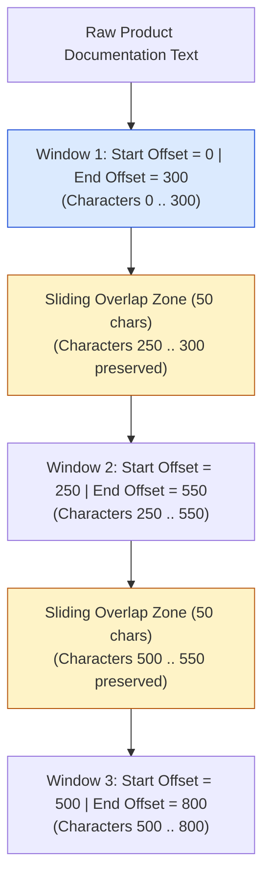
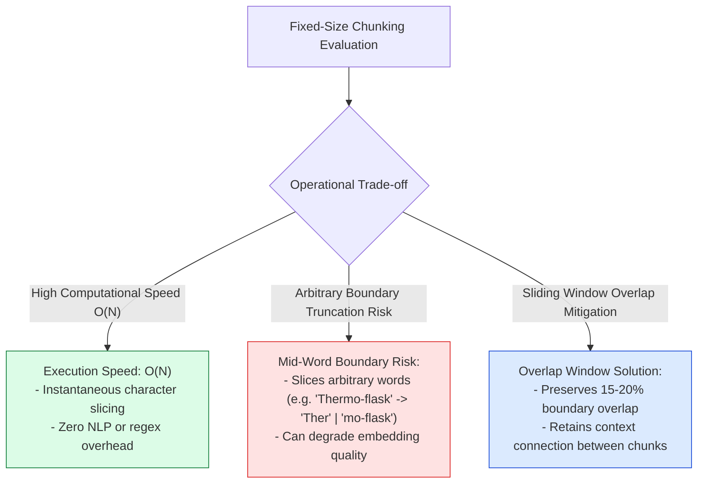
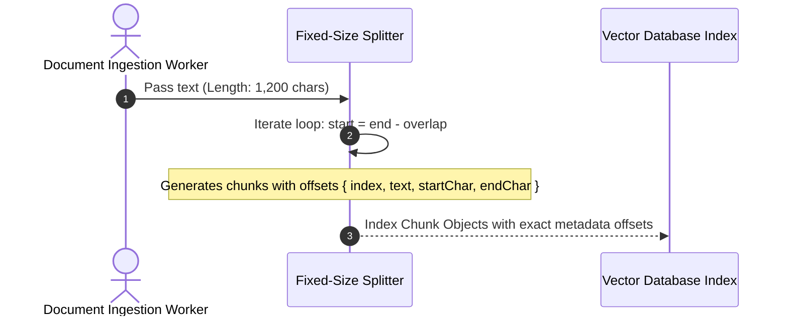

# Module 04: Fixed-Size Text Chunking & Sliding Overlap Mechanics (`src/chunking/fixed-size.js`)

## Overview

When indexing long e-commerce document descriptions or user manuals into vector databases, long texts must be partitioned into smaller context blocks. **Fixed-Size Chunking** slices raw document text into uniform character or token windows of fixed length $N$ (e.g. 500 characters) with a configurable sliding overlap window $M$ (e.g. 100 characters) to prevent context loss across chunk boundaries.

Understanding **Sliding Window Offset Math**, **Overlap Window Economics**, **Mid-Word Truncation Trade-offs**, and **Chunk Metadata Extraction** is essential for document ingestion.

---

## 1. Fixed-Size Sliding Window Topology



---

## 2. Fixed-Size Chunking Trade-Off Matrix



### Fixed-Size Chunking Parameter Reference

| Parameter Name | Recommended Default | Mathematical Purpose | Impact of Too Large / Too Small |
| :--- | :--- | :--- | :--- |
| **`chunkSize`** | 300 - 500 Chars | Maximum character length of each chunk window. | **Too large**: Exceeds embedding context detail; dilutes vector. **Too small**: Destroys sentence semantics. |
| **`overlap`** | 50 - 100 Chars ($15\%-20\%$) | Number of characters duplicated across adjacent chunks. | **Too large**: Duplicate redundant vector storage. **Too small**: Misses entities split across boundaries. |

---

## 3. Chunk Metadata & Offset Tracking Pipeline



---

## 4. Code Walkthrough (`src/chunking/fixed-size.js`)

```javascript
/**
 * Fixed-Size Chunking with sliding overlap window
 * @param {string} text - Raw document text to slice
 * @param {number} chunkSize - Max characters per chunk (default: 300)
 * @param {number} overlap - Overlap character size (default: 50)
 * @returns {Array<Object>} Array of chunk objects containing text and character offset metadata
 */
export function fixedSizeChunk(text, chunkSize = 300, overlap = 50) {
  if (!text || typeof text !== "string" || chunkSize <= 0) return [];

  const chunks = [];
  let start = 0;
  const sanitizedText = text.trim();

  while (start < sanitizedText.length) {
    let end = Math.min(start + chunkSize, sanitizedText.length);
    const chunkText = sanitizedText.substring(start, end).trim();

    if (chunkText) {
      chunks.push({
        index: chunks.length,
        text: chunkText,
        startChar: start,
        endChar: end,
        length: chunkText.length
      });
    }

    // Advance sliding window start offset
    start = end - overlap;
    
    // Prevent infinite loop if overlap >= chunkSize
    if (start >= end || end === sanitizedText.length) break;
  }

  return chunks;
}

// Execution Verification Example
const sampleProductManual = "The Stainless Steel Vacuum Flask features double-wall vacuum insulation technology keeping liquids hot for 24 hours or cold for 36 hours. Constructed from 18/8 food-grade stainless steel with BPA-free lid.";

const generatedChunks = fixedSizeChunk(sampleProductManual, 100, 20);
console.log(`Generated ${generatedChunks.length} Fixed-Size Chunks:\n`, generatedChunks);
```

---

## Key Production Takeaways

1. **Maintain 15%-20% Overlap Windows**: Always include a sliding overlap window ($M \approx 15\% - 20\%$ of $N$) to ensure key product entities split across boundaries are preserved in at least one chunk.
2. **Track Character Offset Metadata**: Include `startChar` and `endChar` in chunk payload metadata so frontend UI apps can highlight exact snippet locations in source documents.
3. **Use Fixed-Size Chunking for Uniform Datasets**: Use fixed-size chunking when performance ($O(N)$ speed) is paramount and input document structures lack natural paragraph formatting.
4. **Guard Against Overlap Loop Deadlocks**: Ensure `overlap < chunkSize` in validation logic to prevent infinite `while` loops during window calculation.

