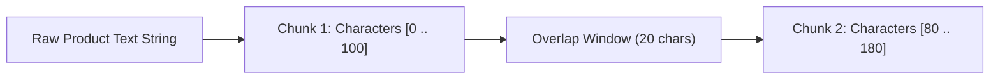

# File 04: Fixed-Size Chunking (`src/chunking/fixed-size.js`)

## Overview
**Fixed-Size Chunking** slices raw product documentation text into uniform character or token character windows of length $N$ with a fixed sliding overlap window $M$.

---

## 1. Fixed Sliding Window Mechanism



---

## 2. Fixed-Size Chunking Implementation (`src/chunking/fixed-size.js`)

```javascript
export function fixedSizeChunk(text, chunkSize = 100, overlap = 20) {
    if (!text || chunkSize <= 0) return [];
    
    const chunks = [];
    let start = 0;

    while (start < text.length) {
        const end = Math.min(start + chunkSize, text.length);
        const chunkText = text.substring(start, end).trim();
        
        if (chunkText) {
            chunks.push({
                index: chunks.length,
                text: chunkText,
                startChar: start,
                endChar: end
            });
        }

        start = end - overlap;
        if (end === text.length) break;
    }

    return chunks;
}
```

---

## Key Takeaways
1. Simple and fast $O(N)$ execution.
2. May slice sentences mid-word if character boundaries land arbitrarily inside words.
