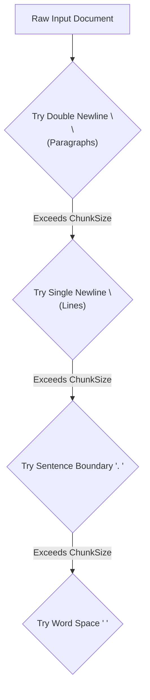

# File 05: Recursive Character Chunking (`src/chunking/recursive.js`)

## Overview
**Recursive Character Chunking** splits long documents by evaluating a list of natural separators (`\n\n`, `\n`, `. `, ` `) in sequence, keeping paragraphs and complete sentences intact whenever possible.

---

## 1. Separator Hierarchy Cascade



---

## 2. Recursive Chunking Implementation (`src/chunking/recursive.js`)

```javascript
export function recursiveChunk(text, chunkSize = 200, overlap = 40, separators = ["\n\n", "\n", ". ", " "]) {
    const chunks = [];
    
    function splitRecursively(textSegment) {
        if (textSegment.length <= chunkSize) {
            if (textSegment.trim()) chunks.push(textSegment.trim());
            return;
        }

        // Find highest priority separator present in segment
        let chosenSep = null;
        for (const sep of separators) {
            if (textSegment.includes(sep)) {
                chosenSep = sep;
                break;
            }
        }

        if (!chosenSep) {
            chunks.push(textSegment.substring(0, chunkSize).trim());
            return;
        }

        const parts = textSegment.split(chosenSep);
        let currentChunk = "";

        for (const part of parts) {
            if ((currentChunk + chosenSep + part).length <= chunkSize) {
                currentChunk += (currentChunk ? chosenSep : "") + part;
            } else {
                if (currentChunk) chunks.push(currentChunk.trim());
                currentChunk = part;
            }
        }
        if (currentChunk) chunks.push(currentChunk.trim());
    }

    splitRecursively(text);
    return chunks;
}
```

---

## Key Takeaways
1. Industry standard default chunker for plain text processing.
2. Preserves sentence and paragraph boundaries, improving vector embedding quality.
