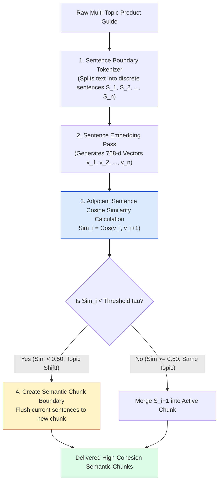
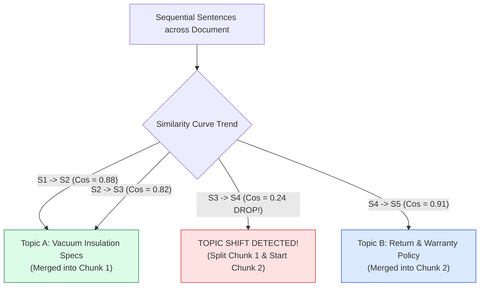
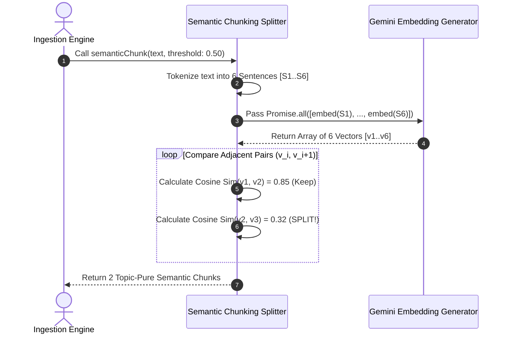

# Module 06: Semantic Embedding Distance Chunking & Topic Transition Detection (`src/chunking/semantic.js`)

## Overview

Character-count chunking strategies (fixed-size and recursive) split text based on arbitrary string lengths or surface syntax. **Semantic Chunking** uses dense vector embeddings to measure semantic similarity drops between adjacent sentences. When the Cosine Similarity between sentence $S_i$ and sentence $S_{i+1}$ falls below a configured threshold $\tau$ (e.g. $\tau = 0.50$), the engine detects a conceptual topic transition and splits the document at that precise semantic boundary.

Understanding **Sentence Vector Distance Shifts**, **Similarity Threshold Calibration ($\tau$)**, **Semantic Topic Boundaries**, and **Async Embedding Chunk Pipelines** is essential for advanced retrieval architectures.

---

## 1. Semantic Distance Shift Detection Topology



---

## 2. Distance Shift Curve & Boundary Determination



### Chunking Strategy Comprehensive Comparison Matrix

| Chunking Strategy | Boundary Criterion | Computational Cost | Semantic Cohesion | Best Production Use Case |
| :--- | :--- | :--- | :--- | :--- |
| **Fixed-Size** | Character Count $N$ | Extremely Low ($O(N)$) | Low (Mid-word risk) | Raw plain text, fallback ingestion. |
| **Recursive Character** | Linguistic Hierarchy (`\n\n`, `. `) | Low ($O(N)$ regex) | High (Sentences intact) | Default RAG standard for technical docs. |
| **Semantic Embedding** | Embedding Distance Drop | High ($O(N)$ API calls) | **Maximum** (Pure concepts) | Complex multi-topic manuals, legal contracts, research papers. |

---

## 3. Async Sentence Vector Evaluation Pipeline



---

## 4. Code Walkthrough (`src/chunking/semantic.js`)

```javascript
import { getEmbedding } from "../embeddings/generate.js";
import { cosineSimilarity } from "../embeddings/similarity.js";

/**
 * Splits text into chunks based on embedding similarity shifts between adjacent sentences
 * @param {string} text - Raw document input string
 * @param {number} similarityThreshold - Threshold drop trigger for topic split (default: 0.50)
 * @returns {Promise<Array<Object>>} Array of topic-pure semantic chunk objects
 */
export async function semanticChunk(text, similarityThreshold = 0.50) {
  if (!text || typeof text !== "string") return [];

  // Step 1: Tokenize input text into discrete sentences via Regex
  const sentences = text
    .split(/(?<=[.?!])\s+/)
    .map((s) => s.trim())
    .filter((s) => s.length > 0);

  if (sentences.length <= 1) {
    return [{ index: 0, text: text.trim(), sentenceCount: sentences.length }];
  }

  // Step 2: Compute dense vector embeddings for all sentences in parallel
  console.log(`⚡ [SEMANTIC CHUNKER] Generating embeddings for ${sentences.length} sentences...`);
  const sentenceEmbeddings = await Promise.all(sentences.map((s) => getEmbedding(s)));

  const chunks = [];
  let currentSentenceBuffer = [sentences[0]];

  // Step 3: Iterate through adjacent sentence pairs and evaluate similarity drops
  for (let i = 0; i < sentences.length - 1; i++) {
    const similarity = cosineSimilarity(
      sentenceEmbeddings[i],
      sentenceEmbeddings[i + 1]
    );

    console.log(`   Sentence ${i + 1} -> ${i + 2} Cosine Sim: ${similarity.toFixed(4)}`);

    if (similarity < similarityThreshold) {
      // Topic shift detected! Flush current buffer into a completed chunk
      console.log(`💡 [TOPIC SHIFT DETECTED] Similarity ${similarity.toFixed(4)} < Threshold ${similarityThreshold}. Splitting chunk!`);
      const chunkText = currentSentenceBuffer.join(" ");
      chunks.push({
        index: chunks.length,
        text: chunkText,
        sentenceCount: currentSentenceBuffer.length,
        length: chunkText.length
      });
      currentSentenceBuffer = [sentences[i + 1]];
    } else {
      currentSentenceBuffer.push(sentences[i + 1]);
    }
  }

  // Flush remaining sentences in buffer
  if (currentSentenceBuffer.length > 0) {
    const chunkText = currentSentenceBuffer.join(" ");
    chunks.push({
      index: chunks.length,
      text: chunkText,
      sentenceCount: currentSentenceBuffer.length,
      length: chunkText.length
    });
  }

  return chunks;
}

// Execution Verification Example
const multiTopicText = `The Thermosteel Vacuum Flask features double-wall vacuum insulation keeping drinks hot for 24 hours. It is made from 18/8 food-grade stainless steel. All orders ship within 2 business days via FedEx ground delivery. Customer support is available 24/7 for returns.`;

semanticChunk(multiTopicText, 0.45).then((chunks) => {
  console.log(`\nGenerated ${chunks.length} Semantic Chunks:\n`, chunks);
});
```

---

## Key Production Takeaways

1. **Splits Documents by Meaning, Not Character Limits**: Semantic chunking ensures that sentences discussing the same underlying topic remain together in the same chunk regardless of length.
2. **Calibrate the Similarity Threshold ($\tau$)**: Set $\tau \approx 0.45 - 0.55$ for 768-d models. Higher thresholds produce smaller, tighter chunks; lower thresholds group broader topics.
3. **Optimized for Multi-Topic Customer Manuals**: Use semantic chunking for multi-topic e-commerce user manuals where product specifications transition directly into shipping policies.
4. **Pre-Fetch Sentence Embeddings Concurrently**: Always generate sentence embeddings asynchronously using `Promise.all()` to minimize total chunking execution time.


## Learn from the implementation

Use the matching source file as an executable example, not just something to copy. Before running it, state in your own words what data enters the module, what it returns, and which values it changes. Then trace one realistic request from the caller through each function.

Pay special attention to these questions:

- **Data flow:** Which object, array, string, or state value moves between functions? What shape must it have?
- **Control flow:** Which branch, loop, early return, or retry changes the outcome? What condition selects it?
- **Async boundaries:** Where does the code wait for an LLM, database, network, file system, or tool? What should happen if that operation rejects or returns no result?
- **Side effects:** Which lines log information, make an external request, store data, or mutate in-memory state? Keep those distinct from pure calculations.
- **Production limits:** Which assumptions are only safe for a tutorial—for example, in-memory storage, fixed thresholds, approximate token counts, mock data, or a hard-coded batch size?

A useful practice is to change one input at a time and predict the result before executing it. If you can explain why the output changed, when the module should be used, and one way it could fail, you understand the concept rather than only the syntax.
