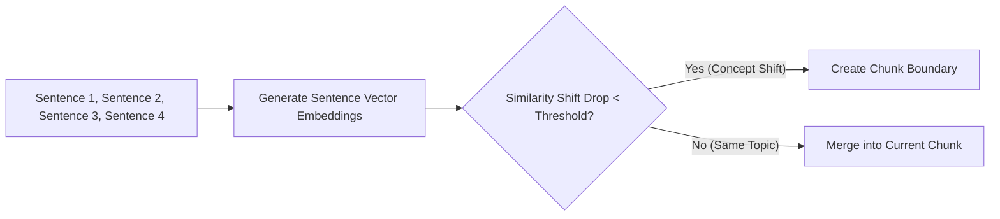

# File 06: Semantic Chunking (`src/chunking/semantic.js`)

## Overview
**Semantic Chunking** splits documents into chunks based on **embedding similarity distance shifts** between consecutive sentences, ensuring that sentences discussing the same underlying concept are grouped into the same chunk regardless of arbitrary length boundaries.

---

## 1. Semantic Boundary Detection Pipeline



---

## 2. Semantic Chunking Implementation (`src/chunking/semantic.js`)

```javascript
import { getEmbedding } from "../embeddings/generate.js";
import { cosineSimilarity } from "../embeddings/similarity.js";

export async function semanticChunk(text, similarityThreshold = 0.5) {
    // 1. Split text into individual sentences
    const sentences = text.split(/(?<=[.?!])\s+/).filter(s => s.trim().length > 0);
    if (sentences.length <= 1) return [text];

    // 2. Generate vector embeddings for all sentences
    const sentenceEmbeddings = await Promise.all(sentences.map(s => getEmbedding(s)));

    const chunks = [];
    let currentChunk = [sentences[0]];

    // 3. Evaluate adjacent sentence similarity shifts
    for (let i = 0; i < sentences.length - 1; i++) {
        const similarity = cosineSimilarity(sentenceEmbeddings[i], sentenceEmbeddings[i + 1]);

        if (similarity < similarityThreshold) {
            // Topic shift detected! Flush current chunk
            chunks.push(currentChunk.join(" "));
            currentChunk = [sentences[i + 1]];
        } else {
            currentChunk.push(sentences[i + 1]);
        }
    }

    if (currentChunk.length > 0) {
        chunks.push(currentChunk.join(" "));
    }

    return chunks;
}
```

---

## Key Takeaways
1. Groups text dynamically based on **meaning rather than fixed character length**.
2. Ideal for complex multi-topic documents.
