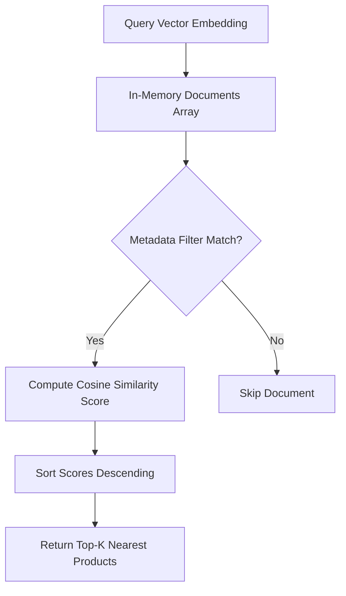

# File 07: In-Memory Vector Store (`src/vector-stores/in-memory.js`)

## Overview
The **In-Memory Vector Store** provides a zero-dependency local vector store implementation supporting fast $O(N)$ exact Cosine Similarity vector queries and metadata filtering.

---

## 1. Vector Search Query Execution Flow



---

## 2. In-Memory Store Implementation (`src/vector-stores/in-memory.js`)

```javascript
import { cosineSimilarity } from "../embeddings/similarity.js";

export class InMemoryVectorStore {
    constructor() {
        this.documents = []; // { id, vector, metadata }
    }

    addDocument(id, vector, metadata = {}) {
        this.documents.push({ id, vector, metadata });
    }

    addDocuments(docs) {
        docs.forEach(d => this.addDocument(d.id, d.vector, d.metadata));
    }

    search(queryVector, topK = 5, filter = null) {
        let candidates = this.documents;

        if (filter) {
            candidates = candidates.filter(doc => 
                Object.entries(filter).every(([key, val]) => doc.metadata[key] === val)
            );
        }

        const results = candidates.map(doc => ({
            id: doc.id,
            score: cosineSimilarity(queryVector, doc.vector),
            metadata: doc.metadata
        }));

        results.sort((a, b) => b.score - a.score);
        return results.slice(0, topK);
    }
}
```

---

## Key Takeaways
1. Zero setup dependency for fast local unit testing and development.
2. Performs exact Cosine Similarity comparisons.
