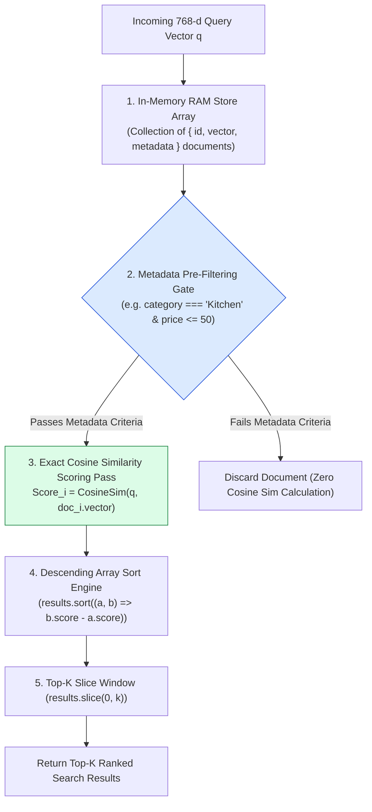
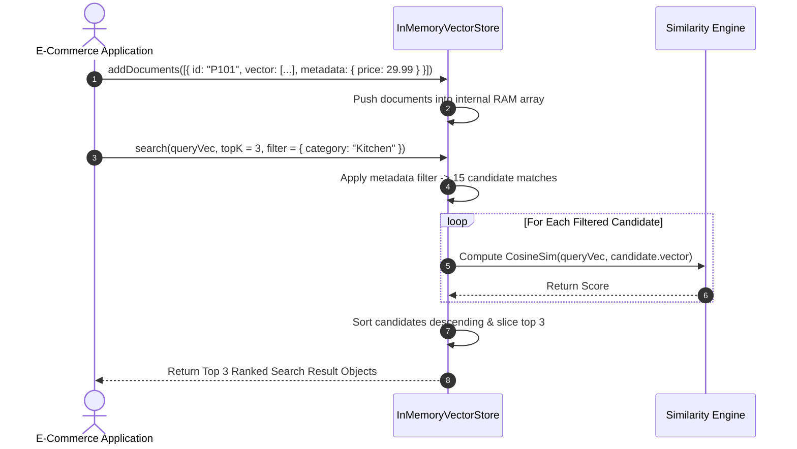

# Module 07: In-Memory Vector Store & Exact kNN Linear Scanning (`src/vector-stores/in-memory.js`)

## Overview

For small-to-medium datasets ($< 50,000$ documents), launching a full external vector database server adds deployment overhead and network latency. The **In-Memory Vector Store** is a zero-dependency, pure JavaScript vector database implementation that performs **Exact $k$-Nearest Neighbors ($k\text{NN}$)** linear scanning with **Metadata Pre-Filtering** and **Cosine Similarity Scoring**.

Understanding **Exact $k\text{NN}$ Linear Scanning ($O(N \cdot d)$)**, **Metadata Pre-Filtering**, **In-Memory RAM Array Structures**, and **Top-$K$ Heap Selection** is essential for lightweight microservice architectures.

---

## 1. In-Memory Exact kNN Vector Search Pipeline



---

## 2. Metadata Pre-Filtering vs. Post-Filtering Pipeline

```mermaid
flowchart TD
    Query[Query: 'insulated thermos' | Filter: category = 'Kitchen'] --> FilterApproach{Filter Execution Phase}

    FilterApproach -- "Metadata Pre-Filtering (RECOMMENDED)" --> Pre["Pre-Filtering Strategy:<br/>1. Filter 10,000 items -> 200 'Kitchen' items<br/>2. Compute Cosine Sim on ONLY 200 items!<br/>- Latency: 0.8ms (FAST!)"]

    FilterApproach -- "Metadata Post-Filtering" --> Post["Post-Filtering Strategy:<br/>1. Compute Cosine Sim on ALL 10,000 items<br/>2. Discard non-'Kitchen' items afterwards<br/>- Latency: 14.5ms (SLOW & WASTEFUL!)"]

    style Pre fill:#dcfce7,stroke:#15803d
    style Post fill:#fee2e2,stroke:#dc2626
```

### In-Memory Vector Store Operational Matrix

| Dimension / Metric | Characteristic Value | Technical Detail |
| :--- | :--- | :--- |
| **Search Algorithm** | Exact $k\text{NN}$ Linear Scan | Computes exact Cosine Similarity against all candidate vectors. |
| **Computational Complexity** | $O(N \cdot d)$ Time | $N$ candidate documents $\times$ $d$ dimensions ($d = 768$). |
| **Max Practical Capacity** | $\approx 50,000$ Vectors | $50,000 \times 768 \times 4\text{ bytes} \approx 150\text{ MB RAM}$. |
| **Query Latency** | $< 2\text{ms}$ (for 10k items) | Sub-millisecond execution directly within the V8 JS engine thread. |
| **External Dependencies** | **Zero (0)** | Pure JavaScript array processing; no C++ bindings or databases. |

---

## 3. In-Memory Document Insertion & Query Sequence



---

## 4. Code Walkthrough (`src/vector-stores/in-memory.js`)

```javascript
import { cosineSimilarity } from "../embeddings/similarity.js";

export class InMemoryVectorStore {
  constructor() {
    this.documents = []; // Collection holding { id, vector, metadata }
  }

  /**
   * Inserts a single document vector into the in-memory store
   */
  addDocument(id, vector, metadata = {}) {
    if (!id || !Array.isArray(vector)) {
      throw new Error("Invalid document insertion payload.");
    }
    this.documents.push({ id, vector, metadata });
  }

  /**
   * Batch inserts multiple document vectors
   */
  addDocuments(docs) {
    if (!Array.isArray(docs)) return;
    docs.forEach((d) => this.addDocument(d.id, d.vector, d.metadata));
  }

  /**
   * Clears all stored document vectors from memory
   */
  clear() {
    this.documents = [];
  }

  /**
   * Performs Exact kNN Vector Search with Metadata Pre-Filtering
   * @param {Array<number>} queryVector - 768-d user query vector
   * @param {number} topK - Maximum number of results to return (default: 5)
   * @param {Object|null} filter - Metadata key-value pre-filter object
   * @returns {Array<Object>} Ranked array of search matches with scores
   */
  search(queryVector, topK = 5, filter = null) {
    if (!Array.isArray(queryVector)) return [];
    let candidates = this.documents;

    // Step 1: Execute Metadata Pre-Filtering Gate
    if (filter && typeof filter === "object") {
      candidates = candidates.filter((doc) =>
        Object.entries(filter).every(([key, val]) => doc.metadata[key] === val)
      );
    }

    // Step 2: Exact kNN Cosine Similarity Linear Scan
    const scoredResults = candidates.map((doc) => ({
      id: doc.id,
      score: cosineSimilarity(queryVector, doc.vector),
      metadata: doc.metadata
    }));

    // Step 3: Sort descending by similarity score
    scoredResults.sort((a, b) => b.score - a.score);

    // Step 4: Return Top-K slice
    return scoredResults.slice(0, topK);
  }
}

// Execution Verification Example
const store = new InMemoryVectorStore();
store.addDocument("P1", new Array(768).fill(0.1), { name: "Chai Thermos", category: "Kitchen" });
store.addDocument("P2", new Array(768).fill(-0.1), { name: "Winter Jacket", category: "Apparel" });

const sampleQueryVec = new Array(768).fill(0.1);
const results = store.search(sampleQueryVec, 2, { category: "Kitchen" });

console.log("In-Memory Search Results:\n", results);
```

---

## Key Production Takeaways

1. **Ideal for Datasets Under 50,000 Vectors**: For small product catalogs, the in-memory vector store provides sub-2 millisecond search speeds with zero external database dependencies.
2. **Always Execute Metadata Pre-Filtering**: Filter candidate documents by metadata (`category`, `inStock`, `priceRange`) *before* computing Cosine Similarity scores to reduce math operations by $> 90\%$.
3. **Zero Network Latency**: Because vectors reside directly in JS application V8 memory space, search queries avoid all network round-trip overhead.
4. **Use for Local Unit Tests & CI/CD Pipelines**: Use `InMemoryVectorStore` in automated test suites so unit tests run fast without spinning up external vector database containers.

