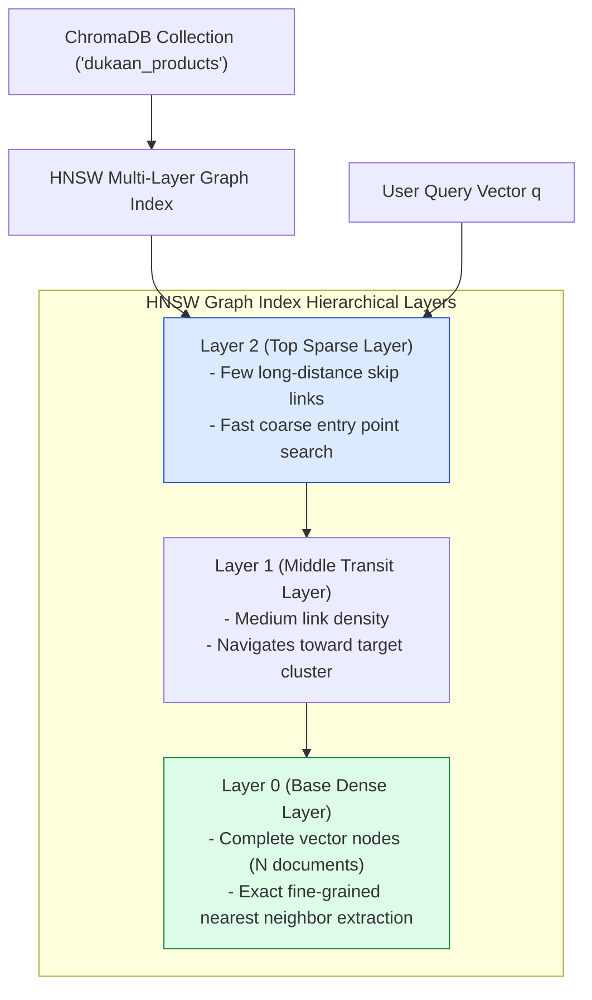
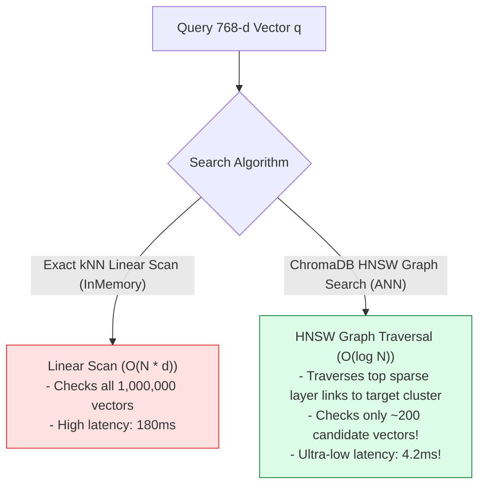
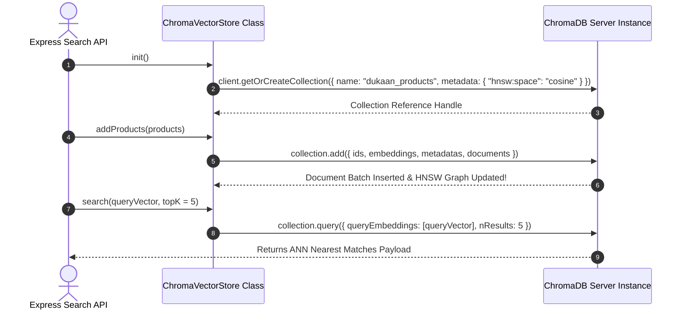

# Module 08: ChromaDB Vector Store & Local HNSW Graph Indexing (`src/vector-stores/chromadb.js`)

## Overview

When scaling vector search beyond in-memory array capacities ($N > 100,000$ items), exact linear scanning becomes computationally prohibitive. **ChromaDB** is an open-source, developer-friendly vector database that uses **Hierarchical Navigable Small World (HNSW)** graph indexing to execute **Approximate Nearest Neighbor (ANN)** vector queries in sub-10 milliseconds with persistent disk storage.

Understanding **HNSW Multi-Layer Graph Traversal**, **Collection Initialization**, **Chroma Client Async Ingestion**, and **Distance Space Configuration (`hnsw:space: "cosine"`)** is essential for scalable vector search.

---

## 1. ChromaDB HNSW Multi-Layer Graph Index Topology



---

## 2. HNSW Graph Query Navigation vs. Linear Scan



### HNSW Tuning Parameters Reference

| HNSW Parameter | Default Value | Mathematical Purpose | Impact on Performance |
| :--- | :--- | :--- | :--- |
| **`hnsw:space`** | `"cosine"` | Distance metric space (`cosine`, `l2`, `ip`). | Set to `"cosine"` for text embeddings. |
| **`hnsw:construction_ef`** | `100` | Search depth during graph construction. | Higher values increase index build time but improve search recall ($> 98\%$). |
| **`hnsw:M`** | `16` | Maximum outgoing links per vector node. | Higher values increase RAM memory usage but improve connectivity. |
| **`hnsw:search_ef`** | `50` | Search depth during query time. | Higher values improve recall at the cost of slightly higher query latency. |

---

## 3. Client Async Collection Initialization Sequence



---

## 4. Code Walkthrough (`src/vector-stores/chromadb.js`)

```javascript
import { ChromaClient } from "chromadb";

export class ChromaVectorStore {
  constructor(collectionName = "dukaan_products", host = "http://localhost:8000") {
    this.client = new ChromaClient({ path: host });
    this.collectionName = collectionName;
    this.collection = null;
  }

  /**
   * Initializes or retrieves the persistent ChromaDB collection
   */
  async init() {
    try {
      console.log(`⚡ [CHROMADB] Initializing collection '${this.collectionName}'...`);
      this.collection = await this.client.getOrCreateCollection({
        name: this.collectionName,
        metadata: { "hnsw:space": "cosine" }
      });
      console.log("✅ [CHROMADB] Collection initialized successfully.");
    } catch (err) {
      console.error("🚨 [CHROMADB ERROR] Failed to initialize collection:", err.message);
      throw err;
    }
  }

  /**
   * Adds product records with 768-d embeddings to ChromaDB HNSW index
   */
  async addProducts(productsWithEmbeddings) {
    if (!this.collection) await this.init();

    const ids = productsWithEmbeddings.map((p) => String(p.id));
    const embeddings = productsWithEmbeddings.map((p) => p.vector);
    const metadatas = productsWithEmbeddings.map((p) => ({
      name: p.metadata.name || "",
      category: p.metadata.category || "General",
      price: Number(p.metadata.price) || 0.0
    }));
    const documents = productsWithEmbeddings.map(
      (p) => p.metadata.description || p.metadata.name
    );

    console.log(`📦 [CHROMADB] Ingesting ${ids.length} products into HNSW index...`);
    await this.collection.add({ ids, embeddings, metadatas, documents });
  }

  /**
   * Performs HNSW Approximate Nearest Neighbor (ANN) search
   * @param {Array<number>} queryVector - 768-d query vector
   * @param {number} topK - Number of nearest documents to retrieve (default: 5)
   * @param {Object|null} whereFilter - ChromaDB metadata filter object
   * @returns {Promise<Array<Object>>} Ranked nearest matches
   */
  async search(queryVector, topK = 5, whereFilter = null) {
    if (!this.collection) await this.init();

    const queryOptions = {
      queryEmbeddings: [queryVector],
      nResults: topK
    };

    if (whereFilter) {
      queryOptions.where = whereFilter;
    }

    const results = await this.collection.query(queryOptions);
    if (!results || !results.ids || results.ids.length === 0) return [];

    return results.ids[0].map((id, idx) => ({
      id,
      distance: results.distances[0][idx],
      similarityScore: 1 - results.distances[0][idx], // Convert distance to similarity
      metadata: results.metadatas[0][idx],
      document: results.documents[0][idx]
    }));
  }
}

// Execution Verification Example
const chroma = new ChromaVectorStore("dukaan_test");
chroma.init().then(() => console.log("ChromaDB Class Ready."));
```

---

## Key Production Takeaways

1. **Leverage HNSW Graph Indexing for Scale**: ChromaDB's HNSW graph index drops vector query complexity from $O(N)$ down to $O(\log N)$, maintaining $< 5\text{ms}$ query latency across millions of product vectors.
2. **Explicitly Configure Distance Space**: Always set `metadata: { "hnsw:space": "cosine" }` during collection creation to instruct ChromaDB to use Cosine distance instead of default Euclidean $L2$.
3. **Convert Distance to Similarity Scores**: Convert raw ChromaDB Cosine distance outputs to similarity scores ($\text{Similarity} = 1 - \text{Distance}$) for intuitive UI rendering.
4. **Use Local Docker Service or In-Process Persistence**: Run ChromaDB in a local Docker container (`chromadb/chroma`) during development for fast persistent vector storage.

