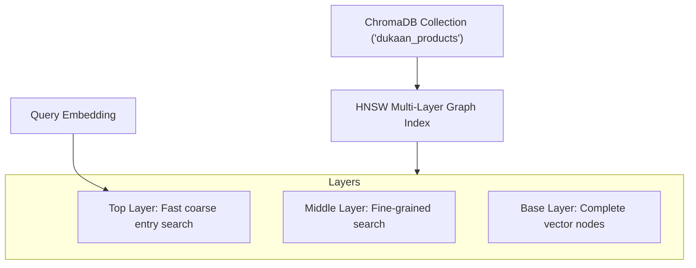

# File 08: ChromaDB Vector Store (`src/vector-stores/chromadb.js`)

## Overview
**ChromaDB** is a lightweight, open-source persistent vector database. It uses **HNSW (Hierarchical Navigable Small World)** graphs to index high-dimensional vectors for fast ANN queries.

---

## 1. ChromaDB HNSW Graph Architecture



---

## 2. ChromaDB Store Implementation (`src/vector-stores/chromadb.js`)

```javascript
import { ChromaClient } from "chromadb";

export class ChromaVectorStore {
    constructor(collectionName = "dukaan_products") {
        this.client = new ChromaClient();
        this.collectionName = collectionName;
        this.collection = null;
    }

    async init() {
        this.collection = await this.client.getOrCreateCollection({
            name: this.collectionName,
            metadata: { "hnsw:space": "cosine" }
        });
    }

    async addProducts(productsWithEmbeddings) {
        const ids = productsWithEmbeddings.map(p => p.id);
        const embeddings = productsWithEmbeddings.map(p => p.vector);
        const metadatas = productsWithEmbeddings.map(p => ({
            name: p.metadata.name,
            category: p.metadata.category,
            price: p.metadata.price
        }));
        const documents = productsWithEmbeddings.map(p => p.metadata.description);

        await this.collection.add({ ids, embeddings, metadatas, documents });
    }

    async search(queryVector, topK = 5) {
        const results = await this.collection.query({
            queryEmbeddings: [queryVector],
            nResults: topK
        });

        return results.ids[0].map((id, idx) => ({
            id,
            distance: results.distances[0][idx],
            metadata: results.metadatas[0][idx],
            document: results.documents[0][idx]
        }));
    }
}
```

---

## Key Takeaways
1. Uses **HNSW ANN indexing** for sub-millisecond search latency across millions of vectors.
2. Supports persistent disk storage across restarts.
