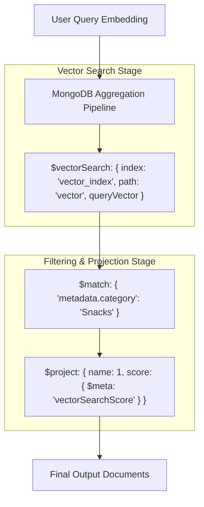

# File 09: MongoDB Atlas Vector Search (`src/vector-stores/mongodb-atlas.js`)

## Overview
**MongoDB Atlas Vector Search** integrates dense vector embeddings directly into document databases using native **`$vectorSearch` aggregation pipelines**, enabling unified hybrid queries across JSON metadata and high-dimensional vector embeddings.

---

## 1. MongoDB Atlas `$vectorSearch` Aggregation Pipeline



---

## 2. MongoDB Atlas Store Implementation (`src/vector-stores/mongodb-atlas.js`)

```javascript
import { MongoClient } from "mongodb";

export class MongoDBVectorStore {
    constructor(uri, dbName = "dukaan", collectionName = "products") {
        this.client = new MongoClient(uri);
        this.dbName = dbName;
        this.collectionName = collectionName;
    }

    async connect() {
        await this.client.connect();
        this.db = this.client.db(this.dbName);
        this.collection = this.db.collection(this.collectionName);
    }

    async search(queryVector, topK = 5) {
        const pipeline = [
            {
                $vectorSearch: {
                    index: "vector_index",
                    path: "embedding",
                    queryVector: queryVector,
                    numCandidates: topK * 10,
                    limit: topK
                }
            },
            {
                $project: {
                    name: 1,
                    category: 1,
                    price: 1,
                    description: 1,
                    score: { $meta: "vectorSearchScore" }
                }
            }
        ];

        return await this.collection.aggregate(pipeline).toArray();
    }
}
```

---

## Key Takeaways
1. Enables **hybrid search** combining structured MongoDB JSON filters with vector search in a single database.
2. Uses **`$vectorSearch`** aggregation stage for enterprise scalability.
