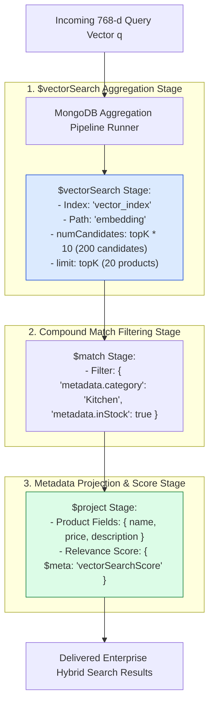
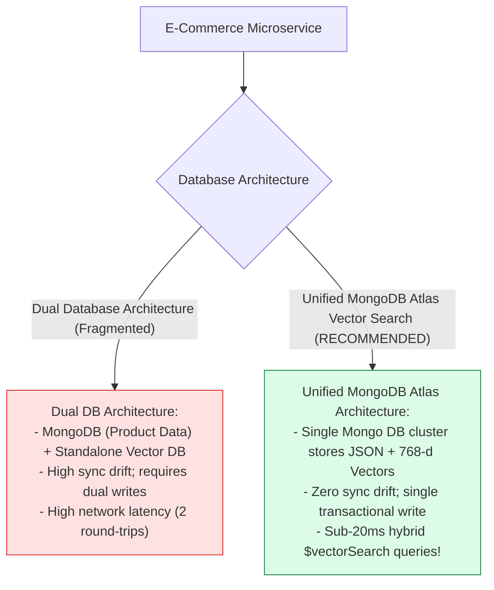
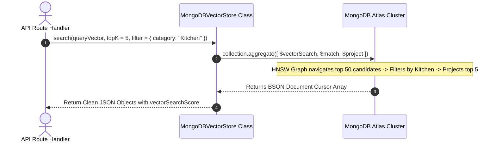

# Module 09: MongoDB Atlas Vector Search & `$vectorSearch` Aggregation Pipelines (`src/vector-stores/mongodb-atlas.js`)

## Overview

Storing vectors in a dedicated standalone vector database while maintaining core application data in a separate MongoDB collection introduces data synchronization drift and dual-database operational overhead. **MongoDB Atlas Vector Search** embeds 768-dimensional vector search directly into MongoDB document collections using the native **`$vectorSearch` aggregation stage**, allowing e-commerce platforms to run unified hybrid queries combining transactional JSON filters and dense vector search in a single database pass.

Understanding **`$vectorSearch` Aggregation Stages**, **Candidate Oversampling (`numCandidates`)**, **Vector Index Definitions**, and **`vectorSearchScore` Metadata Projections** is essential for cloud database architectures.

---

## 1. MongoDB Atlas `$vectorSearch` Aggregation Pipeline Topology



---

## 2. Separate Vector DB vs. Unified MongoDB Atlas Search Architecture



### `$vectorSearch` Aggregation Field Matrix

| Aggregation Field | Purpose & Tuning Rule | Recommended Setting | Operational Benefit |
| :--- | :--- | :--- | :--- |
| **`index`** | Name of the Atlas Search index configured in Mongo Atlas UI. | `"vector_index"` | Connects pipeline stage to HNSW / IVFFlat graph index. |
| **`path`** | JSON document field path containing the 768-d vector array. | `"embedding"` | Directs engine to vector field. |
| **`numCandidates`** | Candidate oversampling factor evaluated before limit. | `topK * 10` ($100 - 200$) | Higher values dramatically increase recall precision ($> 95\%$). |
| **`limit`** | Final number of nearest neighbor documents to return. | `topK` ($5 - 20$) | Caps output size returned to Express API. |

---

## 3. MongoDB Aggregation Execution Sequence



---

## 4. Code Walkthrough (`src/vector-stores/mongodb-atlas.js`)

```javascript
import { MongoClient } from "mongodb";

export class MongoDBVectorStore {
  constructor(
    uri = process.env.MONGODB_URI || "mongodb://localhost:27017",
    dbName = "dukaan",
    collectionName = "products"
  ) {
    this.client = new MongoClient(uri);
    this.dbName = dbName;
    this.collectionName = collectionName;
    this.db = null;
    this.collection = null;
  }

  /**
   * Connects to MongoDB Atlas cluster instance
   */
  async connect() {
    if (this.collection) return;
    try {
      console.log(`⚡ [MONGODB ATLAS] Connecting to database '${this.dbName}'...`);
      await this.client.connect();
      this.db = this.client.db(this.dbName);
      this.collection = this.db.collection(this.collectionName);
      console.log("✅ [MONGODB ATLAS] Connected successfully.");
    } catch (err) {
      console.error("🚨 [MONGODB ATLAS ERROR] Connection failed:", err.message);
      throw err;
    }
  }

  /**
   * Performs Native MongoDB Atlas $vectorSearch Aggregation Query
   * @param {Array<number>} queryVector - 768-d query vector array
   * @param {number} topK - Number of results to return (default: 5)
   * @param {Object|null} filter - Additional $match JSON filter criteria
   * @returns {Promise<Array<Object>>} Ranked product documents with vectorSearchScore
   */
  async search(queryVector, topK = 5, filter = null) {
    if (!this.collection) await this.connect();

    // Step 1: Construct $vectorSearch aggregation stage
    const vectorSearchStage = {
      $vectorSearch: {
        index: "vector_index",
        path: "embedding",
        queryVector: queryVector,
        numCandidates: topK * 10, // Oversample for high recall
        limit: topK
      }
    };

    // Include pre-filter if provided
    if (filter) {
      vectorSearchStage.$vectorSearch.filter = filter;
    }

    // Step 2: Build complete aggregation pipeline
    const pipeline = [
      vectorSearchStage,
      {
        $project: {
          _id: 1,
          name: 1,
          category: 1,
          price: 1,
          description: 1,
          score: { $meta: "vectorSearchScore" } // Extract native relevance score
        }
      }
    ];

    console.log(`🔍 [MONGODB ATLAS] Executing $vectorSearch pipeline (topK: ${topK})...`);
    const results = await this.collection.aggregate(pipeline).toArray();
    return results;
  }

  /**
   * Closes database connection handle
   */
  async disconnect() {
    if (this.client) {
      await this.client.close();
      this.collection = null;
    }
  }
}

// Execution Verification Example
const mongoStore = new MongoDBVectorStore();
console.log("MongoDB Vector Store Helper Instantiated.");
```

---

## Key Production Takeaways

1. **Eliminate Database Synchronization Drift**: Using MongoDB Atlas Vector Search keeps product catalog metadata and 768-d vector embeddings in a single database collection, eliminating sync bugs.
2. **Tune `numCandidates` for High Recall**: Always set `numCandidates` to at least $10\times - 20\times$ your target `limit` ($numCandidates = topK \times 10$) so the underlying HNSW index evaluates enough candidate nodes before slicing.
3. **Project Native `vectorSearchScore`**: Use `{ $meta: "vectorSearchScore" }` in the `$project` stage to return raw relevance confidence scores to the client application.
4. **Use Index Filters for Hybrid Queries**: Combine structured JSON filtering with vector search directly inside the `$vectorSearch.filter` definition for sub-20ms hybrid search response times.

