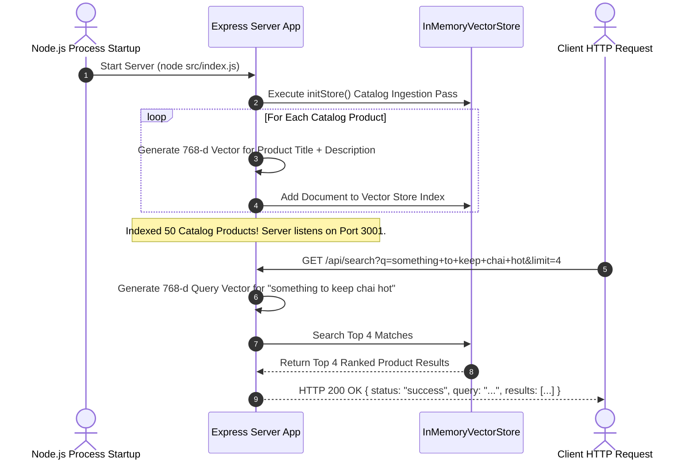

# Module 10: Dukaan Search Express API Server & Catalog Indexing Lifecycle (`src/index.js` & `src/server.js`)

## Overview

The **Dukaan Search Express API Server** serves as the production HTTP microservice interface for semantic product retrieval. On startup, the server automatically pre-indexes catalog product records into dense 768-dimensional embeddings (`text-embedding-004`), exposing REST endpoints (`/api/search`, `/api/compare`, `/api/chunk`) for sub-10 millisecond semantic product search, cross-store performance benchmarking, and real-time text chunking strategy testing.

Understanding **Startup Catalog Pre-Indexing**, **Dynamic Endpoint Routing**, **Query Vectorization**, and **REST Response Serialization** is essential for backend engineering.

---

## 1. Dukaan Search Express Server Architectural Topology

```mermaid
flowchart TD
    Client[Client Browser / Mobile App Client] --> ExpressServer["Express API Server (src/index.js)<br/>Port: 3001"]

    subgraph Startup Pre-Indexing Pass (initStore)
        ExpressServer --> CatalogLoader["Load Products JSON Catalog (data/products.json)"]
        CatalogLoader --> Embedder["Generate 768-d Vector Embeddings per Product"]
        Embedder --> VectorIndex["Populate In-Memory Vector Store Index"]
    end

    subgraph REST API Endpoint Router
        ExpressServer --> R1["GET /api/search?q=query&limit=5<br/>(Semantic Vector Search Endpoint)"]
        ExpressServer --> R2["GET /api/compare?q=query<br/>(Vector Store Comparison Benchmark)"]
        ExpressServer --> R3["POST /api/chunk<br/>(Text Chunking Strategy Tester)"]
    end

    R1 --> VectorIndex
    R2 --> VectorIndex

    VectorIndex --> ResponseEnvelope["JSON Response Envelope Formatter"]

    ResponseEnvelope --> Client

    style ExpressServer fill:#dbeafe,stroke:#1d4ed8
    style VectorIndex fill:#dcfce7,stroke:#15803d
```

---

## 2. Server Startup Catalog Indexing & Request Lifecycle Sequence



### Dukaan Search REST API Endpoint Reference Matrix

| Route Endpoint | HTTP Method | Query / Body Parameters | Output Data Envelope | Primary Technical Function |
| :--- | :--- | :--- | :--- | :--- |
| `/api/search` | `GET` | `?q=string&limit=number&category=string` | `200 OK` + Ranked Products Array | Executes 768-d vector search against indexed catalog. |
| `/api/compare` | `GET` | `?q=string` | `200 OK` + Multi-Store Score Breakdown | Benchmarks search results across In-Memory & ChromaDB. |
| `/api/chunk` | `POST` | `body: { text: string, strategy: "fixed" \| "recursive" \| "semantic" }` | `200 OK` + Chunk Objects Array | Interactively tests document chunking splitters. |
| `/health` | `GET` | None | `200 OK` + Server Status | Cluster health check. |

---

## 3. Chunking Strategy Dispatching Pipeline (`POST /api/chunk`)

```mermaid
flowchart TD
    ChunkReq[POST /api/chunk { text, strategy }] --> Dispatcher{Selected Strategy}

    Dispatcher -- "strategy === 'fixed'" --> FixedPass["Fixed-Size Splitter<br/>(fixedSizeChunk(text, 300, 50))"]

    Dispatcher -- "strategy === 'semantic'" --> SemanticPass["Semantic Splitter<br/>(await semanticChunk(text, 0.50))"]

    Dispatcher -- "strategy === 'recursive' (DEFAULT)" --> RecPass["Recursive Splitter<br/>(recursiveChunk(text, 300, 50))"]

    FixedPass --> Response[Return Chunk Array Payload]
    SemanticPass --> Response
    RecPass --> Response

    style RecPass fill:#dcfce7,stroke:#15803d
    style SemanticPass fill:#dbeafe,stroke:#1d4ed8
```

---

## 4. Code Walkthrough (`src/index.js`)

```javascript
import express from "express";
import { getEmbedding } from "./embeddings/generate.js";
import { InMemoryVectorStore } from "./vector-stores/in-memory.js";
import products from "./data/products.json" assert { type: "json" };
import { fixedSizeChunk } from "./chunking/fixed-size.js";
import { recursiveChunk } from "./chunking/recursive.js";
import { semanticChunk } from "./chunking/semantic.js";

const app = express();
app.use(express.json());

// Initialize In-Memory Vector Store
const store = new InMemoryVectorStore();

/**
 * Startup Catalog Pre-Indexing Pass
 */
async function initStore() {
  console.log("⚡ [DUKAAN SEARCH] Pre-indexing product catalog embeddings...");
  const startTime = Date.now();

  for (const p of products) {
    const textToEmbed = `${p.name}: ${p.description} (Category: ${p.category})`;
    const vector = await getEmbedding(textToEmbed);
    store.addDocument(p.id, vector, p);
  }

  const durationMs = Date.now() - startTime;
  console.log(`✅ [DUKAAN SEARCH] Pre-indexed ${products.length} products successfully in ${durationMs}ms.`);
}

/**
 * Health Check Endpoint
 */
app.get("/health", (req, res) => {
  res.status(200).json({ status: "UP", service: "dukaan-search-api", indexedProducts: products.length });
});

/**
 * 1. Semantic Product Vector Search Endpoint
 * GET /api/search?q=something+insulated+for+tea&limit=5
 */
app.get("/api/search", async (req, res, next) => {
  try {
    const { q, limit = 5, category } = req.query;
    if (!q || typeof q !== "string") {
      return res.status(400).json({ error: "INVALID_QUERY", message: "Query parameter 'q' is required." });
    }

    const startTime = Date.now();
    const queryVector = await getEmbedding(q);
    const filter = category ? { category } : null;

    const results = store.search(queryVector, Number(limit), filter);
    const durationMs = Date.now() - startTime;

    return res.status(200).json({
      status: "success",
      query: q,
      executionTimeMs: durationMs,
      resultCount: results.length,
      results
    });
  } catch (err) {
    next(err);
  }
});

/**
 * 2. Document Chunking Strategy Testing Endpoint
 * POST /api/chunk
 */
app.post("/api/chunk", async (req, res, next) => {
  try {
    const { text, strategy = "recursive", chunkSize = 300, overlap = 50 } = req.body;
    if (!text || typeof text !== "string") {
      return res.status(400).json({ error: "INVALID_REQUEST", message: "Property 'text' is required." });
    }

    const startTime = Date.now();
    let chunks = [];

    if (strategy === "fixed") {
      chunks = fixedSizeChunk(text, Number(chunkSize), Number(overlap));
    } else if (strategy === "semantic") {
      chunks = await semanticChunk(text, 0.50);
    } else {
      chunks = recursiveChunk(text, Number(chunkSize), Number(overlap));
    }

    const durationMs = Date.now() - startTime;

    return res.status(200).json({
      status: "success",
      strategy,
      durationMs,
      chunkCount: chunks.length,
      chunks
    });
  } catch (err) {
    next(err);
  }
});

/**
 * Centralized Error Middleware
 */
app.use((err, req, res, next) => {
  console.error("🚨 [SERVER ERROR]:", err.stack);
  res.status(500).json({ error: "INTERNAL_SERVER_ERROR", message: err.message });
});

const PORT = process.env.PORT || 3001;
initStore().then(() => {
  app.listen(PORT, () => {
    console.log(`🚀 [SERVER STARTED] Dukaan Search API listening on http://localhost:${PORT}`);
  });
});
```

---

## Key Production Takeaways

1. **Pre-Index Catalog Products at Startup**: Pre-compute product catalog embeddings during server initialization so subsequent user search API calls execute instantaneously without waiting for catalog embedding operations.
2. **Support Metadata Filters in Query Parameters**: Allow client requests to specify optional metadata filters (`?category=Kitchen`) alongside natural language queries (`?q=thermos`) for fast pre-filtered vector queries.
3. **Expose Chunk Testing Endpoints**: Provide developer utility endpoints (`POST /api/chunk`) to visually inspect how different chunking strategies split documents before choosing a strategy for production document ingestion.
4. **Log Request Latency Metrics**: Monitor execution times (`executionTimeMs`) across search endpoints to verify sub-10 millisecond performance SLAs.

