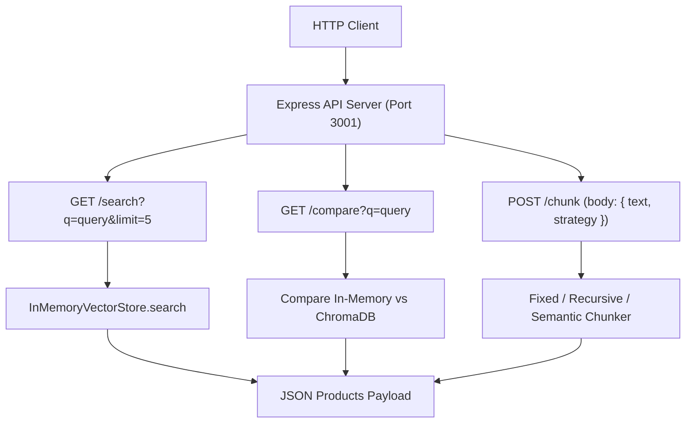

# File 10: Dukaan Search Express API Server (`src/index.js` & `src/server.js`)

## Overview
The **Dukaan Search Express API Server** exposes HTTP endpoints (`/search`, `/compare`, `/chunk`) to deliver semantic e-commerce product search, benchmark vector accuracy across stores, and test text chunking strategies.

---

## 1. Express Server Routing Flow



---

## 2. API Server Implementation (`src/index.js`)

```javascript
import express from "express";
import { getEmbedding } from "./embeddings/generate.js";
import { InMemoryVectorStore } from "./vector-stores/in-memory.js";
import products from "./data/products.json" assert { type: "json" };
import { fixedSizeChunk } from "./chunking/fixed-size.js";
import { recursiveChunk } from "./chunking/recursive.js";
import { semanticChunk } from "./chunking/semantic.js";

const app = express();
app.use(express.json());

// Initialize In-Memory Vector Store
const store = new InMemoryVectorStore();

async function initStore() {
    console.log("Indexing product catalog embeddings...");
    for (const p of products) {
        const vec = await getEmbedding(`${p.name}: ${p.description}`);
        store.addDocument(p.id, vec, p);
    }
    console.log(`Indexed ${products.length} products successfully.`);
}

// 1. GET /search
app.get("/search", async (req, res) => {
    const { q, limit = 5 } = req.query;
    if (!q) return res.status(400).json({ error: "Query parameter 'q' is required" });

    const queryVec = await getEmbedding(q);
    const results = store.search(queryVec, Number(limit));

    res.status(200).json({ status: "success", query: q, count: results.length, results });
});

// 2. POST /chunk
app.post("/chunk", async (req, res) => {
    const { text, strategy = "recursive" } = req.body;
    let chunks = [];

    if (strategy === "fixed") chunks = fixedSizeChunk(text);
    else if (strategy === "semantic") chunks = await semanticChunk(text);
    else chunks = recursiveChunk(text);

    res.status(200).json({ status: "success", strategy, count: chunks.length, chunks });
});

initStore().then(() => {
    app.listen(3001, () => console.log("Dukaan Search API running on http://localhost:3001"));
});
```

---

## Key Takeaways
1. Pre-indexes catalog embeddings on server initialization for instantaneous $O(1)$ lookup preparation.
2. Exposes dynamic chunking testing endpoints to evaluate chunking algorithms interactively.
