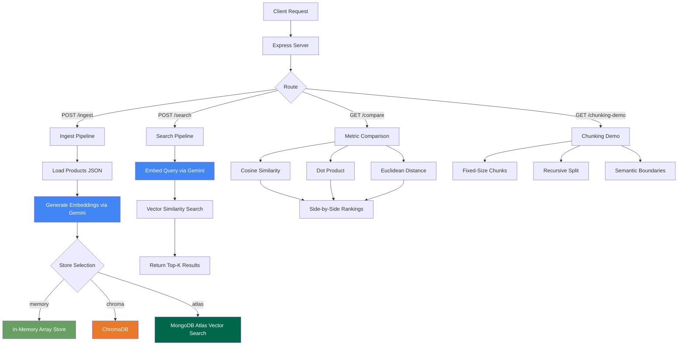
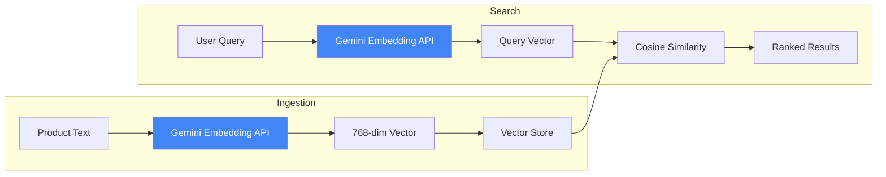
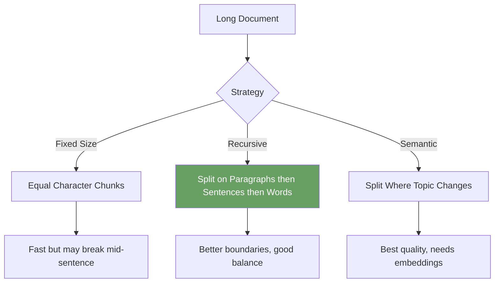

# DukaanDhundho - Semantic Product Search

**Client:** DukaanDhundho, Jaipur - E-commerce startup needing semantic product search.

**Tech:** Gemini Embeddings (free tier), Express.js, ChromaDB + MongoDB Atlas

## Architecture



## Embedding and Search Flow



## Chunking Strategies



## Setup

```bash
npm install
cp .env.example .env
# Add your Gemini API key to .env

# Start the server (in-memory store, no external DB needed)
npm run dev

# Optional: start ChromaDB with Docker
docker run -p 8000:8000 chromadb/chroma
```

## API Endpoints

### POST /ingest
```bash
curl -X POST http://localhost:3001/ingest \
  -H "Content-Type: application/json" \
  -d '{"store": "memory"}'
```

### POST /search
```bash
curl -X POST http://localhost:3001/search \
  -H "Content-Type: application/json" \
  -d '{"query": "something to keep water cold", "topK": 3}'
```

### GET /compare
```bash
curl "http://localhost:3001/compare?q=snack+for+chai+time"
```

### GET /chunking-demo
```bash
curl http://localhost:3001/chunking-demo
```

## Key Concepts

1. **Embeddings** - Convert text to numbers that capture meaning
2. **Vector Similarity** - Find similar items by comparing their number representations
3. **Cosine vs Dot vs Euclidean** - Different ways to measure similarity
4. **Chunking** - Breaking large text into smaller pieces for better embedding quality
5. **Vector Stores** - Databases optimized for similarity search


## Learning path

Read the numbered module notes in order before changing the application. Each note explains one responsibility and points to the matching implementation. For each module, follow one input through the code, identify its output and side effects, then run a small example. This builds understanding of the system boundaries before you combine them.
